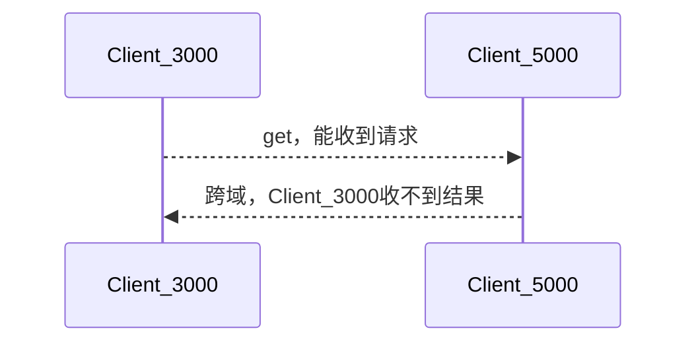
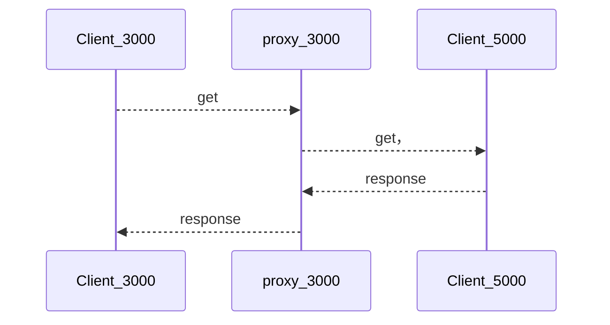

# k8s

## k8s 集群
包含
- 控制面板
- 节点
	- 每个节点都是一个VM or 物理机
	- 每个节点都有kubelet，负责管理所在的节点，以及对接控制面板
	- 节点上还有容器管理的服务，比如docker
- Minikube
	- 一个简单版本的k8s集群

## 基础命令

kubectl version 查看版本

kubectl cluster-info 查看集群信息

kubectl get nodes 查看节点信息


## deployment


# react

#react 

## jsx
要素
1. class使用className替换
2. style后的内容使用双花括号代替，none则用'none'代替

## react 脚手架
就使用创建一个基于react的模板项目

https://reactjs.org/docs/create-a-new-react-app.html

npx create-react-app app-name

其中有使用到webpack

### react 模板项目结构

```shell
node_modules  // 依赖库 比如webpack
public   // 静态资源  包含index.html  整个react项目只有一个html， SPA 单页面应用
src    // 
package-lock.json
package.json
```

### 应用加壳技术  public
可以把前段界面转换成手机应用，有点像自适应。在public目录下的manifest.json里进行相关的配置


### src
```shell
component.css
component.js
index.js  入口文件
```


### 执行顺序
1. src/index.js
2. index.html

## vscode插件推荐
ES7+ React/Redux/React-Native snippets


## 组件化编码
1. 拆分组件
2. 静态组件
3. 动态组件
	1. 初始化数据
		1. 类型
		3. 名称
		4. 保存在哪个组件
4. 交互（绑定事件）

## 函数绑定
#todo 
在构造器，或者在传递时

## 事件回调函数
```js
class Iteam extends Component {
    constructor(props) {
        super(props)
        this.state = {
            mouse: false
        }
        this.mouseHandler = this.mouseHandler.bind(this);
    }
    mouseHandler(flag) {
        return () => {
            this.setState({

                mouse: flag
            })
        }
    }
    render() {
        return (
            <li onMouseEnter={this.mouseHandler(true)} onMouseLeave={this.mouseHandler(false)}>
                <label>
                    <input type="checkbox" defaultChecked={this.props.todo.done} />
                    <span>{this.props.todo.name}</span>
                </label>
                <button className="btn btn-danger" style={{ display: 'none' }}>删除</button>
            </li>
        )
    }
}
```


## react ajax
1. react 只关注界面，不包含ajax
2. react中如果要用ajax，需集成，或封装


## 代理
目的：解决跨域问题？
比如当前是localhost:3000 ，请求的端口是 localhost:5000,



代理的方式则是




### 配置方式1 
package.json中增加 
```
	"proxy":"http://localhost:5000"
```

简单，临时
所有发给当前端口的请求都转发给了5000端口。然后实际请求的时候，请求的端口是3000。
但是如果已有的资源，就不会转发。

缺点：
只能写一个代理

### 配置方式2
src、setupProxy.js
使用CJS语法。common js。打包时，webpack会用到。
https://create-react-app.dev/docs/proxying-api-requests-in-development/


## 消息发布和订阅
库
npm install pubsub-js --save
一个开源的库。
https://github.com/mroderick/PubSubJS

也就是一个js版本的消息队列。


## 组件生命周期
#todo 


# ajax
#js #ajax
## jQuery
比较重，专门用于操作dom，封装的xhr


## axios
轻量，promise
安装 
node install axios，同样封装的xhr

## fetch
和xhr并列的内置库，同样是promise风格
https://github.com/github/fetch

但是兼容性可能存在一点问题，有些浏览器版本不支持
           

1. [https://segmentfault.com/a/1190000003810652](https://segmentfault.com/a/1190000003810652)

用了关注分离的设计思想。


## SPA
single page application
一个界面，局部刷新，数据都是ajax请求，异步展现

## react 路由
实现SPA

原理简述：点击导航时，路径变化，路由组件检测到变化，导航到对应的页面。路由组件记录了导航和组件的映射。


### 基石

history
BOM对象上有历史记录，浏览器的访问记录。浏览器上前进后退就是这个提供的。

也可以使用锚点跳转。

简单版本的路由，就是在a标签里提供onClick方法，处理路径变化，不进行跳转


### react里怎么用
库 react-router
1. web
	1. react-router-dom
		1. 内置组件
		2. BrowserRouter
		3. HashRouter
		4. Route
		5. Redirect
		6. Link
		7. NavLink
		8. Switch
		9. History对象
		10. match对象
		11. withRouter函数
	2. 用于实现spa
2. native
	1. 
3. any

## react-rotuer-dom@5
工程结构一般会区分一般组件和路由组件
一般在src/pages/下

两者的区别？
1. 渲染
	1. 一般组件 <Component/>
	2. 路由组件 {Component}
2. 参数
	1. 一般组件的参数是自主传入
	2. 路由组件会默认收到router传入的几个参数
		1. history
		2. location
		3. match
		4. 那么这三个对象作用是什么？


### Link
默认记录在history上是push模式，push模式方便于浏览器前进后退；
如果想用replace模式，则打开。`replace={true}`  or `replace`

### NavLink
支持高亮

### Router

#### 模糊匹配  精确匹配

模糊匹配，相当于startsWith，默认行为。不影响多级路由，嵌套路由
精确匹配 添加参数 `exact={true}`  或 `exact` 即可

## Redirect 重定向
可以用于页面默认重定向，可以在Router不匹配的时候进行兜底。

## 嵌套路由

1. 子路由要加上父路由的路径。
2. 父路由要是模糊匹配的


## 编程式路由
直接操作history对象。路由组件会收到history对象。
API
push(path,state)
replace(path,state)
goBack()
goForward()
go(n) // n 前进后后退的步数

### withRouter

是个函数，可以加工一般组件，以注入路由组件的对象


### 向路由传递参数
params参数，类似http 请求里的path参数
Link里 在url里，例如
```js
	Link to={`/home/message/detail/${msgObj.id}/${msgObj.title}`}>{msgObj.title}</Link>
```
在路由里声明接收，例如
```js
		 <Route path="/home/message/detail/:id/:title" component={Detail}/>
```


search参数，也就是http里的query参数。拼接在`?`后
路由链接里直接拼接Url ？xxx=xxx

在接收组件里从props.location.search获取，

state参数，和组件里的state不是同一个意思。
难道是body？


### Switch
用于包裹Route组件，可以达到switch-case的效果。否则route会一直匹配。

### 封装Link或NavLInk


## react-router-dom@6
和5有重大区别？


## 样式丢失
index.html里面的css引入，如果是相对路径，会有点小问题。会把path也加入相对路径里。所以用绝对路径好些。

解决方法：
1. 绝对路径  不要使用 `./`相对路径
2. 使用 `%PUBLIC_URL%/`
3. 使用HashRouter，也就是锚点，锚点内容不会发送到服务器

##  yarn 和 npm 有什么区别，有什么冲突


## UI组件库
           

流行的开源React UI组件库

material-ui(国外)

1. 官网: [http://www.material-ui.com/#/](http://www.material-ui.com/#/)

2. github: [https://github.com/callemall/material-ui](https://github.com/callemall/material-ui)

ant-design(国内蚂蚁金服)

1. 官网: [https://ant.design/index-cn](https://ant.design/index-cn)

2. Github: [https://github.com/ant-design/ant-design/](https://github.com/ant-design/ant-design/)

# promise
#js #promise


# ES6
和之前的js有什么语法上的改进、差异、
## 组件暴露语法

export default component;
### 没见过的语法

比如
[...obj]
{...obj}
有点像python里的`**`
连续结构赋值
结构赋值


# webpack
#todo 

# nanoid
#js库 

npm install nanoid


用法


# prop-types

# ES6
map、reduce。。。
结构赋值？

async
await


# NodeJs

# express 框架


# TODO
HTML的常用标签以及里面的属性


# VSCode使用
#vscode

## 常用命令
命令面板
通过 F1 或者“Cmd+Shift+P ”(Windows 上是 “Ctrl+Shift+P”) 打开


### 光标

代码块跳转
Cmd + Shift + \（Windows 上是 Ctrl + Shift + \），就可以在这对花括号之间跳转。
这个和vim里的ctrl+%类似

移动到最后一行，或者开始
vim gg  shift+g
Windows 上是 Ctrl + Home/End 键

## 文本选择

## 文件跳转

ctrl + tab
类似idea里的ctrl+e

Ctrl+p 类似ctrl+tab，但是可以搜索，找到文件后回车就可以打开，如果按ctrl+回车，则在另一个窗口打开


## 符号跳转
Ctrl + Shift + O。可以搜索变量、函数、类等。输入`:`可以分类

ctrl+t可以在多个打开的文件搜索符号

 F12 跳转到定义
 ctrl+F12 跳转到实现
 shift + F12 引用跳转


## 自动补全

ctrl+空格 补全
ctrl+shift+空格 预览

## 重构

F2 重命名

## 代码片段
类似idea里的代码模板，敲几个字母，就可以出来。可以引用上下文的一下东西，比如文件名。
命令面板里搜
`配置用户代码片段”（Configure User Snippets）`

搜索js的配置。
```
	"promise response error template":{
		"prefix": "ref",
		"body": [
			"response => {$1},",
			"error => {$2:lable}"
		],
		"description": "promise template"
	}
```

则在js代码里输入ref就会弹出提示，$1,$2则是按tab的位置。
`$2:lable` lable则是默认值。上下文就是预设变量。

更多参考
https://code.visualstudio.com/docs/editor/userdefinedsnippets#_variables


## 代码折叠、小地图、面包屑

快捷键
 “Cmd + Option + 左方括号”（Windows 上是 Ctrl + Shift + 左方括号）


声明折叠块

 ```
 // region Main
 ...
 // endregion
 
 ```


 右侧的预览图就是小地图

 上方文件的导航栏就是面包屑。


 ## 搜索
 ctrl + f


 # CSS

 ## 样式有权重
 增加 ！important可以增加权重


 # Redux
 管理状态的js库，可以配合vue、react、angular使用。
 可以集中管理共享的状态？


 

## 什么场景下使用？
多个组件共享状态
一个组件修改另一个组件的状态


## 原理
类似一个命令模式
![[redux原理图.png]]


## 同步action和异步action
同步 object
异步 function


## react-redux
![[react-redux模型图.png]]
