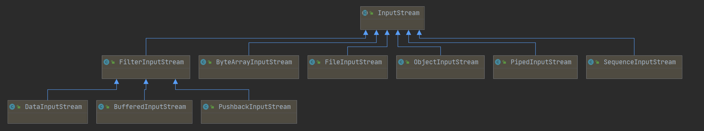
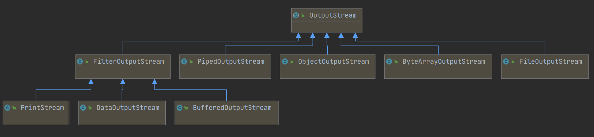

Java IO


File类，一个抽象类，表示文件或者文件夹。

流，按照输入输出可以划分为输入流和输出流。

按照读取的类型可以划分为字节流和字符流。

|        | 输入流      | 输出流       |
| ------ | ----------- | ------------ |
| 字符流 | Reader      | Writer       |
| 字节流 | InputStream | OutputStream |
|        |             |              |


InputStream

定义：所有字节输入流的抽象父类。

类图：




输入的来源可以有：

- 字节数组
- String对象
- 文件
- 管道
- 其他种类流的序列
- 其他数据源


OutputStream

定义：所有字节输出流的抽象父类。

类图：




OutputStream和InputStream基本是一一对应的。所以接下来试试

```java
public class DataStreamDemo {

    public static void main(String[] args) throws IOException {
        try (DataOutputStream dataOutputStream = new DataOutputStream(new FileOutputStream("data.txt"));) {

            dataOutputStream.writeBoolean(true);
            dataOutputStream.writeInt(1);
            dataOutputStream.writeChar('a');
            dataOutputStream.writeChars("testString");
            dataOutputStream.writeByte(2);
            dataOutputStream.writeBytes("123123");
            dataOutputStream.writeDouble(123D);
            dataOutputStream.writeFloat(123F);
            dataOutputStream.writeLong(123L);
        }
        try (DataInputStream dataInputStream = new DataInputStream(new FileInputStream("data.txt"));) {
            System.out.println(dataInputStream.readBoolean());
            System.out.println(dataInputStream.readInt());
            System.out.println(dataInputStream.readChar());
        }

    }
}
```
