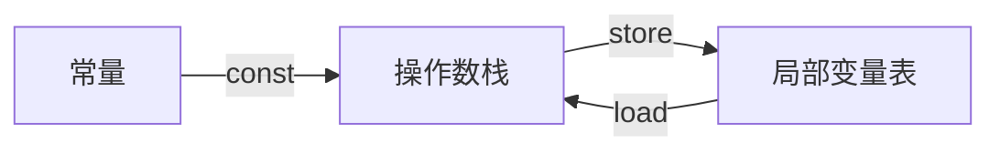

[oracle 文档](https://docs.oracle.com/javase/specs/jvms/se9/html/jvms-6.html)


## JVM数据类型

java是静态类型

字节码操作指令也被影响.

比如

- iadd
- ladd
- fadd
- dadd


定义的类型有

- 原始类型
  - byte
  - short
  - int
  - long
  - char
  - float
  - double
  - boolean被当作int处理
- 参考类型
  - class types
  - array types
  - interface types


## 基于栈的结构

基于栈所以让字节码指令比较简单,如果是基于寄存器就比较复杂.


PC register: 对于每个正在执行的java线程,PC寄存器存储了当前执行的指令


JVM stack:存储局部变量,方法参数,返回值


Heap:存储共享变量,比如Class的实例,数组的实例,这里也会有垃圾回收


Method area:对于每个加载的class,存储方法的代码,以及符号表,常量池


stack frames:调用方法入栈,方法结束出栈

- 局部变量
- 操作数栈,存储指令的操作数,或者中间变量


## 探索入门


### 简单语句

每个java文件都是由指令构成的

```java
opcode (1 byte)      operand1 (optional)      operand2 (optional)      ...	
```


指令可以对当前方法的栈帧的操作数栈或者局部变量数组操作

比如

```java
public static void main(String[] args) {
    int a = 1;
    int b = 2;
    int c = a + b;
}
```

使用javac编译

```
javac Test.java
```


使用javap命令查看字节码

```sh
javap -v Test.class
```

/* */ 的注释是我加的

得到

```shell
public static void main(java.lang.String[]);
    descriptor: ([Ljava/lang/String;)V
    flags: (0x0009) ACC_PUBLIC, ACC_STATIC
    Code:
      stack=2, locals=4, args_size=1
         0: iconst_1 /* 把常量加载到操作数栈 */
         1: istore_1 /* 把操作数栈栈顶的弹出到局部变量表*/
         2: iconst_2  /* 把常量2放到操作数栈顶 */
         3: istore_2
         4: iload_1
         5: iload_2
         6: iadd
         7: istore_3
         8: return
      LineNumberTable:
        line 4: 0
        line 5: 2
        line 6: 4
        line 7: 8
```




下标表示目标的位置


### 方法调用


```java
public class Test{

    public static void main(String[] args) {
        int a = 1;
        int b = 2;
        int c = calc(a, b);
    }

    static int calc(int a, int b) {
        return (int) Math.sqrt(Math.pow(a, 2) + Math.pow(b, 2));
    }
}
```

依旧

```sh
javac Test.java
javap -v Test.class
```

结果

```sh
Classfile /mnt/c/Users/qpzm7903/workspace/java/Test.class
  Last modified Oct 19, 2021; size 437 bytes
  MD5 checksum efc502eac68cdd2853c62959c285b292
  Compiled from "Test.java"
public class Test
  minor version: 0
  major version: 55
  flags: (0x0021) ACC_PUBLIC, ACC_SUPER
  this_class: #7                          // Test
  super_class: #8                         // java/lang/Object
  interfaces: 0, fields: 0, methods: 3, attributes: 1
Constant pool:
   #1 = Methodref          #8.#19         // java/lang/Object."<init>":()V
   #2 = Methodref          #7.#20         // Test.calc:(II)I
   #3 = Double             2.0d
   #5 = Methodref          #21.#22        // java/lang/Math.pow:(DD)D
   #6 = Methodref          #21.#23        // java/lang/Math.sqrt:(D)D
   #7 = Class              #24            // Test
   #8 = Class              #25            // java/lang/Object
   #9 = Utf8               <init>
  #10 = Utf8               ()V
  #11 = Utf8               Code
  #12 = Utf8               LineNumberTable
  #13 = Utf8               main
  #14 = Utf8               ([Ljava/lang/String;)V
  #15 = Utf8               calc
  #16 = Utf8               (II)I
  #17 = Utf8               SourceFile
  #18 = Utf8               Test.java
  #19 = NameAndType        #9:#10         // "<init>":()V
  #20 = NameAndType        #15:#16        // calc:(II)I
  #21 = Class              #26            // java/lang/Math
  #22 = NameAndType        #27:#28        // pow:(DD)D
  #23 = NameAndType        #29:#30        // sqrt:(D)D
  #24 = Utf8               Test
  #25 = Utf8               java/lang/Object
  #26 = Utf8               java/lang/Math
  #27 = Utf8               pow
  #28 = Utf8               (DD)D
  #29 = Utf8               sqrt
  #30 = Utf8               (D)D
{
  public Test();
    descriptor: ()V
    flags: (0x0001) ACC_PUBLIC
    Code:
      stack=1, locals=1, args_size=1
         0: aload_0
         1: invokespecial #1                  // Method java/lang/Object."<init>":()V
         4: return
      LineNumberTable:
        line 1: 0

  public static void main(java.lang.String[]);
    descriptor: ([Ljava/lang/String;)V
    flags: (0x0009) ACC_PUBLIC, ACC_STATIC
    Code:
      stack=2, locals=4, args_size=1
         0: iconst_1
         1: istore_1
         2: iconst_2
         3: istore_2
         4: iload_1
         5: iload_2
         6: invokestatic  #2                  // Method calc:(II)I
         9: istore_3
        10: return
      LineNumberTable:
        line 4: 0
        line 5: 2
        line 6: 4
        line 7: 10

  static int calc(int, int);
    descriptor: (II)I
    flags: (0x0008) ACC_STATIC
    Code:
      stack=6, locals=2, args_size=2
         0: iload_0
         1: i2d
         2: ldc2_w        #3                  // double 2.0d    
         5: invokestatic  #5                  // Method java/lang/Math.pow:(DD)D
         8: iload_1
         9: i2d
        10: ldc2_w        #3                  // double 2.0d
        13: invokestatic  #5                  // Method java/lang/Math.pow:(DD)D
        16: dadd
        17: invokestatic  #6                  // Method java/lang/Math.sqrt:(D)D
        20: d2i
        21: ireturn
      LineNumberTable:
        line 10: 0
}
```


```
i2d
```

把操作数栈顶的对象从int转为double


```
2: ldc2_w        #3                  // double 2.0d   
```

ldc2_w	将 long 或 do le 型常量值从常量池中推送至栈顶（宽索引）


```
6: invokestatic  #2    中的 #2 是个符号引用
```

行号表示这条命令的起始位置,下一条是它的终止位置.

所以基本都是一个字节,但是 invokestatic命令是3个字节


### 创建实例

源码

```java
public class Test {
    public static void main(String[] args) {
        Point a = new Point(1, 1);
        Point b = new Point(5, 3);
        int c = a.area(b);
    }
}

class Point {
    int x, y;

    Point(int x, int y) {
        this.x = x;
        this.y = y;
    }

    public int area(Point b) {
        int length = Math.abs(b.y - this.y);
        int width = Math.abs(b.x - this.x);
        return length * width;
    }
}
```

执行

```sh
javac Test.java  >>> Test.class Point.class
javap -v Test.class
```

输出

```sh
Classfile /mnt/c/Users/qpzm7903/workspace/java/Test.class
  Last modified Oct 19, 2021; size 350 bytes
  MD5 checksum f696785bccb50c6d010d115dcc0efba3
  Compiled from "Test.java"
public class Test
  minor version: 0
  major version: 55
  flags: (0x0021) ACC_PUBLIC, ACC_SUPER
  this_class: #5                          // Test
  super_class: #6                         // java/lang/Object
  interfaces: 0, fields: 0, methods: 2, attributes: 1
Constant pool:
   #1 = Methodref          #6.#15         // java/lang/Object."<init>":()V
   #2 = Class              #16            // Point
   #3 = Methodref          #2.#17         // Point."<init>":(II)V
   #4 = Methodref          #2.#18         // Point.area:(LPoint;)I
   #5 = Class              #19            // Test
   #6 = Class              #20            // java/lang/Object
   #7 = Utf8               <init>
   #8 = Utf8               ()V
   #9 = Utf8               Code
  #10 = Utf8               LineNumberTable
  #11 = Utf8               main
  #12 = Utf8               ([Ljava/lang/String;)V
  #13 = Utf8               SourceFile
  #14 = Utf8               Test.java
  #15 = NameAndType        #7:#8          // "<init>":()V
  #16 = Utf8               Point
  #17 = NameAndType        #7:#21         // "<init>":(II)V
  #18 = NameAndType        #22:#23        // area:(LPoint;)I
  #19 = Utf8               Test
  #20 = Utf8               java/lang/Object
  #21 = Utf8               (II)V
  #22 = Utf8               area
  #23 = Utf8               (LPoint;)I
{
  public Test();
    descriptor: ()V
    flags: (0x0001) ACC_PUBLIC
    Code:
      stack=1, locals=1, args_size=1
         0: aload_0
         1: invokespecial #1                  // Method java/lang/Object."<init>":()V
         4: return
      LineNumberTable:
        line 1: 0

  public static void main(java.lang.String[]);
    descriptor: ([Ljava/lang/String;)V
    flags: (0x0009) ACC_PUBLIC, ACC_STATIC
    Code:
      stack=4, locals=4, args_size=1
         0: new           #2                  // class Point
         3: dup
         4: iconst_1
         5: iconst_1
         6: invokespecial #3                  // Method Point."<init>":(II)V   这里消费操作数栈的三个值
         9: astore_1   // 实例引用赋值给局部变量
        10: new           #2                  // class Point
        13: dup
        14: iconst_5
        15: iconst_3
        16: invokespecial #3                  // Method Point."<init>":(II)V
        19: astore_2
        20: aload_1
        21: aload_2
        22: invokevirtual #4                  // Method Point.area:(LPoint;)I
        25: istore_3
        26: return
      LineNumberTable:
        line 3: 0
        line 4: 10
        line 5: 20
        line 6: 26
}
SourceFile: "Test.java"
```


new

创建指定的实例, 实例在heap上, 操作数栈上放的是引用

dup

复制栈顶元素, 也就是栈顶前两个都是new出来的对象的引用

invokespecial

调用实例的初始化函数


invokevirtual

基于实际类型分派方法调用


### 其他

并不需要掌握所有的指令,知道基本结构, 现查现用即可


## 一些

https://github.com/jon-bell/bytecode-examples


## 一些好用的用于操作字节码的库

[asmtools](https://wiki.openjdk.java.net/display/CodeTools/asmtools) - 用于生产环境的 Java .class 文件开发工具。

[Byte Buddy](http://bytebuddy.net/) - 代码生成库：运行时创建 Class 文件而不需要编译器帮助。

[Jitescript](https://github.com/qmx/jitescript) - 和 BiteScript 类似的字节码生成库。

[javassist](http://www.javassist.org/) - Javassist (Java Programming Assistant) makes Java bytecode manipulation simple


## Java agent

运行时可以进行各种动态的代码修改，而且可以进行无侵入的编程。

retransformed or redefined class bytecode

java标准库没有提供修改字节码的api，但是又很多开源的库提供了。

### 入门参考

https://stackoverflow.com/questions/11898566/tutorials-about-javaagents

描述性文档 https://docs.oracle.com/javase/1.5.0/docs/api/java/lang/instrument/package-summary.html

https://www.javamex.com/tutorials/memory/instrumentation.shtml


```java
import java.lang.instrument.Instrumentation;

class Agent{
    public static void premain(String args, Instrumentation inst) {
            System.out.println("hello from agent");
            System.out.println("args is " + args);
            System.out.println("inst is " + inst);
    }
}
```


premain.txt

```
Premain-Class: Agent
```


执行

```sh

javac Agent.java
jar cmf premain.txt agent.jar Agent.class
java -javaagent:Agent.jar -jar App.jar
>>>
hello from agent
args is null
inst is sun.instrument.InstrumentationImpl@548c4f57
hello world
```


详细参考

https://www.javacodegeeks.com/2015/09/java-agents.html


### Instrumentation

用于实现java agent，premain函数执行后，才会执行main


### demo应用 - 捕捉所有http链接的url

很多情况下第三方组件里面的代码无法修改，所以看通过代理这种动态修改字节码的方式做


