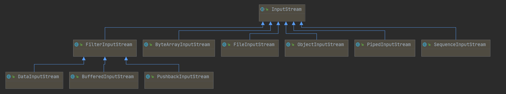
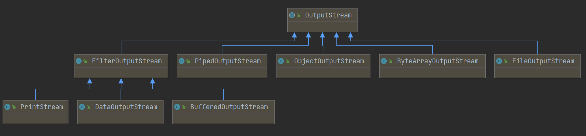

Java IO
#java-io
#nio 
#io 


# IO


File类，一个抽象类，表示文件或者文件夹。

流，按照输入输出可以划分为输入流和输出流。

按照读取的类型可以划分为字节流和字符流。

|        | 输入流      | 输出流       |
| ------ | ----------- | ------------ |
| 字符流 | Reader      | Writer       |
| 字节流 | InputStream | OutputStream |
|        |             |              |


InputStream

定义：所有字节输入流的抽象父类。

类图：




输入的来源可以有：

- 字节数组
- String对象
- 文件
- 管道
- 其他种类流的序列
- 其他数据源


OutputStream

定义：所有字节输出流的抽象父类。

类图：




OutputStream和InputStream基本是一一对应的。所以接下来试试

```java
public class DataStreamDemo {

    public static void main(String[] args) throws IOException {
        try (DataOutputStream dataOutputStream = new DataOutputStream(new FileOutputStream("data.txt"));) {

            dataOutputStream.writeBoolean(true);
            dataOutputStream.writeInt(1);
            dataOutputStream.writeChar('a');
            dataOutputStream.writeChars("testString");
            dataOutputStream.writeByte(2);
            dataOutputStream.writeBytes("123123");
            dataOutputStream.writeDouble(123D);
            dataOutputStream.writeFloat(123F);
            dataOutputStream.writeLong(123L);
        }
        try (DataInputStream dataInputStream = new DataInputStream(new FileInputStream("data.txt"));) {
            System.out.println(dataInputStream.readBoolean());
            System.out.println(dataInputStream.readInt());
            System.out.println(dataInputStream.readChar());
        }

    }
}
```


# NIO

Java NIO 由  channel、buffer、slector组成

channel就是数据通道
buffer和channel之间进行数据读写


## channel


channel是什么，是一个通道，可以连接到一些io设备，比如硬件、文件、网络socket、或者程序

步骤：
- 获取channel
- 将channel的数据读取到buffer
- 读取buffer里的数据

例如
```java
public static void main(String[] args) {  
    System.out.println("Working Directory = " + System.getProperty("user.dir"));  
    try (RandomAccessFile file = new RandomAccessFile("data/test.txt", "rw")) {  
        FileChannel channel = file.getChannel();  
        ByteBuffer buffer = ByteBuffer.allocate(24);  
        int read = channel.read(buffer);  
        while (read != -1) {  
            // change to read mode  
            buffer.flip();  
            while (buffer.hasRemaining()) {  
                System.out.print((char) buffer.get());  
            }  
            // change to write mode  
            buffer.clear();  
            read = channel.read(buffer);  
        }  
  
    } catch (IOException e) {  
        throw new RuntimeException(e);  
    }  
}
```

## buffer
一块连续的内存，封装好，提供对应的方法
buffer是单通道，也就是同一时刻，只能里面读取数据，或者向里面写数据。

buffer有几个属性
- capacity 容量
- position
	- read
		- 表示读取到的位置
		- position <= limit < capacity - 1
	- write
		- 表示写入的位置
		- position <= capacity - 1
- limit
	- read
		- 表示读取的限制，等于上次写入的位置
	- write
		- 表示写入的限制，等于capacity
- mark


## Selector
选择器，channel可以注册到selector上，并注册相关的事件。

当channel上对应的事件发生时，selector就可以感知到。

通常是在一个线程里不断的循环获取selector上注册、并触发事件的channel，从channel中获取数据。例如下面打开个socketChannel。

```java
public static void main(String[] args) throws IOException {  
  
  
    Selector selector = Selector.open();  
    ServerSocketChannel serverSocketChannel = ServerSocketChannel.open();  
    serverSocketChannel.configureBlocking(false);  
    serverSocketChannel.bind(new InetSocketAddress("localhost", 9090));  
    serverSocketChannel.register(selector, SelectionKey.OP_ACCEPT);  
    // see java doc , selector.select() will block util at least one channel is selected  
  
    while (selector.select() > 0) {  
        Iterator<SelectionKey> iterator = selector.selectedKeys().iterator();  
        while (iterator.hasNext()) {  
            SelectionKey selectionKey = iterator.next();  
            if (selectionKey.isAcceptable()) {  
                SocketChannel socketChannel = serverSocketChannel.accept();  
                socketChannel.configureBlocking(false);  
                // one selector can register with many channel  
                socketChannel.register(selector, SelectionKey.OP_READ);  
  
  
            } else if (selectionKey.isReadable()) {  
                SocketChannel channel = (SocketChannel) selectionKey.channel();  
                ByteBuffer buffer = ByteBuffer.allocate(1024);  
                int length = 0;  
                while ((length = channel.read(buffer)) > 0) {  
                    // change to read mode  
                    buffer.flip();  
                    extracted(new String(buffer.array(), 0, length));  
                    // change to write mode  
                    buffer.clear();  
                }  
                channel.close();  
            }  
			// when process complete , should remove it
            iterator.remove();  
  
        }  
    }  
}
```

# NIO

# NIO SocketChannel
连接socket的一种channel，

## NIO File


# NIO 和 IO 有什么区别

面向
-  NIO是面向buffer，buffer是可以随意操作的
-  IO是面向流，流只能不断往前，不能回退


阻塞、非阻塞
-  NIO是非阻塞的
- IO是阻塞的


[ref](https://jenkov.com/tutorials/java-nio/nio-vs-io.html)


# NIO2
#NIO2

NIO2和NIO有区别？NIO2是异步的，NIO是同步的。
区别在于是用户线程主动去获取数据，还是通过注册回调的方式，让OS去写入数据。

# ref

[oracle - doc](https://docs.oracle.com/en/java/javase/18/core/java-core-libraries1.html)
[美团 IO文章](https://zhuanlan.zhihu.com/p/23488863)