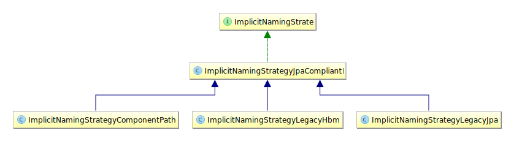

# JPA

jpa是什么？

https://docs.jboss.org/hibernate/jpa/2.2/api/overview-summary.html


# 入门 hibernate

### 使用原生的hibernate API--基于配置文件

声明在resource目录下，文件名为hibernate.cfg.xml

里面配置数据库相关配置，以及mapping文件，mapping文件和mybatis的的resultMap有点像，就是关于一个java对象和数据库表字段的映射关系。

比如官方提供的入门文档的例子是：

```xml
<hibernate-mapping package="org.hibernate.tutorial.hbm">

    <class name="Event" table="EVENTS">
        <id name="id" column="EVENT_ID">
            <generator class="increment"/>
        </id>
        <property name="date" type="timestamp" column="EVENT_DATE"/>
        <property name="title"/>
    </class>

</hibernate-mapping>
```


有了模型、hibernate配置文件，mapping文件，就可以使用hibernate去操作数据库了。

首先读取配置文件，然后得到一个SessionFacotry，类似于要获取一个Mybatis的SessionFacotry，里面都封装了对jdbc 的connection的操作。

```java
StandardServiceRegistry registry = new StandardServiceRegistryBuilder()
				.configure() // configures settings from hibernate.cfg.xml
				.build();
sessionFactory = new MetadataSources( registry ).buildMetadata().buildSessionFactory();
```

获取sessionFacotry后，工厂模式自然是提供对应的类，也就是session，然后用session将实例化的模型纳入hibernate的管理。同样前后要开启事务、关闭事务。

```java
Session session = sessionFactory.openSession();
		session.beginTransaction();
		session.save( new Event( "Our very first event!", new Date() ) );
		session.save( new Event( "A follow up event", new Date() ) );
		session.getTransaction().commit();
		session.close();
```


查询的时候需要写点类似sql的东西，比较接近面向对象的方式。

```java
session = sessionFactory.openSession();
		session.beginTransaction();
		List result = session.createQuery( "from Event" ).list();
		for ( Event event : (List<Event>) result ) {
			System.out.println( "Event (" + event.getDate() + ") : " + event.getTitle() );
		}
		session.getTransaction().commit();
		session.close();
```


### 使用原生的hibernate API--基于注解

**类**

```JAVA
@Entity
@Table( name = "EVENTS" )
public class Event {
    ...
}
```

`@javax.persistence.Entity`注解标识一个entity

`@javax.persistence.Table`显式声明表名称，如果没有，就和类名相同

**属性**

```JAVA
@Id
@GeneratedValue(generator="increment")
@GenericGenerator(name="increment", strategy = "increment")
public Long getId() {
    return id;
}
```

`@javax.persistence.Id`主键

`@javax.persistence.GeneratedValue`


### 基于JPA Java Persistence API

1、资源路径下声明配置META-INF\persistence.xml

内容为

```xml
<persistence-unit name="a unique name">
    <description>
        Persistence unit for the JPA tutorial of the Hibernate Getting Started Guide
    </description>

    <class>org.hibernate.tutorial.em.Event</class>

    <properties>
        <property name="javax.persistence.jdbc.driver" value="org.h2.Driver" />
        <property name="javax.persistence.jdbc.url" value="jdbc:h2:mem:db1;DB_CLOSE_DELAY=-1;MVCC=TRUE" />
        <property name="javax.persistence.jdbc.user" value="sa" />
        <property name="javax.persistence.jdbc.password" value="" />

        <property name="hibernate.show_sql" value="true" />
        <property name="hibernate.hbm2ddl.auto" value="create" />
    </properties>

</persistence-unit>
```


**疑问：如果class有多个呢？**


2、获取EntityManagerFactory

```java
EntityManagerFactory entityManagerFactory = Persistence.createEntityManagerFactory( "a unique name" );
```

3、使用factory获取entityManager

```java
EntityManager entityManager = entityManagerFactory.createEntityManager();
```

4、使用entityManager去persist和query

entityManager就类似于session一样，可以开启事务、关闭，查询，获取结果集。


### 参考

[官方入门文档](https://docs.jboss.org/hibernate/orm/5.4/quickstart/html_single/#preface)

# hibernate  user guide

## 1、架构


`SessionFactory `

线程安全、并且创建开销很大。EntityManagerFactory和SessionFactory等价。

`Session`

单线程、短周期的工作单元，在JPA中对应的是EntityManager。

Hibernate的Session封装了JDBC的connection，同时是Transaction的Factory，维护了可重复读的上下文。

`Transaction`

单线程、短周期的事物控制对象。


## 2、领域模型

类似Java bean，POJO

### 2.1映射类型

分为value type 和 entity type。


```java
@Entity(name = "Contact")
public static class Contact {

	@Id
	private Integer id;

	private Name name;

	private String notes;

	private URL website;

	private boolean starred;

	//Getters and setters are omitted for brevity
}

@Embeddable
public class Name {

	private String first;

	private String middle;

	private String last;

	// getters and setters omitted
}
```

自动建立的表是：

```sql
-- auto-generated definition
create table contact
(
    id      int          not null
        primary key,
    first   varchar(255) null,
    last    varchar(255) null,
    middle  varchar(255) null,
    notes   varchar(255) null,
    starred bit          not null,
    website varchar(255) null
);
```


#### 2.1.1 Value type

entity里面的属性就是值类型

分为

1. Basic type
2. Embeddable types
3. collection types

#### 2.1.2 entity type


### 2.2 naming strategies

两阶段处理

1. 显示的注解，或者隐式的策略
2. 物理命名策略


#### 2.2.1 隐式命名策略



当没有显示命名的时候就会触发。


#### 2.2.2 PhysicalNamingStrategy

自定义规则来的。


### 2.3 Basic type


#### 2.3.1 hibernate提供的类型


##### **标准类型**

| Hibernate type (org.hibernate.type package) | JDBC type                                                    | Java type                              | BasicTypeRegistry key(s)                                     |
| :------------------------------------------ | :----------------------------------------------------------- | :------------------------------------- | :----------------------------------------------------------- |
| StringType                                  | VARCHAR                                                      | java.lang.String                       | string, java.lang.String                                     |
| MaterializedClob                            | CLOB                                                         | java.lang.String                       | materialized_clob                                            |
| TextType                                    | LONGVARCHAR                                                  | java.lang.String                       | text                                                         |
| CharacterType                               | CHAR                                                         | char, java.lang.Character              | character, char, java.lang.Character                         |
| BooleanType                                 | BOOLEAN                                                      | boolean, java.lang.Boolean             | boolean, java.lang.Boolean                                   |
| NumericBooleanType                          | INTEGER, 0 is false, 1 is true                               | boolean, java.lang.Boolean             | numeric_boolean                                              |
| YesNoType                                   | CHAR, 'N'/'n' is false, 'Y'/'y' is true. The uppercase value is written to the database. | boolean, java.lang.Boolean             | yes_no                                                       |
| TrueFalseType                               | CHAR, 'F'/'f' is false, 'T'/'t' is true. The uppercase value is written to the database. | boolean, java.lang.Boolean             | true_false                                                   |
| ByteType                                    | TINYINT                                                      | byte, java.lang.Byte                   | byte, java.lang.Byte                                         |
| ShortType                                   | SMALLINT                                                     | short, java.lang.Short                 | short, java.lang.Short                                       |
| IntegerType                                 | INTEGER                                                      | int, java.lang.Integer                 | integer, int, java.lang.Integer                              |
| LongType                                    | BIGINT                                                       | long, java.lang.Long                   | long, java.lang.Long                                         |
| FloatType                                   | FLOAT                                                        | float, java.lang.Float                 | float, java.lang.Float                                       |
| DoubleType                                  | DOUBLE                                                       | double, java.lang.Double               | double, java.lang.Double                                     |
| BigIntegerType                              | NUMERIC                                                      | java.math.BigInteger                   | big_integer, java.math.BigInteger                            |
| BigDecimalType                              | NUMERIC                                                      | java.math.BigDecimal                   | big_decimal, java.math.bigDecimal                            |
| TimestampType                               | TIMESTAMP                                                    | java.util.Date                         | timestamp, java.sql.Timestamp, java.util.Date                |
| DbTimestampType                             | TIMESTAMP                                                    | java.util.Date                         | dbtimestamp                                                  |
| TimeType                                    | TIME                                                         | java.util.Date                         | time, java.sql.Time                                          |
| DateType                                    | DATE                                                         | java.util.Date                         | date, java.sql.Date                                          |
| CalendarType                                | TIMESTAMP                                                    | java.util.Calendar                     | calendar, java.util.Calendar, java.util.GregorianCalendar    |
| CalendarDateType                            | DATE                                                         | java.util.Calendar                     | calendar_date                                                |
| CalendarTimeType                            | TIME                                                         | java.util.Calendar                     | calendar_time                                                |
| CurrencyType                                | VARCHAR                                                      | java.util.Currency                     | currency, java.util.Currency                                 |
| LocaleType                                  | VARCHAR                                                      | java.util.Locale                       | locale, java.util.Locale                                     |
| TimeZoneType                                | VARCHAR, using the TimeZone ID                               | java.util.TimeZone                     | timezone, java.util.TimeZone                                 |
| UrlType                                     | VARCHAR                                                      | java.net.URL                           | url, java.net.URL                                            |
| ClassType                                   | VARCHAR (class FQN)                                          | java.lang.Class                        | class, java.lang.Class                                       |
| BlobType                                    | BLOB                                                         | java.sql.Blob                          | blob, java.sql.Blob                                          |
| ClobType                                    | CLOB                                                         | java.sql.Clob                          | clob, java.sql.Clob                                          |
| BinaryType                                  | VARBINARY                                                    | byte[]                                 | binary, byte[]                                               |
| MaterializedBlobType                        | BLOB                                                         | byte[]                                 | materialized_blob                                            |
| ImageType                                   | LONGVARBINARY                                                | byte[]                                 | image                                                        |
| WrapperBinaryType                           | VARBINARY                                                    | java.lang.Byte[]                       | wrapper-binary, Byte[], java.lang.Byte[]                     |
| CharArrayType                               | VARCHAR                                                      | char[]                                 | characters, char[]                                           |
| CharacterArrayType                          | VARCHAR                                                      | java.lang.Character[]                  | wrapper-characters, Character[], java.lang.Character[]       |
| UUIDBinaryType                              | BINARY                                                       | java.util.UUID                         | uuid-binary, java.util.UUID                                  |
| UUIDCharType                                | CHAR, can also read VARCHAR                                  | java.util.UUID                         | uuid-char                                                    |
| PostgresUUIDType                            | PostgreSQL UUID, through Types#OTHER, which complies to the PostgreSQL JDBC driver definition | java.util.UUID                         | pg-uuid                                                      |
| SerializableType                            | VARBINARY                                                    | implementors of java.lang.Serializable | Unlike the other value types, multiple instances of this type are registered. It is registered once under java.io.Serializable, and registered under the specific java.io.Serializable implementation class names. |
| StringNVarcharType                          | NVARCHAR                                                     | java.lang.String                       | nstring                                                      |
| NTextType                                   | LONGNVARCHAR                                                 | java.lang.String                       | ntext                                                        |
| NClobType                                   | NCLOB                                                        | java.sql.NClob                         | nclob, java.sql.NClob                                        |
| MaterializedNClobType                       | NCLOB                                                        | java.lang.String                       | materialized_nclob                                           |
| PrimitiveCharacterArrayNClobType            | NCHAR                                                        | char[]                                 | N/A                                                          |
| CharacterNCharType                          | NCHAR                                                        | java.lang.Character                    | ncharacter                                                   |
| CharacterArrayNClobType                     | NCLOB                                                        | java.lang.Character[]                  | N/A                                                          |
| RowVersionType                              | VARBINARY                                                    | byte[]                                 | row_version                                                  |
| ObjectType                                  | VARCHAR                                                      | implementors of java.lang.Serializable | object, java.lang.Object                                     |

##### Java8基础类型

| Hibernate type (org.hibernate.type package) | JDBC type | Java type                | BasicTypeRegistry key(s)                 |
| :------------------------------------------ | :-------- | :----------------------- | :--------------------------------------- |
| DurationType                                | BIGINT    | java.time.Duration       | Duration, java.time.Duration             |
| InstantType                                 | TIMESTAMP | java.time.Instant        | Instant, java.time.Instant               |
| LocalDateTimeType                           | TIMESTAMP | java.time.LocalDateTime  | LocalDateTime, java.time.LocalDateTime   |
| LocalDateType                               | DATE      | java.time.LocalDate      | LocalDate, java.time.LocalDate           |
| LocalTimeType                               | TIME      | java.time.LocalTime      | LocalTime, java.time.LocalTime           |
| OffsetDateTimeType                          | TIMESTAMP | java.time.OffsetDateTime | OffsetDateTime, java.time.OffsetDateTime |
| OffsetTimeType                              | TIME      | java.time.OffsetTime     | OffsetTime, java.time.OffsetTime         |
| ZonedDateTimeType                           | TIMESTAMP | java.time.ZonedDateTime  | ZonedDateTime, java.time.ZonedDateTime   |

##### hibernate特别基础类型

| Hibernate type (org.hibernate.spatial package) | JDBC type              | Java type                            | BasicTypeRegistry key(s)                                     |
| :--------------------------------------------- | :--------------------- | :----------------------------------- | :----------------------------------------------------------- |
| JTSGeometryType                                | depends on the dialect | com.vividsolutions.jts.geom.Geometry | jts_geometry, and the class names of Geometry and its subclasses |
| GeolatteGeometryType                           | depends on the dialect | org.geolatte.geom.Geometry           | geolatte_geometry, and the class names of Geometry and its subclasses |


#### 2.3.2 @Basic 注解

可忽略

Basic定义了两个基础属性，

`optional` - boolean (defaults to true)，非基础类型默认nullable

`fetch` - FetchType (defaults to EAGER)，默认实时加载


#### 2.2.3 @Column注解

可定义列明，隐式列名为字段名。比如

```java
@Entity
public class TestEntity {

    @Id
    private int id;

    private String testName;

    @Column(name = "testC")
    private String testF;

}
```

会生成这样的表

```sql
-- auto-generated definition
create table test_entity
(
    id        int          not null
        primary key,
    testc     varchar(255) null,
    test_name varchar(255) null
);
```


其他属性。。


#### 2.3.4 基础类型注册

字段的类型是怎么映射的


#### 2.3.5 显式类型

```JAVA
@org.hibernate.annotations.Type(type="XXX")
```

支持

1. org.hibernate.type.Type实现的全名
2. 类型注册中的类型
3. 已知的类型定义


#### 2.3.6 自定义基本类型


跳


### 2.5 Entity Type

单一标识符

组合标识符

自增

序列

UUID

自定义生成器


### 2.6. Identifiers


### 2.7 关联

#### 2.7.1 @MantToOne

最常见，数据库中又外键这样的机制直接挂钩。

比如这样的Entity

```java
@Entity(name = "Person")
public static class Person {

	@Id
	@GeneratedValue
	private Long id;

	//Getters and setters are omitted for brevity

}

@Entity(name = "Phone")
public static class Phone {

	@Id
	@GeneratedValue
	private Long id;

	@Column(name = "`number`")
	private String number;

	@ManyToOne
	@JoinColumn(name = "person_id",
			foreignKey = @ForeignKey(name = "PERSON_ID_FK")
	)
	private Person person;

	//Getters and setters are omitted for brevity

}
```

会自动建立这样的表结构

```sql
CREATE TABLE Person (
    id BIGINT NOT NULL ,
    PRIMARY KEY ( id )
)

CREATE TABLE Phone (
    id BIGINT NOT NULL ,
    number VARCHAR(255) ,
    person_id BIGINT ,
    PRIMARY KEY ( id )
 )

ALTER TABLE Phone
ADD CONSTRAINT PERSON_ID_FK
FOREIGN KEY (person_id) REFERENCES Person
```

创建phone的时候，可以传入一个已存在的person进行关联，也可以不传。或者将一个已存在的person设置到已存在的phone里进行关联。


#### 2.7.2. `@OneToMany`

建立类似父子的关系。

单向：如果OneToMany的另一端没有和这一段建立ManyToOne的关系

双向：如果另一端和这一端有ManyToOne的关系


##### **单向**

Only the parent side of an association makes sense to cascade its entity state transitions to children.

只有关联的父方才有意义将其实体状态转换级联到子级。

会新建表来承载关系。

**父项**

```java
@Entity
@Data
public class Person {
    @Id
    @GeneratedValue
    private Long id;

    @OneToMany(cascade = CascadeType.ALL, orphanRemoval = true)
    private List<House> houseList = new ArrayList<>();

    private String name;

}
```

**子项**

```java
@Entity
@Data
public class House {
    @Id
    @GeneratedValue
    private Long id;

    private String address;
}
```

**表结构**

```java
create table person_house_list
(
    person_id     bigint not null,
    house_list_id bigint not null,
    constraint UK_9btyqqjboh9nv7qxkb4aed8gr
        unique (house_list_id),
    constraint FK9ec1negmqeucmkptq4ctjke21
        foreign key (house_list_id) references house (id),
    constraint FKrcuvdn3b7ad7thq9i0me4okew
        foreign key (person_id) references person (id)
);
```


父会级联创建（cascade = CascadeType.ALL）、删除子（orphanRemoval=true)。


```json
{
    "name": "12",
    "houseList": [
        {
            "address": "12"
        }
    ]
}
```

这样构造一个person，持久化的时候，hibernate会持久化person和一个house，以及在关系表上建立关系。


##### **双向**

只有外键承载关系。

**父**

```java
@Entity
@Data
public class Person {
    @Id
    @GeneratedValue
    private Long id;

    @OneToMany(cascade = CascadeType.ALL, orphanRemoval = true)
    private List<House> houseList = new ArrayList<>();

    private String name;

    @OneToMany(mappedBy = "person", cascade = CascadeType.ALL, orphanRemoval = true)
    private List<Phone> phones = new ArrayList<>();
}
```


**子**

```java
@Data
@Entity
public class Phone {
    @Id
    @GeneratedValue
    private Long id;

    @Column(name = "`number`")
    private String number;

    @ManyToOne
    private Person person;
}
```

这个时候phone的表结构是

```sql
create table phone
(
    id        bigint       not null
        primary key,
    number    varchar(255) null,
    person_id bigint       null,
    constraint FKkk6uij3j6wikpnqlj9dymobs9
        foreign key (person_id) references person (id)
);
```


这个时候，传入

```json
{
    "name": "12",
    "houseList": [
        {
            "address": "12"
        }
    ],
    "phones": [
        {
            "number": "12"
        }
    ]
}
```

然后给phones里面的每个phone的person都设置person的引用。然后持久化的时候，会在Phone的person_id上记录这个id。但是在持久化后返回的person对象中，需要将phone对于person的引用去掉，不然的话序列化会失败，因为会一直循环。

这个时候返回的结果是

```json
{
    "id": 1,
    "houseList": [
        {
            "id": 2,
            "address": "12"
        }
    ],
    "name": "12",
    "phones": [
        {
            "id": 3,
            "number": "12",
            "person": null
        }
    ]
}
```


### 2.8. Collections


### 2.9. Natural Ids


### 2.10. Dynamic Model


### 2.11. Inheritance


### 2.12. Immutability


#### 参考


https://docs.jboss.org/hibernate/orm/5.4/userguide/html_single/Hibernate_User_Guide.html

# spring jpa


### 使用mysql8


```properties
spring.jpa.hibernate.ddl-auto=update
spring.datasource.url=jdbc:mysql://${MYSQL_HOST:localhost}:3306/jpa_test
spring.datasource.username=root
spring.datasource.password=admin
```


### 错误1

Access to DialectResolutionInfo cannot be null when 'hibernate.dialect' not set

于是增加配置

```properties
spring.jpa.database-platform=org.hibernate.dialect.MySQL8Dialect
```


### 错误2

InvalidConnectionAttributeException: The server time zone value '�й���׼ʱ��' is unrecognized or represents more than one time zone. You must configure either the server or JDBC driver (via the 'serverTimezone' configuration property) to use a more specifc time zone value if you want to utilize time zone support

修改配置

```properties
spring.datasource.url=jdbc:mysql://${MYSQL_HOST:localhost}:3306/jpa_test?characterEncoding=UTF-8&serverTimezone=UTC
```

于是启动正常


错误3

log出现多个

SLF4J: Class path contains multiple SLF4J bindings.
SLF4J: Found binding in [jar:file:/D:/software/maven/repository/ch/qos/logback/logback-classic/1.2.3/logback-classic-1.2.3.jar!/org/slf4j/impl/StaticLoggerBinder.class]
SLF4J: Found binding in [jar:file:/D:/software/maven/repository/org/slf4j/slf4j-log4j12/1.6.1/slf4j-log4j12-1.6.1.jar!/org/slf4j/impl/StaticLoggerBinder.class]
SLF4J: See http://www.slf4j.org/codes.html#multiple_bindings for an explanation.
SLF4J: Actual binding is of type [ch.qos.logback.classic.util.ContextSelectorStaticBinder]


