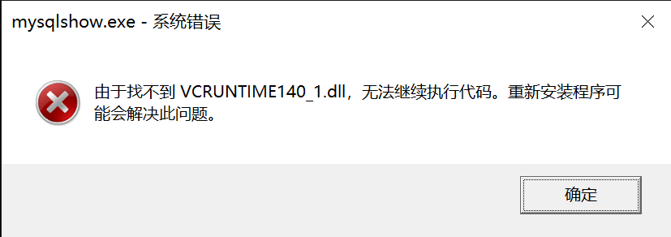

# MySQL8

[下载](https://dev.mysql.com/downloads/mysql/)

[文档](https://dev.mysql.com/doc/)

## windows10下安装

步骤

1. Extract the main archive to the desired install directory

   *Optional*: also extract the debug-test archive if you plan to execute the MySQL benchmark and test suite

2. Create an option file

3. Choose a MySQL server type

4. Initialize MySQL

5. Start the MySQL server

6. Secure the default user accounts


### 1、解压

### 2、在解压目录增加my.ini文件

#### 2.1、文件里面写

```ini
[mysqld]
# set basedir to your installation path
basedir=D:\\software\\databse\\mysql\\mysql-8.0.20-winx64
# set datadir to the location of your data directory
datadir=D:\\software\\databse\\mysql\\mysql-8.0.20-winx64\\data
```

注意windows里面路径要么写 /  要么写 \\\\ 

### 3、选择类型？？

### 4、初始化

mysqld --install

把bin目录添加到系统变量Path中


问题：用powershell一直没反应，切换到cmd，提示



一搜，发现需要安装

https://www.microsoft.com/zh-CN/download/details.aspx?id=52685

https://support.microsoft.com/en-gb/help/2977003/the-latest-supported-visual-c-downloads

安装后输入

mysqlshow提示

`mysqlshow: Can't connect to MySQL server on 'localhost' (10061)`


mysqld --console 提示

```log
2020-06-22T15:05:00.421786Z 0 [System] [MY-010116] [Server] D:\software\databse\mysql\mysql-8.0.20-winx64\bin\mysqld.exe (mysqld 8.0.20) starting as process 6736
2020-06-22T15:05:00.422530Z 0 [ERROR] [MY-010338] [Server] Can't find error-message file 'D:\software\databse\mysql\mysql-8.0.20-winx64\bin\ oftware\databse\mysql\mysql-8.0.20-winx64\share\errmsg.sys'. Check error-message file location and 'lc-messages-dir' configuration directive.
2020-06-22T15:05:00.429993Z 0 [Warning] [MY-010091] [Server] Can't create test file D: oftware\databse\mysql\mysql-8.0.20-winx64\data\mysqld_tmp_file_case_insensitive_test.lower-test
2020-06-22T15:05:00.430050Z 0 [Warning] [MY-010091] [Server] Can't create test file D: oftware\databse\mysql\mysql-8.0.20-winx64\data\mysqld_tmp_file_case_insensitive_test.lower-test
2020-06-22T15:05:00.430719Z 0 [ERROR] [MY-013276] [Server] Failed to set datadir to 'D: oftware\databse\mysql\mysql-8.0.20-winx64\data\' (OS errno: 2 - No such file or directory)
2020-06-22T15:05:00.432533Z 0 [ERROR] [MY-010119] [Server] Aborting
2020-06-22T15:05:00.435963Z 0 [System] [MY-010910] [Server] D:\software\databse\mysql\mysql-8.0.20-winx64\bin\mysqld.exe: Shutdown complete (mysqld 8.0.20)  MySQL Community Server - GPL.
```

把data目录放到了mysql目录之外，提示

```
2020-06-22T15:08:56.668297Z 0 [System] [MY-010116] [Server] D:\software\databse\mysql\mysql-8.0.20-winx64\bin\mysqld.exe (mysqld 8.0.20) starting as process 6864
2020-06-22T15:08:56.688195Z 1 [ERROR] [MY-011011] [Server] Failed to find valid data directory.
2020-06-22T15:08:56.688627Z 0 [ERROR] [MY-010020] [Server] Data Dictionary initialization failed.
2020-06-22T15:08:56.688850Z 0 [ERROR] [MY-010119] [Server] Aborting
2020-06-22T15:08:56.689438Z 0 [System] [MY-010910] [Server] D:\software\databse\mysql\mysql-8.0.20-winx64\bin\mysqld.exe: Shutdown complete (mysqld 8.0.20)  MySQL Community Server - GPL.
```


因为，没执行安装命令

mysqld --install

 mysqld --initialize --console

于是提示

```
2020-06-22T15:18:05.962357Z 0 [System] [MY-013169] [Server] D:\software\databse\mysql\mysql-8.0.20-winx64\bin\mysqld.exe (mysqld 8.0.20) initializing of server in progress as process 8352
2020-06-22T15:18:05.973473Z 1 [System] [MY-013576] [InnoDB] InnoDB initialization has started.
2020-06-22T15:18:06.730484Z 1 [System] [MY-013577] [InnoDB] InnoDB initialization has ended.
2020-06-22T15:18:08.551178Z 6 [Note] [MY-010454] [Server] A temporary password is generated for root@localhost: N27m-&R0rmfy
```

### 5、启动

`net start mysql`

### 6、连接

mysql -u roo -p  回车

然后输入密码

进入后修改密码

```sql
ALTER USER 'root'@'localhost' identified with mysql_native_password by 'admin';
```


## 参考

https://zhuanlan.zhihu.com/p/75891315