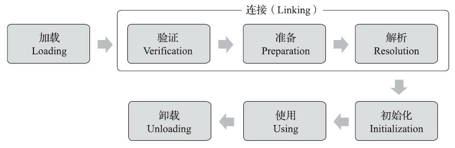

## 1、Algorithm

> 每周至少做一个 leetcode 的算法题


## 2、Review

> 阅读并点评至少一篇英文技术文章


## 3、Tip

> 学习至少一个技术技巧

Java类加载器

**类加载器要加载什么？**

通过一个类的全限定名来获取类的二进制字节流 ----- 二进制字节流的来源有多种。--所以加载的时类的二进制字节流。


**可以指定吗？**

通过类的全限定名来指定

**类加载后得到的是什么？**

加载后，将其字节流代表的静态存储结构存到方法区中的运行时数据结构，并且在内存中生成一个代表这个类的java.lang.Class对象，作为方法去这个类的各种数据的访问入口

**存储在哪里？**

方法区

**怎么访问?**

得到对应的java.lang.Class对象，可以用class对象类实例化操作等

**什么时候加载？**

启动时类加载器会加载，运行时也可以自行调用类加载器加载指定的类。


1. 任意一个类，必须由加载它的类加载器和这个类本身一起共同确立其在Java虚拟机中的唯一性，每一个类加载器，都有一个独立的类命名空间

   1. 唯一性的判断，可以用 instanceof、equals、isAssignableFrom、isInstance

   2. example 

   3. ```java
      
      ```

   4. 


**类型的生命周期**




**什么情况下会初始化？**

1. 遇到new getstatic、putstatic、invokestatic四条字节码指令，如果没有初始化过，就要初始化
   1. new 对象实例化
   2. 读取或者设置一个类型的静态字段（被final修饰，编译期已经吧结果放到常量池的除外）
   3. 调用静态方法的时候
2. 使用java.lang.reflect对类型进行反射调用的时候
3. 类初始化过程中，如果父没有初始化，就会触发父类的初始化
4. 虚拟机启动的时候，需要执行一个main函数在的类，会初始化这个类
5. JDK7中，java.lang.invoke.MethodHandle示例最后的解析结果为xxxx时，会触发
6. JDK8的接口中，如果定义默认方法，如果这个接口的实现类初始化，那么这个接口要在实现类之前初始化

双亲委派模型

加载类的时候，先让自己的父加载器加载，只有父加载器无法加载的时候，才自己去加载。

优点

类随着类加载器天然带了层次关系。比如java.lang.Object，它的类加载器是启动类加载器，保证了各个类加载器都能加载出同一个Object。


JDK9的模块化带来什么变化


Class.forName 和 classLoader有什么区别

```java
Class.forName(String name, boolean initialize, ClassLoader loader)
Class.forName(String className)
```

class.forName会进行初始化，classLoader只是加载。

参考

https://developer.ibm.com/zh/articles/j-lo-classloader/

深入理解java虚拟机


## 4、Share

> 分享一篇有观点和思考的技术文章

