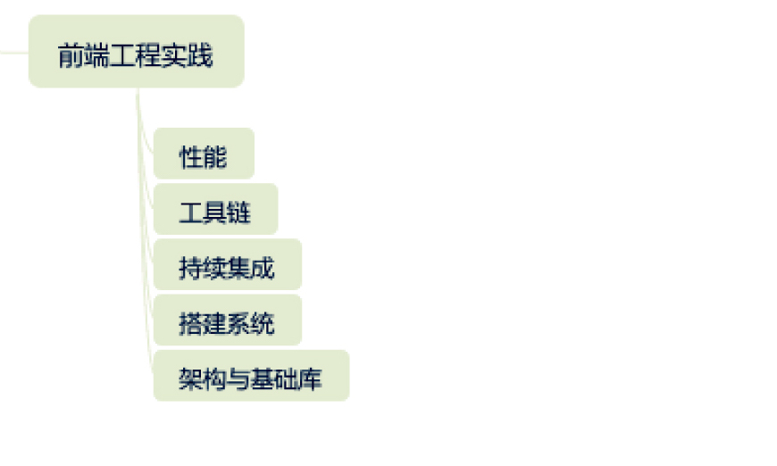

前端入门

参考

web入门

https://developer.mozilla.org/zh-CN/docs/Learn/Getting_started_with_the_web

JavaScript

https://developer.mozilla.org/zh-CN/docs/Web/JavaScript

https://www.liaoxuefeng.com/wiki/1022910821149312

CSS文档

https://developer.mozilla.org/zh-CN/docs/Web/CSS

HTML文档

https://developer.mozilla.org/zh-CN/docs/Web/HTML

工具

VSCode

https://legacy.gitbook.com/book/jeasonstudio/vscode-cn-doc/details

# 概述

基础部分

js、css、html、浏览器实现原理、API


实践



# javascript
[[202207162253]]


# HTML

HTML是什么

是一种用于定义内容结构的*标记语言*


HTML由什么组成

由一系列的**元素（[elements](https://developer.mozilla.org/zh-CN/docs/Glossary/Element)）**组成，一个元素包含开始、结束标签、以及内容


最基本的HTML组成

```html
<!DOCTYPE html>
<html>
  <head>
    <meta charset="utf-8">
    <title>测试页面</title>
  </head>
  <body>
    
  </body>
</html>
```


常用标签

标题、段落、列表、链接（a,anchor)


## 标签


`<span></span>`

> **HTML `<span>`** 元素是短语内容的通用行内容器，并没有任何特殊语义。可以使用它来编组元素以达到某种样式意图（通过使用类或者Id属性），或者这些元素有着共同的属性，比如**lang**。应该在没有其他合适的语义元素时才使用它。`<span>` 与 [``](https://developer.mozilla.org/zh-CN/docs/Web/HTML/Element/div) 元素很相似，但 [``](https://developer.mozilla.org/zh-CN/docs/Web/HTML/Element/div) 是一个 [块元素](https://developer.mozilla.org/en-US/docs/HTML/Block-level_elements) 而 `<span>` 则是 [行内元素 ](https://developer.mozilla.org/en-US/docs/HTML/Inline_elements).


## 表单


# CSS

## CSS是什么

CSS全称是：层叠样式表（Cascading style sheet CSS)，作用是为网页添加样式的代码。样式可以是颜色、大小、位置等。


## 怎么在HTML中使用

一般在head部分中，加入一个link，例如

```html
<link href="styles/style.css" rel="stylesheet">
```


## CSS语法、规则

由选择器、声明构成。

声明由属性、值构成。

选择器表示选择HTML中的什么元素。

声明是一个单独的规则，用于指定选中元素的样式

比如

```css
p {
  color: red;
  width: 500px;
  border: 1px solid black;
}
```

包含一个选择器，三条声明。


选择器可以同时出现多个。例如

```css
p, li, h1 {
  color: red;
}
```


## CSS选择器

[参考](https://developer.mozilla.org/en-US/docs/Learn/CSS/Building_blocks/Selectors)


常用选择器类型

| 选择器名称                           | 选择的内容                                                   | 示例                                                         |
| :----------------------------------- | :----------------------------------------------------------- | :----------------------------------------------------------- |
| 元素选择器（也称作标签或类型选择器） | 所有指定(该)类型的 HTML 元素                                 | `p` 选择 `<p>`                                               |
| ID 选择器                            | 具有特定 ID 的元素（单一 HTML 页面中，每个 ID 只对应一个元素，一个元素只对应一个 ID） | `#my-id` 选择 `<p id="my-id">` 或 `<a id="my-id">`           |
| 类选择器                             | 具有特定类的元素（单一页面中，一个类可以有多个实例）         | `.my-class` 选择 `<p class="my-class">` 和 `<a class="my-class">` |
| 属性选择器                           | 拥有特定属性的元素                                           | `img[src]` 选择 `` 而不是 ``     |

 

CSS原理-一切皆盒子


# NPM

node.js 和 npm

临时使用其他源

npm --registry https://registry.npm.taobao.org install -g @angular/cli


Angular


# 学习进度条

2020-07-13 https://developer.mozilla.org/zh-CN/docs/Learn/Getting_started_with_the_web/CSS_basics 一切皆盒子


