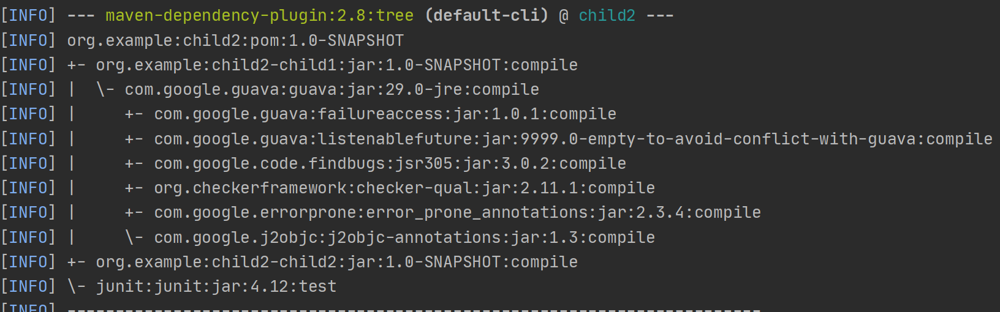
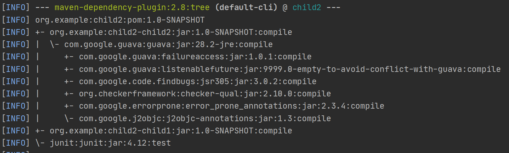
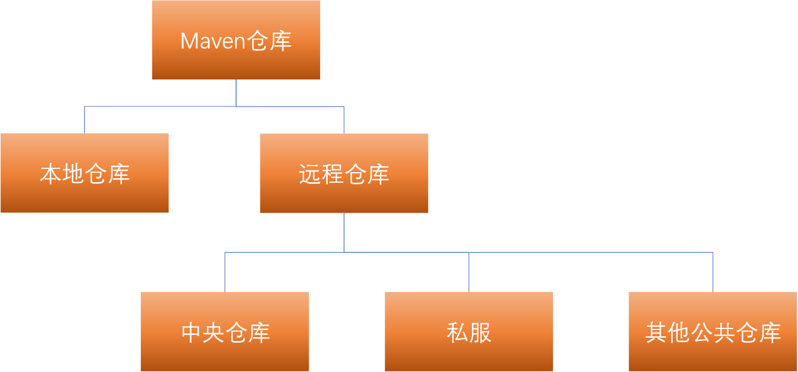
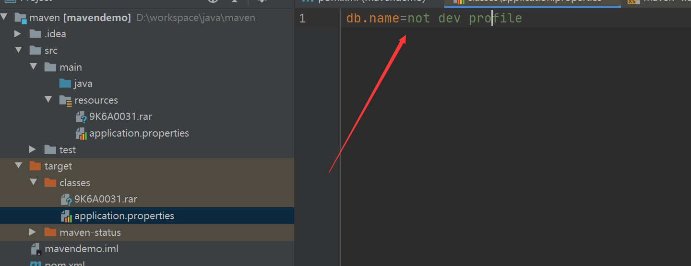

[toc]

# maven


## 安装


### windows

[https://maven.apache.org/download.cgi]()下载安装包

解压到本地目录。

配置环境变量，因为以来Java，所以Java需要提前安装好。

添加系统变量`M2_HOME --> D:\software\maven\apache-maven-3.6.3`

然后在系统变量PATH中加入`%M2_HOME%\bin`

打开个cmd验证。 `mvn -v`


### setting文件

setting文件分为全局和用户范围。

1. $M2_HOME/conf/settings.xml 是全局范围的
2. ${user.home}/.m2/settings.xml 是用户范围的

前者又被叫做全局配置，后者被称为用户配置。如果两者都存在，它们的内容将被合并，并且用户范围的settings.xml优先。

### 配置本地仓库

默认路径在 `${user.home}/.m2/repository`，所以如果不配置的话，我的电脑上就是`C:\Users\qpzm7903\.m2\repository`。

在maven的安装目录下找到conf目录，把setting文件copy到.m2目录下，并且指定本地仓库位置

`<localRepository>D:\software\maven\repository</localRepository>`


### 配置远程仓库


### 配置镜像 


### 配置代理

```xml
<settings>
	<proxies>
    <!-- proxy
     | Specification for one proxy, to be used in connecting to the network.
     |
    <proxy>
      <id>optional</id>
      <active>true</active>
      <protocol>http</protocol>
      <username>proxyuser</username>
      <password>proxypass</password>
      <host>proxy.host.net</host>
      <port>80</port>
      <nonProxyHosts>local.net|some.host.com</nonProxyHosts>
    </proxy>
    -->
  </proxies>
</settings>  
```


### 配置全局插件


## POM文件

### 标签

```xml
<modelVersion>4.0.0</modelVersion>
```

指定POM模型的版本，maven2和3都是4.0.0

| 标签      | 意义                                          |
| --------- | --------------------------------------------- |
| groupId   | 这个i项目属于哪个组，比如com.googlecode.myapp |
| artifacId | 在该项目组中的唯一Id                          |
| version   | 就是版本，有SNAPSHOT、RELEASE两种             |
| name      | 友好显示的项目名称                            |
| packing   | 打包方式，比如jar，war                        |

groupId，artifactId，version在maven中唯一定义了一个组件。


### 指定jar包的main方法

比如spring boot项目启动的时候会指定了main方法，这是在spring boot的依赖pom文件里定义好了的

如下（省略了一些，只保留主要的）

```xml
<plugin>
  <groupId>org.apache.maven.plugins</groupId>
  <artifactId>maven-shade-plugin</artifactId>
  <executions>
    <execution>
      <phase>package</phase>
      <goals>
        <goal>shade</goal>
      </goals>
      <configuration>
        <transformers>
          <transformer implementation="org.apache.maven.plugins.shade.resource.ManifestResourceTransformer">
            <mainClass>${start-class}</mainClass>
          </transformer>
        </transformers>
      </configuration>
    </execution>
  </executions>
</plugin>
```

打包后在Jar包的META-INF 目录下会有MANIFEST.MF文件，里面会有main函数的信息，比如spring boot项目打出来的包是：

```tex
Manifest-Version: 1.0
Spring-Boot-Classpath-Index: BOOT-INF/classpath.idx
Implementation-Title: jpademo
Implementation-Version: 1.0-SNAPSHOT
Start-Class: com.example.jpademo.JpademoApplication
Spring-Boot-Classes: BOOT-INF/classes/
Spring-Boot-Lib: BOOT-INF/lib/
Build-Jdk-Spec: 1.8
Spring-Boot-Version: 2.3.1.RELEASE
Created-By: Maven Jar Plugin 3.2.0
Implementation-Vendor: Pivotal Software, Inc.
Main-Class: org.springframework.boot.loader.JarLauncher
```


### 依赖

一个完整的依赖为

```xml
    <dependencies>
        <dependency>
            <groupId>junit</groupId>
            <artifactId>junit</artifactId>
            <version>4.12</version>
            <scope>test</scope>
            <type>jar</type>
            <optional>true</optional>
            <exclusions>
                <exclusion>
                    <groupId>org.hamcrest</groupId>
                    <artifactId>hamcrest-core</artifactId>
                </exclusion>
            </exclusions>
        </dependency>
    </dependencies>
```

| 标签       | 涵义         |
| ---------- | ------------ |
| type       | 依赖的类型   |
| scope      | 依赖的范围   |
| optional   | 标记可选     |
| exclusions | 排除传递依赖 |

### 依赖范围

| 类型     | 含义                                                         |
| -------- | ------------------------------------------------------------ |
| compile  | 默认的范围，编译、测试、运行三种classpath都有效              |
| test     | 只对测试classpath有效，在编译测试代码、运行测试的时候需要    |
| provided | 对编译和测试classpath有效，运行时无效，比如servlet-api，运行时容器以提供，就不需要 |
| runtime  | 测试和运行时classpath有效，比如JDBC驱动实现，编译时主代码无效 |
| system   | 系统依赖范围，和provided范围一致                             |

| scope    | 对于编译classpath有效 | 对于测试classpath有效 | 对于运行时classpath有效 |
| -------- | --------------------- | --------------------- | ----------------------- |
| compile  | Y                     | Y                     | Y                       |
| test     | N                     | Y                     | N                       |
| provided | Y                     | Y                     | N                       |
| runtime  | N                     | Y                     | Y                       |
| system   | Y                     | Y                     | N                       |

对于classpath有效是什么意思？也就是这个依赖用了这个范围，那么这个在对应的作用下，这个组件就加到classpath中使用。

### 传递性依赖

一个是范围冲突，一个是版本冲突，一个是路径冲突

首先是依赖范围的传递性影响

|          | compile  | test | provided     | runtime     |
| -------- | -------- | ---- | ------------ | ----------- |
| compile  | compile  | N    | N            | **runtime** |
| test     | test     | N    | N            | test        |
| provided | provided | N    | **provided** | provided    |
| runtime  | runtime  | N    | N            | runtime     |

第一列是直接依赖，第一行是第二直接依赖，中间是两者的碰撞


### 依赖调解

第二直接依赖如果是可选依赖，那么就不会被第一依赖给引用。

比如项目A依赖于项目B，项目B依赖了两个可选依赖X，Y，那么X和Y不会对A产生影响。

### 依赖原则

#### 优先声明原则

如果

A->B->E(1.0)

A->C->E(2.0)

结果会依赖出什么？

以以下三个项目依赖为例：

child2

```xml
<dependencies>

    <dependency>
        <version>1.0-SNAPSHOT</version>
        <groupId>org.example</groupId>
        <artifactId>child2-child1</artifactId>
    </dependency>
    <dependency>
        <version>1.0-SNAPSHOT</version>
        <groupId>org.example</groupId>
        <artifactId>child2-child2</artifactId>
    </dependency>
</dependencies>
```

child2-child1

```xml
<dependencies>
    <!-- https://mvnrepository.com/artifact/com.google.guava/guava -->
    <dependency>
        <groupId>com.google.guava</groupId>
        <artifactId>guava</artifactId>
        <version>29.0-jre</version>
    </dependency>

</dependencies>
```

child2-child2

```xml
<dependencies>
    <!-- https://mvnrepository.com/artifact/com.google.guava/guava -->
    <dependency>
        <groupId>com.google.guava</groupId>
        <artifactId>guava</artifactId>
        <version>28.2-jre</version>
    </dependency>

</dependencies>
```

然后输出依赖树



改变child2中依赖的顺序为

```xml
<dependencies>
    <dependency>
        <version>1.0-SNAPSHOT</version>
        <groupId>org.example</groupId>
        <artifactId>child2-child2</artifactId>
    </dependency>
    <dependency>
        <version>1.0-SNAPSHOT</version>
        <groupId>org.example</groupId>
        <artifactId>child2-child1</artifactId>
    </dependency>

</dependencies>
```

此时的依赖树为




所以相同路径长度的不同版本依赖，取决于声明的顺序


#### 最短路径原则


如果

A->B->E（1.0）

A->E（2.0）

结果会依赖什么？

会依赖E（2.0）


#### 重复引入原则

如果一个项目重复引入了一个包的多个版本，那么已最后一个声明为主。


### 排除依赖

依赖的传递带来很多好处，但是也有很多问题，比如不知道第三方依赖具体会带来什么依赖，比如第三方依赖本身依赖了一些不稳定的、有漏洞的版本，那么就可以用依赖排除给排除掉。然后在本身项目引入一个稳定、安全的版本。

### 依赖归类

比如引入多个spring的包，但是版本都是一样的，避免多个地方重复的声明版本，可以通过引入变量的方式达到。比如

```xml
<properties>
	<springframework.version>2.3.1.RELEASE</springframework.version>
</properties>

<dependency>
    <groupId>org.springframework.boot</groupId>
    <artifactId>spring-boot-starter-web</artifactId>
     <version>${springframwork.versoin}</version>
</dependency>
```

### 优化依赖

`mvn dependency:list` 列出当前项目已解析的依赖

`mvn dependency:tree` 依赖树

`mvn dependency:analyze`


## 仓库

### 仓库分类

分为远程仓库和本地仓库

寻找时先找本地，再找远程。

中心仓库是maven自带的远程仓库。

私服也是远程仓库，只不过是架设再局域网内。


maven自带的仓库在maven安装目录下的

`M2_HOME\lib\maven-model-builder-3.6.3.jar`

打开这个jar里面的

`maven-model-builder-3.6.3.jar\org\apache\maven\model\pom-4.0.0.xml`

里面有定义

```xml
  <repositories>
    <repository>
      <id>central</id>
      <name>Central Repository</name>
      <url>https://repo.maven.apache.org/maven2</url>
      <layout>default</layout>
      <snapshots>
        <enabled>false</enabled>
      </snapshots>
    </repository>
  </repositories>
```

这个pom文件是所有maven项目都会继承的超级pom。


### 配置远程仓库

```xml
<repositories>
    <repository>
        <id>rep_id</id>
        <name>rep name</name>
        <url>rep url</url>
        <releases>
            <enabled>true</enabled>
        </releases>
        <snapshots>
            <enabled>true</enabled>
            <updatePolicy>daily</updatePolicy>
            <checksumPolicy>ignore</checksumPolicy>
        </snapshots>
    </repository>
</repositories>
```

id是唯一的，可以被覆盖，release和快照都可以设置更新策略，有never，daily，always，interval


### 认证


访问远程仓库的时候有时候会需要账号密码，这个必须在setting文件里面配置。

```xml
  <servers>
    <!-- server
     | Specifies the authentication information to use when connecting to a particular server, identified by
     | a unique name within the system (referred to by the 'id' attribute below).
     |
     | NOTE: You should either specify username/password OR privateKey/passphrase, since these pairings are
     |       used together.
     |
    <server>
      <id>deploymentRepo</id>
      <username>repouser</username>
      <password>repopwd</password>
    </server>
    -->

    <!-- Another sample, using keys to authenticate.
    <server>
      <id>siteServer</id>
      <privateKey>/path/to/private/key</privateKey>
      <passphrase>optional; leave empty if not used.</passphrase>
    </server>
    -->
  </servers>
```

setting里的认证id要和pom里面设置的仓库id一致。


### 部署到远程仓库

再deploy的时候可以将包上传到远程仓库，这个需要配置pom文件

```xml
<distributionManagement>
    <repository>
        <id>rep id</id>
        <name>rep name</name>
        <url>rep url</url>
    </repository>
    <snapshotRepository>
        <id> rep id</id>
        <name>rep name</name>
        <url>rep url</url>
    </snapshotRepository>
</distributionManagement>
```

分别对应release和快照版本的仓库。


### 快照版本是什么

防止开发版本的依赖经常需要变动，用快照就不用一直变。 

maven默认参数是每天更新一次，可以强行更新

```mvn clean install -U```


### 镜像


## 继承与聚合

聚合就是把项目的模块聚合在一起构建。聚合pom所在的模块打包要是pom的，子模块是jar。

继承就是抽取模块相同的依赖和插件等配置


### 聚合

在pom文件中添加 modules标签，然后添加子模块，子模块的路径是相对于当前pom文件的。

当构建的时候，maven会解析各个模块的pom，计算出一个反应堆构建顺序 reactor build order，然后根据这个顺序构建各个模块。


### 继承

groupid 和 version是会被继承的。

比如properties、dependencies、dependencyManagement、repositories、build、都会继承。

dependencyManagement声明的依赖不会引入到子模块，也不会引入到父模块。

但是这个配置是可以继承的。

子模块只需要在dependencies中将要用的artifactId和groupid引入就可以。version就在dependencyManagement里面维护了。这样能够统一版本，降低版本冲突的可能性。


## 灵活的构建

属性、profile、资源过滤


### 属性

使用属性可以减少重复

内置属性

POM属性

自定义属性

```xml
<properties>
    <springframework.version>2.3.1.RELEASE</springframework.version>
</properties>
```

Settings属性

Java系统属性

环境变量属性


### profile


### 资源过滤

打包的时候，要让项目里的资源目录一同打包，这个是由maven-resources-plugin插件做的事情，它将项目的资源文件复制到编译后的目录中，将测试的资源文件复制到测试的编译目录下。

资源过滤就是指：进行占位符替换。

比如在配置文件application.properties文件中配置了

db.name=${db.name}

然后进行了资源过滤。在pom文件里面定义了这个属性。

如果定义了profile，那么编译的时候可以指定用哪个profile，profile里面可以定义properties，那么就可以这样来定义不同的打包命令对应不同的环境了。


例子：

application.properties

```properties
db.name=${db.name}
```


```xml
<properties>
    <db.name>not dev profile</db.name>
</properties>

<profiles>
    <profile>
        <id>dev</id>
        <properties>
            <db.name>testName</db.name>
        </properties>
    </profile>
</profiles>
<build>
    <resources>
        <resource>
            <directory>src/main/resources</directory>
            <filtering>true</filtering>
        </resource>
    </resources>
</build>
```

这样编译或者打包的时候

如果指定profile是dev，那么就会被提花昵称testName

如果不指定，就会替换成 not dev profile。

打包后如下




### 资源不进行二次编码

maven编译的时候会将文件进行二次编码，但是一些文件不需要，所以要手动去掉。

```xml
<build>
        <plugins>
            <plugin>
                <groupId>org.apache.maven.plugins</groupId>
                <artifactId>maven-resources-plugin</artifactId>
                <configuration>
                    <!-- maven编译下面扩展类型文件的时候直接复制原文件，而不会进行二次编码-->
                    <nonFilteredFileExtensions>
                        <extension>zip</extension>
                        <extension>rar</extension>
                    </nonFilteredFileExtensions>
                </configuration>
            </plugin>
        </plugins>
    </build>
   
```

这样的话就不会被二次编码，导致一些文件被破坏打不开。


继承的pom文件会这样吗