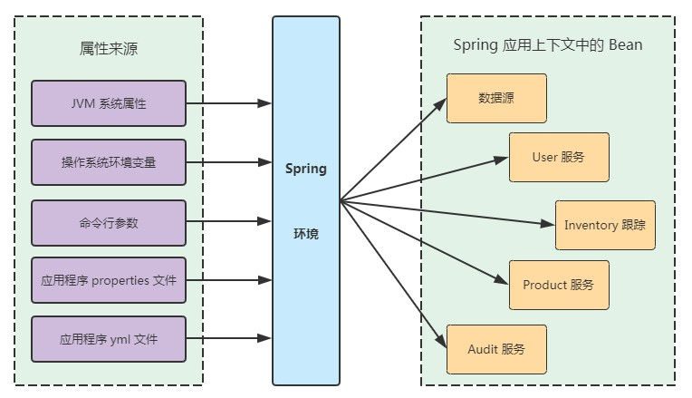
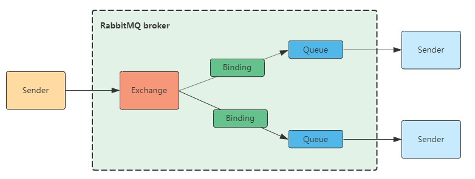

参考

[spring 实战]

使用idea直接创建spring工程

spring boot 版本 2.4.1

其中spring boot 对spring的核心依赖为

```xml
    <dependency>
      <groupId>org.springframework</groupId>
      <artifactId>spring-core</artifactId>
      <version>5.3.2</version>
      <scope>compile</scope>
    </dependency>
    <dependency>
      <groupId>org.springframework</groupId>
      <artifactId>spring-context</artifactId>
      <version>5.3.2</version>
      <scope>compile</scope>
    </dependency>
```


# spring bean的配置方式

建议，自动化最方便。

1、组件扫描

要知道系统中哪些组件（component）

2、组件装配

组件之间的相互依赖，就是装配。

## XML中显式配置

根节点 beans

可以通过https://spring.io/tools的工具来创建xml

或者直接通过IDEA里面创建文件的时候选择类型为配置、spring配置。

结果如下

```xml
<?xml version="1.0" encoding="UTF-8"?>
<beans xmlns="http://www.springframework.org/schema/beans"
       xmlns:xsi="http://www.w3.org/2001/XMLSchema-instance"
       xsi:schemaLocation="http://www.springframework.org/schema/beans http://www.springframework.org/schema/beans/spring-beans.xsd">

</beans>
```

提示

文档根元素 "beans" 必须匹配 DOCTYPE 根 "null"。

配置文件的名称不能是application.xml

要是别的，因为application这个名字被spring占用了。


为了能在让spring能识别xml，在启动类上加

```java
@ImportResource(value = "classpath:applicationContext.xml")
```

让其知道我们用的是哪个xml来配置。

### bean声明

简单的声明

```xml
<bean id="cdByXmlConfiguration" class="com.qpzm7903.springdemo.soundsystem.support.CdByXmlConfig"/>
```

说明要创建的bean对象是说明，id是什么。

简单声明会使用默认构造器

#### 构造器

##### \<constructor-arg\>

比较直接，清晰

配置引用


配置字面量

##### -c

\<constructor-arg\>的替代方案比较方便，简短

要在beans的属性里面引入

```xml
xmlns:c="http://www.springframework.org/schema/c"
```


#### 属性

<property>

-p

要在beans的属性里面引入

```xml
xmlns:p="http://www.springframework.org/schema/p"
```


### util

```xml
xmlns:util="http://www.springframework.org/schema/util"
```

有很多用法


## Java中显式配置

## 隐式的Bean发现机制和自动装配

## 注解

### component 

组件，可以设置名称，默认为类名首字母小写。

### named

Spring支持将@Named作为@Component注解的替代方案。两者之间有一些细微的差异，但是在大多数场景中，它们是可以互相替换的。

但是named没有component那么强的语义，所以建议还是用compnent。


### ComponentScan

在spring boot中，似乎不用添加这个

但是什么时候需要用到？


### Autowired

是spring特有的注解

注入，不管是构造器、setter方法、spring都会尝试满足依赖。


### Inject

@Inject注解来源于Java依赖注入规范，该规范同时还为我们定义了@Named注解。在自动
装配中，Spring同时支持@Inject和@Autowired。


### Configuration

用于创建配置类，里面可以声明各种bean的创建


### Bean

> 带有@Bean注解的方法可以采用任何必要的Java功能来产生bean实例

在配置类中可以做到注入前的配置，相当于一个工厂。

打在方法上，入参是bean，出参也是bean


# 高级装配


环境于profile

最简单例子，不同的环境，数据库配置是不同的。


### 注解配置


#### @Profile

属性是环境名


XML配置


### 激活

如果没有激活，那么就用默认的

spring.profiles.active

spring.profiles.default


#### 激活方式


作为DispatcherServlet的初始化参数；
作为Web应用的上下文参数；
作为JNDI条目；
作为环境变量；
作为JVM的系统属性；
在集成测试类上，使用@ActiveProfiles注解设置


在默认的配置文件中

```properties
spring.profiles.active=dev
```


### FAQ

配置怎么用profiles来配置？除了xml之外的。比如用Properties


### 使用profile进行测试

比如测试的一套环境，通过配置隔离开，测试的时候激活,如下

```java
@SpringBootTest
@ActiveProfiles("dev")
```

## 条件化的bean


## 处理自动装配的歧义

一个接口有多个实现的时候，注入会出现歧义，因为spring不知道要用哪个。

但是可以在bean声明的时候用上一些注解，

@Primary

或者xml中配置 primay 属性为true


@Qulifier

限定符，注入的时候可以设置qulifier属性，选择要注入哪个bean对象。

最基本的是用id，但是id是个string，有耦合并且还有松散的关系。


在bean的时候，比如使用@Component，也可以在bean上增加@Qulifier注解，定制该bean的id，在注入的时候可以使用，建议这个时候的id带有语义性质。


可以自定义@Qulifier注解

比如

```java
@Target({ElementType.FIELD, ElementType.TYPE, ElementType.METHOD, ElementType.CONSTRUCTOR})
@Retention(RetentionPolicy.RUNTIME)
@Qualifier
public @interface Wyc {
}
```

自定义注解的方式也更加类型安全。

## bean的作用域

单例（Singleton）：在整个应用中，只创建bean的一个实例。 -- 默认作用域
原型（Prototype）：每次注入或者通过Spring应用上下文获取的时候，都会创建一个新
的bean实例。
会话（Session）：在Web应用中，为每个会话创建一个bean实例。
请求（Rquest）：在Web应用中，为每个请求创建一个bean实例。


配置方式

1、注解 

@Scope

```java
@Scope(ConfigurableBeanFactory.SCOPE_SINGLETON)
```


2、xml中

对bean设置 scope属性，有prototye，singleton。。。


会话作用域


## 运行时注入

两种形式

1、属性占位符

2、spring表达式语言 SpEL


### 1、属性占位符


1、定义属性，以及引入

默认的可以之际在application.properties中配置

也可以自定义配置，然后通过`@PropertySource("classpath:file")`引入

注意：

- @PropertySource通常用于属性加载配置文件，注意@PropertySource注解不支持加载yaml文件，支持properties文件。
- @ImportResource通常用于加载Spring的xml配置文件

@PropertySource的位置，打在要用的类上

**疑问：为什么不是在启动类上，如果是在要用的类上，那么如果有很多类，就需要打很多了。**

参考 https://www.cnblogs.com/eternityz/p/12511777.html

@ConfigurationProperties方式可以进行配置文件与实体字段的自动映射，但需要字段必须提供set方法才可以，而使用@Value注解修饰的字段不需要提供set方法

| 比较项                      | @ConfigurationProperties | @Value |
| --------------------------- | ------------------------ | ------ |
| 全量注入                    | 支持                     | 否     |
| 松散绑定（Relaxed binding） | 支持                     | 否     |
| SpEL                        | 否                       | 支持   |
| JSR303                      | 支持                     | 不支持 |

2、使用

在配置类中，注入 `Enviroment`然后，使用`getProperty`方法使用。


在Coponent中，直接`@Value("${xxx}")`这样使用


在xml的bean中，也是  `"${xxx}"`


3、文件类型

propertySource默认支持properties文件

yml文件需要自己读取，并加入到上下文中。

也许可以自己写一个注解来处理


# Web中的spring

## SpringMVC


使用thymeleaf作为视图处理器


使用这种模型，controller返回的是视图的名称。


重定向也可以在controller指定，比如

```java

return "redirect:/orders/current";
```


### postMapping

表单内容直接和模型映射。


字段映射

list映射

看post请求，内容是通过Form data传入的。不是body中的json


表单输入验证

直接在VO上加一些校验的注解

`javax.validation.constraints`

`org.hibernate.validator.constraints`

这两个包里都有一些校验的注解。


### controller


### view


### view-controller

假设某些view不需要逻辑，直接返回，就可以使用视图控制器


### model

model属性

### session

​	


### FAQ

MVC模式下，错误信息怎么返回？

比如复选框选错了


### thymeleaf

[官网](https://www.thymeleaf.org/)


### 命名空间

`th:text="${attribute}"`

会替代所在的标签内容


`th:each="item : ${items}"`


`th:value="${obejct.attr}"`

替换value属性


### 模板缓存

| 模板             | 配置                         |
| ---------------- | ---------------------------- |
| Freemarker       | spring.freemarker.cache      |
| Groovy Templates | spring.groovy.template.cache |
| Mustache         | spring.mustache.cahce        |
| Thymeleaff       | spring.thymeleaf.cahce       |


## 处理数据

- spring jdbcTemplate
- springJdbcinsert
- spring data 中的jpa


### spring jdbc tempalte

使用这个的原因是jdbc太底层，jdbcTemplate做了一层抽象。


### 依赖

```xml
<dependency>
    <groupId>org.springframework.boot</groupId>
    <artifactId>spring-boot-starter-jdbc</artifactId>
</dependency>
```

使用内存数据库做测试

```xml
<dependency>
    <groupId>com.h2database</groupId>
    <artifactId>h2</artifactId>
    <scope>runtime</scope>
</dependency>
```


### 使用

1、定义repo接口

2、使用jdbcTemplate去实现


### sql

DDL、DML、以及初始化sql的执行

1、DDL

schema.sql 在 reousce目录下，会被spring boot执行


2、初始化数据

data.sql 会自动执行


### h2配置

application.properties

```properties
spring.datasource.url=jdbc:h2:mem:testdb
spring.h2.console.enabled=true
```

启动后日志会输出

`H2 console available at '/h2-console'. Database available at 'jdbc:h2:mem:testdb'`

打开`http://localhost:8080/h2-console`

接着把`jdbc:h2:mem:testdb`复制进去到jdbcurl上，点击连接即可。


### spring data

*Spring Data JPA* - 针对关系数据库的持久化

*Spring Data Mongo* - 针对 Mongo 文档数据库的持久化

*Spring Data Neo4j* - 针对 Neo4j 图形数据库的持久化

*Spring Data Redis* - 针对 Redis 键值存储的持久化

*Spring Data Cassandra* - 针对 Cassandra 数据库的持久化


### 用spring data jpa

依赖

```xml
<dependency>
    <groupId>org.springframework.boot</groupId>
    <artifactId>spring-boot-starter-data-jpa</artifactId>
</dependency>
```


#### 注解

使用Entity标记一个类作为jpa管理的实体

@id属性标记id


#### repo 接口

```java
public interface IngredientRepo extends CrudRepository<Ingredient, String> {

}
```

CrudRepository 为 CRUD（创建、读取、更新、删除）操作声明了十几个方法。第一个是要持久化的类型，第二个是Id的类型


定义接口，不需要写实现，spirng data jpa会自动实现这些基本的实现。


spring data jpa 定义了一种小型的DSL，持久化的细节再repository的方法签名上。

>  repository 的方法由一个动词、一个可选的主语、单词 *by* 和一个谓词组成。在 findByDeliveryZip() 中，动词是 *find*，谓词是 *DeliveryZip*，主语没有指定


当条件比较复杂的时候，签名会很长，这时候可以通过@Query注解来处理


# spring security

了解spring security怎么工作，怎么自定义

自动配置 Spring Security

自定义用户存储

自定义登录页面

防御 CSRF 攻击

了解你的用户


## spring security


依赖

```xml
<dependency>
    <groupId>org.springframework.boot</groupId>
    <artifactId>spring-boot-starter-security</artifactId>
</dependency>
```


添加这个依赖之后，就简单的被保护了。访问需要账号密码

所有的 HTTP 请求路径都需要认证。

不需要特定的角色或权限。

没有登录页面。

身份验证由 HTTP 基本身份验证提供。

只有一个用户；用户名是 *user*。


但是最基本的特性还不足以满足需求


比如

提示使用登录页面进行身份验证，而不是使用 HTTP 基本对话框。

为多个用户提供注册页面，让新的用户可以注册。

为不同的请求路径应用不同的安全规则。例如，主页和注册页面根本不需要身份验证。


## spring security log

```properties
logging.level.org.springframework.security=DEBUG
```


## 配置spring security

```java
@Configuration
@EnableWebSecurity
public class WebSecurityConfig extends WebSecurityConfigurerAdapter {
    @Override
    protected void configure(HttpSecurity http) throws Exception {
        http
                .authorizeRequests()
                .antMatchers("/", "/home").permitAll()
                .anyRequest().authenticated()
                .and()
                .formLogin()
                .loginPage("/login")
                .permitAll()
                .and()
                .logout()
                .permitAll();
    }

    @Bean
    @Override
    public UserDetailsService userDetailsService() {
        UserDetails user =
                User.withDefaultPasswordEncoder()
                        .username("user")
                        .password("password")
                        .roles("USER")
                        .build();

        return new InMemoryUserDetailsManager(user);
    }
}
```

通过使用`EnableWebSecurity`注解，并继承`WebSecurityConfigureAdaptor`类，覆盖里面的一些方法，比如configure，指定哪些路径需要鉴权，哪些不要，登录界面、退出登录、以及`serDetailService`方法，指定一些用户


### 通过java配置

配置类，就可以得到一个简单的登陆界面


### 配置用户

可以基于

一个内存用户存储

基于 JDBC 的用户存储

由 LDAP 支持的用户存储

定制用户详细信息服务


都要实现

```java
@Override
protected void configure(AuthenticationManagerBuilder auth) throws Exception {
    ...
}
```


### 内置用户-基于内存

一般在测试的场景使用

```java

@Configuration
@EnableWebSecurity
public class WebSecurityConfig extends WebSecurityConfigurerAdapter {
    @Override
	protected void configure(AuthenticationManagerBuilder auth) throws Exception {
    auth
        .inMemoryAuthentication() // 在内存中认证身份
            .withUser("buzz")
                .password("infinity")
                .authorities("ROLE_USER") // 授予 USER权限  等价于 .role("USER")
            .and()
            .withUser("woody")
                .password("bullseye")
                .authorities("ROLE_USER");
	}
}
```


### 基于jdbc

表呢？jdbc模式默认一些表的存在，但是也可以自定义用户查询。

密码可以进行一些加密

- BCryptPasswordEncoder —— 采用 bcrypt 强哈希加密
- NoOpPasswordEncoder —— 不应用任何编码
- Pbkdf2PasswordEncoder —— 应用 PBKDF2 加密
- SCryptPasswordEncoder —— 应用了 scrypt 散列加密
- StandardPasswordEncoder —— 应用 SHA-256 散列加密


只要确保在对密码加解密的适合用同一个encoder就可以


### 基于LADP

是什么东西

### 自定义用户服务

不管是基于内存、jdbc、ldap都是通过覆写WebSecurityConfigurerAdapter类。

自定义服务是通过实现`UserDetailsService`接口。

主要是实现里面的`loadUserBUsername`方法。注意此方法返回的是`UserDetails`对象，实现的时候可以继承这个类。


## 保护web请求

拦截想拦截的界面，放行应该放行的界面

能做到

在允许服务请求之前，需要满足特定的安全条件

配置自定义登录页面

使用户能够退出应用程序

配置跨站请求伪造保护

实现

```java
WebSecurityConfigurerAdapter.configure
```

比如

```java
@Configuration
@EnableWebSecurity
public class WebSecurityConfig extends WebSecurityConfigurerAdapter {
    @Override
    protected void configure(HttpSecurity http) throws Exception {
        http
            .authorizeRequests() // 授权访问
                .antMatchers("/design", "/orders")
                    .hasRole("ROLE_USER")
                .antMatchers(“/”, "/**").permitAll();
        }
}
```

对于design,order界面，是允许ROLE_USER访问的，其他用户不允许。

然后其他的请求都允许。

注意顺序是由影响的。

注意，角色名也有坑，spring security 会自动加ROLE前缀

如果先允许所有，再给ROLE_USER授权就无效了。


常用的配置方法

| 方法                       | 做了什么                               |
| -------------------------- | -------------------------------------- |
| access(string)             | SpEL的表达式为True即可访问             |
| anonymous()                | default user can access                |
| authenticated()            | 认证用户可以访问                       |
| denyAll()                  |                                        |
| fullyAuthenticated()       | 完全授权...                            |
| hasAnyAuthority(String...) | 拥有任意给定的权限，可以访问           |
| hasAnyRole(String...)      | 拥有任意给定的角色，可以访问           |
| hasAuthority(String)       | 如果用户有给定的权限，则允许访问       |
| hasIpAddress(String)       | 来自给定 IP 地址的请求允许访问         |
| hasRole(String)            | 如果用户有给定的角色，则允许访问       |
| not()                      | 拒绝任何其他访问方法                   |
| permitAll()                | 无条件允许访问                         |
| rememberMe()               | 允许认证了的同时标记了记住我的用户访问 |


对于SpEL的扩展

| Security 表达式           | 意指什么                                                    |
| ------------------------- | ----------------------------------------------------------- |
| authentication            | 用户认证对象                                                |
| denyAll                   | 通常值为 false                                              |
| hasAnyRole(list of roles) | 如果用户有任何给定的角色，则为 true                         |
| hasRole(role)             | 如果用户有给定的角色，则为 true                             |
| hasIpAddress(IP Address)  | 如果请求来自给定 IP 地址，则为 true                         |
| isAnonymous()             | 如果用户是默认用户，则为 true                               |
| isAuthenticated()         | 如果用户是认证了的，则为 true                               |
| isFullyAuthenticated()    | 如果用户被完全认证了的（不是使用记住我进行认证），则为 true |
| isRememberMe()            | 如果用户被标记为记住我后认证了，则为 true                   |
| permitAll()               | 通常值为 true                                               |
| principal                 | 用户 pricipal 对象                                          |


FAQ

疑问：spring security 怎么做授权、鉴权的

使用filter

### 配置登陆界面

登陆界面可配置，就是配置一个简单的视图，请求发到regsiter上，还可以配置登陆后的跳转


### 登出

登出也要做跳转

配置比如

```java
.and()
    .logout()
        .logoutSuccessUrl("/")
```


以及登出的按钮

```html
<form method="POST" th:action="@{/logout}">
    <input type="submit" value="Logout"/>
</form>
```


### 阻止跨站请求伪造攻击

spring seurity 可以做，thymleafh默认就做了


### 领域与用户关联

通过jpa的关系注解很容易做到。

那么再controller中如何获取用户？


常用的方法由：

- 将主体对象注入控制器方法
- 将身份验证对象注入控制器方法
- 使用 SecurityContext 获取安全上下文
- 使用 @AuthenticationPrincipal 注解的方法


## spring security 架构

安全的两个问题

- authentication (who are you?) 
- authorization or Access Control (what are you allowed to do?)


### authentication 身份认证

```java
interface AuthenticationManager {
    /**
    
    */
    Authentication authenticate(Authentication authentication) throws AuthenticationException;
}

public class ProviderManager implements AuthenticationManager{
    
}
```

用的大多数是providerManager，其下有一个代理的职责链


### authorization 授权 or Access Control  


### Web Security

在sring中，是基于Filter做的spring security

```
client->filter->filter->filter->...->Servlet
```

### 为分发和授权做请求匹配

```java
@Configuration
@Order(SecurityProperties.BASIC_AUTH_ORDER - 10)
public class ApplicationConfigurerAdapter extends WebSecurityConfigurerAdapter {
  @Override
  protected void configure(HttpSecurity http) throws Exception {
    http.antMatcher("/match1/**")
      .authorizeRequests()
        .antMatchers("/match1/user").hasRole("USER")
        .antMatchers("/match1/spam").hasRole("SPAM")
        .anyRequest().isAuthenticated();
  }
}
```


# 使用配置属性

属性来源

- JVM 系统属性
- 操作系统环境变量
- 命令行参数
- 应用程序属性配置文件




## 配置数据源

比如使用applicatoin.yml

配置数据源

```yml
spring:
  datasource:
    url: jdbc:mysql://localhost/tacocloud
    username: tacodb
    password: tacopassword
```

还有指定schema和data

```yml
spring:
  datasource:
    schema:
    - order-schema.sql
    - ingredient-schema.sql
    - tao-schema.sql
    - user-schema.sql
    data:
    - ingredients.sql
```


server.port = 0就会每次用随机端口


## 配置日志

默认情况下spring boot 是使用Logback配置日志，默认级别INFO。

可以自定义`src/main/resources/log.xml`

比如

```xml
<configuration>
    <appender name="STDOUT" class="ch.qos.logback.core.ConsoleAppender">
        <encoder>
            <pattern>
                %d{HH:mm:ss.SSS} [%thread] %-5level %logger{36} - %msg%n
            </pattern>
        </encoder>
    </appender>
    <logger name="root" level="INFO"/>
    <root level="INFO">
        <appender-ref ref="STDOUT" />
    </root>
</configuration>
```


一些简单的配置也可以在yml中配置

```yml
logging:
  path: /var/logs/
  file: TacoCloud.log
  level:
    root: WARN
    org:
      springframework:
        security: DEBUG
```


## 占位符

`${name}`


## 属性注入

> 为了支持配置属性的属性注入，Spring Boot 提供了@ConfigurationProperties 注释。当放置在任何 Spring bean 上时，它指定可以从 Spring 环境中的属性注入到该 bean 的属性。

可以将属性直接注入到控制器中，也可以注入到一个特定的配置bean，比如

```java

@Component
@ConfigurationProperties(prefix="taco.orders")
@Data
public class OrderProps {
    private int pageSize = 20;
}
```

然后什么地方想用就用好了。


## 声明配置元数据

做什么用？

是可选的，但是对于IDE的提示比较友好


## profile

比如各个不同的环境配置不同的数据库、日志级别


配置


激活

```yml
spring:
  profiles:
    active:
    - prod
```

激活也是可以从多个途径的，在配置文件里面其实不太好。

应该从外部决定，也就是运行的时候指定。比如用环境变量

```bash
%export SPRING_PROFILES_ACTIVE=prod
```

或者运行的时候

```bash
java -jar taco-cloud.jar --spring.profiles.active=prod
```

如果要指定多个配置，就用逗号分隔。


# spring 集成


## 创建REST服务

- 在 Spring MVC 中定义 REST 端点
- 启用超链接 REST 资源
- 自动生成基于存储库的 REST 端点


spring mvc 关于REST的注解

| 注解            | HTTP 方法        | 典型用法     |
| --------------- | ---------------- | ------------ |
| @GetMapping     | HTTP GET 请求    | 读取资源数据 |
| @PostMapping    | HTTP POST 请求   | 创建资源     |
| @PutMapping     | HTTP PUT 请求    | 更新资源     |
| @PatchMapping   | HTTP PATCH 请求  | 更新资源     |
| @DeleteMapping  | HTTP DELETE 请求 | 删除资源     |
| @RequestMapping | 通用请求处理     |              |


`@RestController`

在类上，标明是一个controller


其余请求都可以指定路径


参数

路径参数

```
@PathVariable("id")
// 其中id就是在路径上的占位符 比如 /{id}/xxx
```

请求参数

body参数

```
@RequestBody
```


`@RequestMapping`

```
@RequestMapping(path="/design",                      // <1>
                produces="application/json")
```

produces 不仅限制了输出，还限制了输入


# 调用REST服务

Spring 提供了 RestTemplate

| 方法                 | 描述                                                         |
| -------------------- | ------------------------------------------------------------ |
| delete(...)          | 对指定 URL 上的资源执行 HTTP DELETE请求                      |
| exchange(...)        | 对 URL 执行指定的 HTTP 方法，返回一个 ResponseEntity，其中包含从响应体映射的对象 |
| execute(...)         | 对 URL 执行指定的 HTTP 方法，返回一个映射到响应体的对象      |
| getForEntity(...)    | 发送 HTTP GET 请求，返回一个 ResponseEntity，其中包含从响应体映射的对象 |
| getForObject(...)    | 发送 HTTP GET 请求，返回一个映射到响应体的对象               |
| headForHeaders(...)  | 发送 HTTP HEAD 请求，返回指定资源 URL 的 HTTP 请求头         |
| optionsForAllow(...) | 发送 HTTP OPTIONS 请求，返回指定 URL 的 Allow 头信息         |
| patchForObject(...)  | 发送 HTTP PATCH 请求，返回从响应主体映射的结果对象           |
| postForEntity(...)   | 将数据 POST 到一个 URL，返回一个 ResponseEntity，其中包含从响应体映射而来的对象 |
| postForLocation(...) | 将数据 POST 到一个 URL，返回新创建资源的 URL                 |
| postForObject(...)   | 将数据 POST 到一个 URL，返回从响应主体映射的对象             |
| put(...)             | 将资源数据 PUT 到指定的URL                                   |


# 异步消息

- Java 消息服务（JMS）
- RabbitMQ 和高级消息队列协议（AMQP）
- Apache Kafka


## JMS

JMS 是一个 Java 标准，它定义了一个用于使用消息代理的公共 API。

Spring 通过称为 JmsTemplate 的基于模板的抽象来支持 JMS

Spring 还支持消息驱动 POJO 的概念：简单的 Java 对象以异步方式对队列或主题上到达的消息做出响应。


推模型

消息可用时将消息传递给代码


拉模型

代码请求消息并等待消息到达


JmsTemplate 使用的是拉模型。


接收的方法

```java
Message receive() throws JmsException;
Message receive(Destination destination) throws JmsException;
Message receive(String destinationName) throws JmsException;

Object receiveAndConvert() throws JmsException;
Object receiveAndConvert(Destination destination) throws JmsException;
Object receiveAndConvert(String destinationName) throws JmsException;
```


使用消息侦听器

```java
@Component
public class Listener {

    @JmsListener(destination = "test.message")
    public void receive(Object object) {
        System.out.println(object);
    }
}

```

当消息可以被快速处理的时候，侦听器很好用


主动获取消息

```java
@Component
public class Listener {
    private JmsTemplate jms;

    @Autowired
    public Listener(JmsTemplate jms) {
        this.jms = jms;
    }

    public Object pull() {
        return jms.receiveAndConvert("test.pull.message");
    }
}
```


发消息

```java
// 发送原始消息
void send(MessageCreator messageCreator) throws JmsException;
void send(Destination destination, MessageCreator messageCreator) throws JmsException;
void send(String destinationName, MessageCreator messageCreator) throws JmsException;
// 发送转换自对象的消息
void convertAndSend(Object message) throws JmsException;
void convertAndSend(Destination destination, Object message) throws JmsException;
void convertAndSend(String destinationName, Object message) throws JmsException;
// 发送经过处理后从对象转换而来的消息
void convertAndSend(Object message, MessagePostProcessor postProcessor) throws JmsException;
void convertAndSend(Destination destination, Object message, MessagePostProcessor postProcessor) throws JmsException;
void convertAndSend(String destinationName, Object message, MessagePostProcessor postProcessor) throws JmsException;
```


如果不指定目的地

```yml
spring:
  jms:
    template:
      default-destination: tacocloud.order.queue
```


依赖以及配置


```xml
<dependency>
    <groupId>org.springframework.boot</groupId>
    <artifactId>spring-boot-starter-artemis</artifactId>
</dependency>
```

嵌入式artemis依赖

```xml
<dependency>
  <groupId>org.apache.activemq</groupId>
  <artifactId>artemis-jms-server</artifactId>
</dependency>
```


| 属性                    | 描述                           |
| ----------------------- | ------------------------------ |
| spring.artemis.host     | broker 主机                    |
| spring.artemis.port     | broker 端口                    |
| spring.artemis.user     | 用于访问 broker 的用户（可选） |
| spring.artemis.password | 用于访问 broker 的密码（可选） |


使用独立安装的artemis服务器

安装教程https://www.liaoxuefeng.com/wiki/1252599548343744/1304266721460258

配置

```yml
spring:
  artemis:
    # 指定连接外部Artemis服务器，而不是启动嵌入式服务:
    mode: native
    # 服务器地址和端口号:
    host: 127.0.0.1
    port: 61616
    # 连接用户名和口令由创建Artemis服务器时指定:
    user: test
    password: test
```


## RabbitMQ 和 AMQP

> RabbitMQ 可以说是 AMQP 最优秀的实现，它提供了比 JMS 更高级的消息路由策略。JMS 消息使用接收方将从中检索它们的目的地的名称来寻址，而 AMQP 消息使用交换器的名称和路由键来寻址，它们与接收方正在监听的队列解耦。
>
> 



可以参考RabbitMQ实战

使用起来和jms差不多。

> AMQP协议比JMS要复杂一点，它只有Queue，没有Topic，并且引入了Exchange的概念。当Producer想要发送消息的时候，它将消息发送给Exchange，由Exchange将消息根据各种规则投递到一个或多个Queue


pom依赖

```xml
<dependency>
    <groupId>org.springframework.boot</groupId>
    <artifactId>spring-boot-starter-amqp</artifactId>
</dependency>
```


rabbitMQ安装

https://www.rabbitmq.com/download.html

使用docker安装

注意安装带有管理插件的镜像

spring boot配置


```yml
spring:
  profiles: prod
  rabbitmq:
    host: rabbit.tacocloud.com
    port: 5673
    username: tacoweb
    password: l3tm31n
```


发送方法

```java
// 发送原始消息
void send(Message message) throws AmqpException;
void send(String routingKey, Message message) throws AmqpException;
void send(String exchange, String routingKey, Message message) throws AmqpException;
​
// 发送从对象转换过来的消息
void convertAndSend(Object message) throws AmqpException;
void convertAndSend(String routingKey, Object message) throws AmqpException;
void convertAndSend(String exchange, String routingKey, Object message) throws AmqpException;
​
// 发送经过处理后从对象转换过来的消息
void convertAndSend(Object message, MessagePostProcessor mPP) throws AmqpException;
void convertAndSend(String routingKey, Object message, MessagePostProcessor messagePostProcessor) throws AmqpException;
void convertAndSend(String exchange, String routingKey, Object message, MessagePostProcessor messagePostProcessor) throws AmqpException;
```


收消息

```java
// 接收消息
Message receive() throws AmqpException;
Message receive(String queueName) throws AmqpException;
Message receive(long timeoutMillis) throws AmqpException;
Message receive(String queueName, long timeoutMillis) throws AmqpException;
​
// 接收从消息转换过来的对象
Object receiveAndConvert() throws AmqpException;
Object receiveAndConvert(String queueName) throws AmqpException;
Object receiveAndConvert(long timeoutMillis) throws AmqpException;
Object receiveAndConvert(String queueName, long timeoutMillis) throws AmqpException;
​
// 接收从消息转换过来的类型安全的对象
<T> T receiveAndConvert(ParameterizedTypeReference<T> type) throws AmqpException;
<T> T receiveAndConvert(String queueName, ParameterizedTypeReference<T> type) throws AmqpException;
<T> T receiveAndConvert(long timeoutMillis, ParameterizedTypeReference<T> type) throws AmqpException;
<T> T receiveAndConvert(String queueName, long timeoutMillis, ParameterizedTypeReference<T> type) throws AmqpException;
```


## 使用Kafka发消息


> JMS是JavaEE的标准消息接口，Artemis是一个JMS实现产品，AMQP是跨语言的一个标准消息接口，RabbitMQ是一个AMQP实现产品。
>
> Kafka没有实现任何标准的消息接口，它自己提供的API就是Kafka的接口。

>  Kafka 仅利用 topic 来提供消息的发布/订阅
>
> topic 可以分成多个分区
>
> topic 被复制到集群中的所有 broker 中。集群中的每个节点充当一个或多个 topic 的 leader，负责该 topic 的数据并将其复制到集群中的其他节点。


原理上非常简单

```ascii
                              ┌──────────┐
                          ┌──>│Consumer-1│
                          │   └──────────┘
┌────────┐      ┌─────┐   │   ┌──────────┐
│Producer│─────>│Topic│───┼──>│Consumer-2│
└────────┘      └─────┘   │   └──────────┘
                          │   ┌──────────┐
                          └──>│Consumer-3│
                              └──────────┘
```

用分区支持并发

```ascii
            ┌ ─ ─ ─ ─ ─ ─ ─ ─ ─ ┐
             Topic
            │                   │
                ┌───────────┐        ┌──────────┐
            │┌─>│Partition-1│──┐│┌──>│Consumer-1│
             │  └───────────┘  │ │   └──────────┘
┌────────┐  ││  ┌───────────┐  │││   ┌──────────┐
│Producer│───┼─>│Partition-2│──┼─┼──>│Consumer-2│
└────────┘  ││  └───────────┘  │││   └──────────┘
             │  ┌───────────┐  │ │   ┌──────────┐
            │└─>│Partition-3│──┘│└──>│Consumer-3│
                └───────────┘        └──────────┘
            └ ─ ─ ─ ─ ─ ─ ─ ─ ─ ┘
```


> 多个Partition只能保证接收消息大概率按发送时间有序，并不能保证完全按Producer发送的顺序。这一点在使用Kafka作为消息服务器时要特别注意，对发送顺序有严格要求的Topic只能有一个Partition。


持久性

> Kafka总是将消息写入Partition对应的文件

具体实践可配置，consumer上线后可以继续收数据


并发性、批处理

可以一次行收、发批量数据


### pom依赖

```xml
<dependency>
    <groupId>org.springframework.kafka</groupId>
    <artifactId>spring-kafka</artifactId>
</dependency>
```

它的存在将触发 Kafka 的 Spring Boot 自动配置，它将在 Spring 应用程序上下文中生成一个 KafkaTemplate


### kafka配置

```yml
spring:
  kafka:
    bootstrap-servers: localhost:9092
    consumer:
      auto-offset-reset: latest
      max-poll-records: 100
      max-partition-fetch-bytes: 1000000
```

主机为必须配置，consumer为调优项

bootstrap-servers可以为复数，集群可以提供多个kafka服务器


### 发消息

```java
ListenableFuture<SendResult<K, V>> send(String topic, V data);
ListenableFuture<SendResult<K, V>> send(String topic, K key, V data);
ListenableFuture<SendResult<K, V>> send(String topic, Integer partition, K key, V data);
ListenableFuture<SendResult<K, V>> send(String topic, Integer partition, Long timestamp, K key, V data);
ListenableFuture<SendResult<K, V>> send(ProducerRecord<K, V> record);
ListenableFuture<SendResult<K, V>> send(Message<?> message);
ListenableFuture<SendResult<K, V>> sendDefault(V data);
ListenableFuture<SendResult<K, V>> sendDefault(K key, V data);
ListenableFuture<SendResult<K, V>> sendDefault(Integer partition, K key, V data);
ListenableFuture<SendResult<K, V>> sendDefault(Integer partition, Long timestamp, K key, V data);
```


### 收消息


监听


### 安装kakfa


#### docker

参考 https://medium.com/big-data-engineering/hello-kafka-world-the-complete-guide-to-kafka-with-docker-and-python-f788e2588cfc

https://github.com/wurstmeister/kafka-docker


### 可执行文

https://www.liaoxuefeng.com/wiki/1252599548343744/1282388443267106

参考里面的安装使用


# spring integration

不知道做什么用


# Reactive spring

flux、mono类似java8的流式编程，但是底层不同。


适合用在什么场景？

> 响应式Web编程非常适合具有流数据的应用程序以及使用该数据并将其流传输给用户的客户端。 这对开发传统的CRUD应用程序不是很好


## 响应式API

典型的基于servlet是同步、阻塞式的web框架

spring 推出 spring webflux，一个非阻塞式异步的web框架


和spring mvc的对比


> Spring WebFlux 没有耦合到 Servlet API，因此它不需要运行一个 Servlet 容器。相反，它可以在任何非阻塞 web 容器上运行，包括 Netty、Undertow、Tomcat、Jetty 或任何 Servlet3.1 或更高版本的容器。


# cloud native spring


# deployed spring