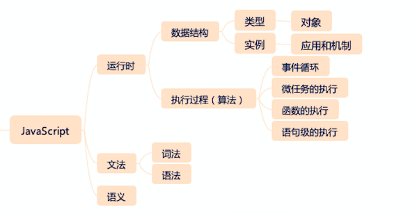

前端入门

参考

web入门

https://developer.mozilla.org/zh-CN/docs/Learn/Getting_started_with_the_web

JavaScript

https://developer.mozilla.org/zh-CN/docs/Web/JavaScript

https://www.liaoxuefeng.com/wiki/1022910821149312

CSS文档

https://developer.mozilla.org/zh-CN/docs/Web/CSS

HTML文档

https://developer.mozilla.org/zh-CN/docs/Web/HTML

工具

VSCode

https://legacy.gitbook.com/book/jeasonstudio/vscode-cn-doc/details

# 概述

基础部分

js、css、html、浏览器实现原理、API

实践

# JavaScript

## 类型

Undefined；Null；Boolean；String；Number；Symbol；Object。

# HTML

## 标签

``

> **HTML ``** 元素是短语内容的通用行内容器，并没有任何特殊语义。可以使用它来编组元素以达到某种样式意图（通过使用类或者Id属性），或者这些元素有着共同的属性，比如**lang**。应该在没有其他合适的语义元素时才使用它。`` 与 [``](https://developer.mozilla.org/zh-CN/docs/Web/HTML/Element/div) 元素很相似，但 [``](https://developer.mozilla.org/zh-CN/docs/Web/HTML/Element/div) 是一个 [块元素](https://developer.mozilla.org/en-US/docs/HTML/Block-level_elements) 而 `` 则是 [行内元素 ](https://developer.mozilla.org/en-US/docs/HTML/Inline_elements).

## 表单

# CSS

# NPM

node.js 和 npm

临时使用其他源

npm --registry https://registry.npm.taobao.org install -g @angular/cli

Angular

