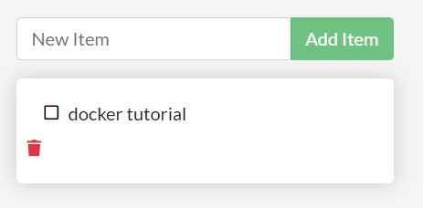

Docker、

https://segmentfault.com/a/1190000037762279


容器是什么

和普通进程一样，就是一个进程，但是用了一些隔离的特性，这些特性在linux上已经用了很长的时间，docker使得这些特性更容易上手使用

容器镜像是什么

如果将容器类比为一个系统，那么容器镜像就类似于系统镜像。


docker的作用是什么

> ocker改变了云服务，使云服务的共融共通的理想逐步成为了可能。并且Docker 已经是云策略的一部分，许多开发者正在计划使用 Docker 将业务迁移到云端。另外，为了避免被云服务供应商绑定，Docker成为很多开发者的首选。
>
> Docker改变了产品交付，为产品的整个生命周期提供了一整套的解决方案和流程。
>
> Docker改变了开发方式，提供了简化的环境配置、封装的运行环境以及统一的环境。并且提供了快速部署的方式。
>
> Docker改变了测试，多版本测试变得极为方便，快速构建测试环境也变得更加简单并且无需开发人员干预或者搭建。
>
> Docker改变了运维，环境的一致性让运维变得更加简单，同时热更新的支持让运维不再需要半夜加班部署更新，更新可以随时进行。当出现重大问题时，还能快速回滚到指定版本。
>
> Docker改变了架构，自动化扩容支持让架构变得更加简单，分布式系统也更加易于搭建和支持。同时遗留的单体应用也很易于转变为现代应用。

核心技术是什么


[官网教程](https://docs.docker.com/engine/reference/commandline/cli/)

基本概念

Docker基本概念
Client（客户端）：是Docker的用户端，可以接受用户命令和配置标识，并与Docker daemon通信。

Images（镜像）：是一个只读模板，含创建Docker容器的说明，它与操作系统的安装光盘有点像。

Containers（容器）：镜像的运行实例，镜像与容器的关系类比面向对象中的类和对象。

Registry（仓库）：是一个集中存储与分发镜像的服务。最常用的Registry是官方的Docker Hub 


# 入门

安装docker后，跟着docker提示进行学习即可。


## todo list 

1、下载压缩工程


2、构建镜像

使用 dockerfile，一个二文本文件，镜像的元信息，

```dockerfile
FROM node:12-alpine
WORKDIR /app
COPY . .
RUN yarn install --production
CMD ["node", "src/index.js"]
```


构建镜像

`docker build -t getting-started .`

会下载依赖的镜像，然后按照dockerfile内容进行，执行其中的命令

CMD 后跟的命令是容器启动后自动执行的命令

-t 是tag，标签，命名

. 在当前目录寻找dockerfile


启动app

`docker run -dp 3000:3000 getting-started`

-d daemon

-p 端口 主机端口和容器端口	


然后访问 `localhost:3000`




更新应用

1、查看docker

`docker ps`


2、停止容器

`docker stop <containera-id>`


3、移除docker

`docker rm <container-id>`


也可以直接操作图形界面


4、重新构建，运行


## 分享app

使用dokcer注册中心，默认是docker hub

注册

开启公共仓库

上传镜像

docker push qpzm7903/getting-started:tagname

但是 提示错误，

1、登录

`docker login -u username`


2、tag

`docker tag getting-started username/getting-started`


## 持久化db

Container Volumes：使用volume，容器挂在在宿主机的文件系统上。


1、name vlolume

创建

`dockr volume create volme-name`


挂载

`docker run -dp 3000:3000 -v todo-db:/etc/todos getting-started`


查看volume

`docker volume inspect volume-name`


## 使用 bind mounts

> Named volumes are great if we simply want to store data, as we don't have to worry about *where* the data is stored.


> When working on an application, we can use a bind mount to mount our source code into the container to let it see code changes, respond, and let us see the changes right away.


> For Node-based applications, [nodemon](https://npmjs.com/package/nodemon) is a great tool to watch for file changes and then restart the application.


命令

```bash
docker run -dp 3000:3000 \
    -w /app -v "$(pwd):/app" \
    node:12-alpine \
    sh -c "yarn install && yarn run dev"
```

- `-dp 3000:3000` - same as before. Run in detached (background) mode and create a port mapping
- `-w /app` - sets the "working directory" or the current directory that the command will run from
- `-v "$(pwd):/app"` - bind mount the current directory from the host in the container into the `/app` directory
- `node:12-alpine` - the image to use. Note that this is the base image for our app from the Dockerfile
- `sh -c "yarn install && yarn run dev"` - the command. We're starting a shell using `sh` (alpine doesn't have `bash`) and running `yarn install` to install *all* dependencies and then running `yarn run dev`. If we look in the `package.json`, we'll see that the `dev` script is starting `nodemon`.


调试完成后，再进行镜像的构建。

`docker build -t getting-started .`


## 多容器应用

> In general, **each container should do one thing and do it well**


1、创建网络

`docker network create todo-app`


2、开启mysql，并和此网络连接

```bash
docker run -d \
    --network todo-app --network-alias mysql \
    -v todo-mysql-data:/var/lib/mysql \
    -e MYSQL_ROOT_PASSWORD=secret \
    -e MYSQL_DATABASE=todos \
    mysql:5.7
```


--network-alias 类似于域名的存在


3、确认

`docker exec -it <mysql-container-id> mysql -p`

`show databases`


4、连接mysql

使用 `nicolaka/netshoot`容器

`docker run -it --network todo-app nicolaka/netshoot` 

也是连到同一个网络

`dig mysql`

查看信息

其中

;; ANSWER SECTION:

 mysql.          600 IN  A   172.23.0.2

mysql并不是域名，但是容器能够将其解析成ip


5、启动app，连接数据库

```bash
docker run -dp 3000:3000 \
  -w /app -v "$(pwd):/app" \
  --network todo-app \
  -e MYSQL_HOST=mysql \
  -e MYSQL_USER=root \
  -e MYSQL_PASSWORD=secret \
  -e MYSQL_DB=todos \
  node:12-alpine \
  sh -c "yarn install && yarn run dev"
```


6、验证

数据库中查看表


## 使用docker compose

是一个工具，用于帮助和分享多容器应用的。


1、安装

win、mac装docker的时候已经装了。

linux需要自己额外装


2、创建comose file

是一个yml形式的文件

在项目根目录创建

3、启动

`docker-compose up -d`

4、销毁

`docker-compose down`


这种能用bind mount吗


## 构建镜像的最佳实践

1、漏洞扫描


2、分层构建


3、Multi-Stage Builds

> an incredibly powerful tool to help use multiple stages to create an image


## 入门之后

1、Container Orchestration

2、Cloud Native Computing Foundation Projects


遇到的一些问题

1、

C:\Users\qpzm7903>docker run -d -p 80:80 docker/getting-started
docker: error during connect: This error may indicate that the docker daemon is not running.: Post http://%2F%2F.%2Fpipe%2Fdocker_engine/v1.24/containers/create: open //./pipe/docker_engine: The system cannot find the file specified.
See 'docker run --help'.


[service mesh](https://www.notion.so/9a287daeb1c24ea8907f3f9d9c02f123#11b8a6dafb0a414da4eec2fc6f58b57d)


# docker发展史


1、容器和虚拟机的区别是什么


# docker技术组成

## Docker引擎

Docker引擎组成部件：Docker client、Docker daemon、containerd、runc

功能；负责容器的创建、运行


client

daemon

containerd：容器运行

runc：负责创建容器


## Docker镜像

1、类似模板

2、多层组成


### 命令

`docker container run image:lab`


`docker container stop [containerId or container-name]`


`docker container ls`


`docker container  rm [container id or container name]`


`docker container run image:lab -p host port:container port`


## 网络管理


# 使用场景

## 应用容器化

过程：

1、写应用代码

2、写dockerfile

3、构建


容器化命令

`docker image build`

`FROM`

`RUN`

`COPY`

`EXPOSE`

`ENTRYPOINT`


# 扩展

## Docker compose 

单引擎方式进行多容器管理的部署和管理