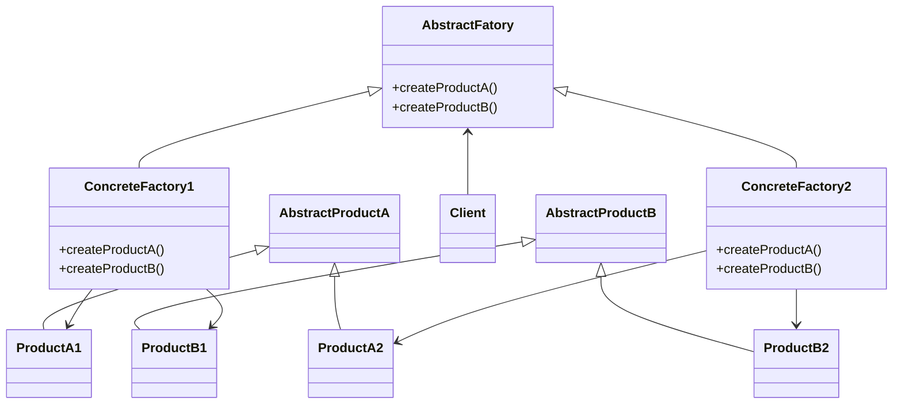

# 抽象工厂
提供一个接口，这个接口能够创建一些列相关、或相互依赖的对象，但是不用指定是哪个具体的对象。

## 适用场景

## 结构

## 优缺点

- 分离了具体类，客户端用的是抽象工厂接口，在需要使用不同系列时，只需要切换实现。
- 有利于产品一致性，也就时是使用不同的实现，获取的是不同系列的产品
- 难以支持新种类。因为在抽象接口里增加一个种类，就需要所有子类都实现

## 实现
concreteFactory一般都是单例。
为每个对象创建一个工厂方法。

在不同语言里，这个实现可能不同。可以在抽象工厂方法里增加操作类型。

## 参考
设计模式-可复用面向对象软件的基础，3.1 抽线工厂