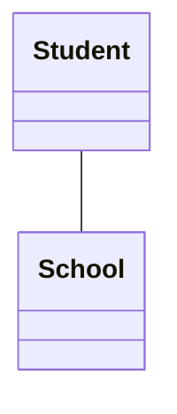
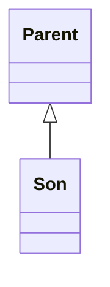
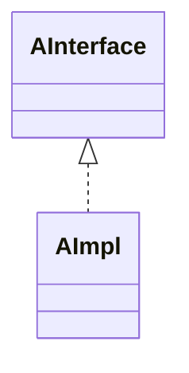
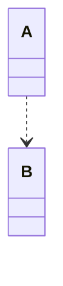
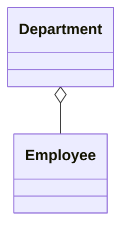
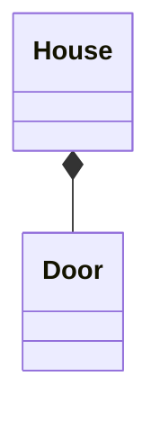
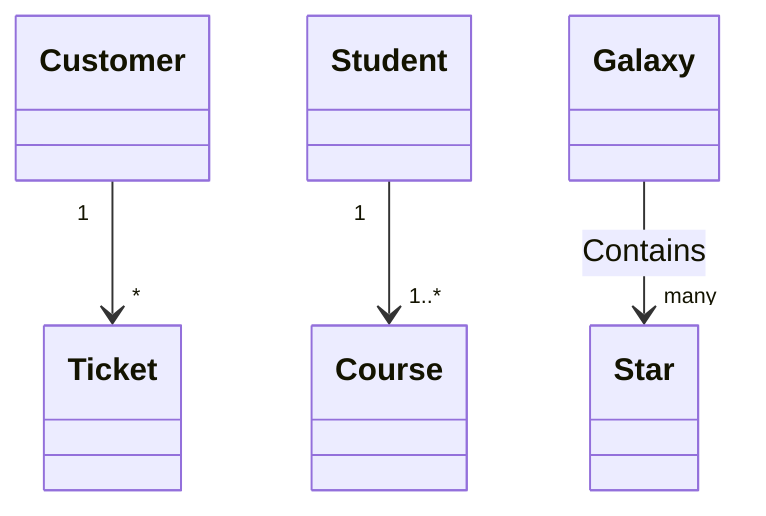

#UML
#UML-类图
# UML类图


# 总结
实现的关联程度高于虚线
实心的关联程度高于空心

## 关系
- 关联  
	- 实线+箭头


表示静态的、天然的结构。如果有方向，则表示一端知道这个关系，另一端不知道。

在Java代码里，是以成员变量的形式体现

- 继承  
	- 实线+空心三角形

- 实现 
	- 虚线+空心三角形



- 依赖  
	- 虚线+箭头


临时的关系，运行时的关系。
在Java代码里一般是在A的方法入参里收到B，然后知道B的方法和成员，能够调用B来完成A。

- 聚合 
	- 实线+空心菱形



部分和整体的关系，但是关系没有那么强烈，比如部门和员工的关系，员工组成了部门的一部分，但是部门解散了，员工实际还是存在的。

一般考虑是聚合，还是组合，是从两者的生命周期来判断的。如果部分的生命周期要跟着整体，那么就是组合。否则是聚合

- 组合 
	- 实现+实心菱形




## 关系的数量和标签
-   `1` Only 1
-   `0..1` Zero or One
-   `1..*` One or more
-   `*` Many
-   `n` n {where n>1}
-   `0..n` zero to n {where n>1}
-   `1..n` one to n {where n>1}

```
[classA] "cardinality1" [Arrow] "cardinality2" [ClassB]:LabelText
```




按照从上到下，从左到右的方向阅读
比如 一个 Customer 可以有 多张 Ticket

一个 Student 可以上 1或者多门 Course

Galaxy contains many Star

如果Galaxy 和 Star映射到Java代码，那么就是如下的例子

```java
class Galaxy{
	
	List<Star> stars;
}

class Star{

}
```

而Customer和Ticket
```java
class Customer{
	List<Ticket> tickets;
}

class Ticket{

}
```


# 参考
- https://java-programming.mooc.fi/part-11/1-class-diagrams
- https://design-patterns.readthedocs.io/zh_CN/latest/read_uml.html

