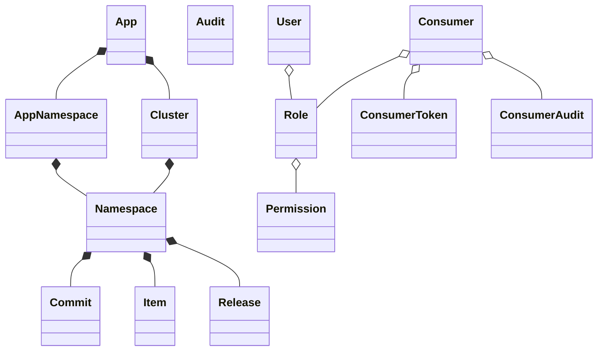
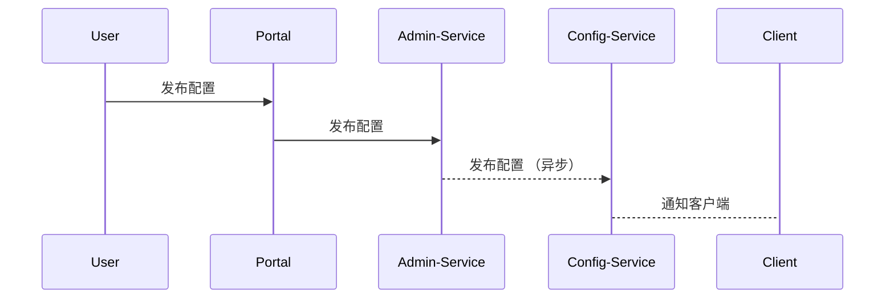

#apollo
#config-center

# apollo
开源微服务配置中心

## 特性
- 动态生效
- 版本管理
- 灰度发布
- 操作审计
- 权限管理
- 高可用
- 部署简单
- 多级缓存
- 多环境

## 解决什么问题？
解决动态配置的问题
- 本地静态配置文件
- 配置格式散乱，properties、db、环境变量
- 容易错乱、引发事故
- 配置修改周期长
- 缺少版本控制和安全审计

什么场景使用？

开关驱动？
feature flag driven development
可结合AB测试
类似通过开关控制用什么功能

在基于主干开发模式的场景下，增加功能开关将新功能隐藏，保证主干随时可以发布，也就是生产上都是关闭的，测试环境此新功能是打开的。

以及重构时，提取接口，通过开关区分新老实现

# apollo核心概念
https://github.com/apolloconfig/apollo

- 应用，唯一表示appId
- 环境
- 集群
- namespace
	- 类型
		- private
		- public
		- 继承
- 配置项
	- env + app + cluster + namespace + key
- 权限
	- 系统管理员
	- 创建者
	- 项目管理员
	- 编辑权限
	- 发布权限
	- 查看权限

## apollo架构

- config-service
	- 和client 推拉
- admin-service
- meta-service
	- 对eureka的简单封装
- eureka
- portal
	- 调用 admin-service
- client

releaseMessage实现/实时推送

Admin-Service插入ReleaseMesage表
Config-Service定时扫描ReleaseMessage表，然后通知客户端更新配置

### Client
长连接推送，并且定时拉取配置，缓存在内存，并sync到本地文件缓存，本地缓存是个降级方案

### apollo高可用

### 分布式部署

客户端和多语言接入

spring集成~xdl

spring集成 代码接入
引入配置，pom依赖，声明config namespace， 在set方法上增加@value

springboot集成
如果不在set方法上设置@value，可以用refresh

spring cloud config

apollo vs spring cloud config

## lab0

# 参考
[geektime-lab]([https://gitee.com/geektime-geekbang/apollo_lab](https://gitee.com/geektime-geekbang/apollo_lab))