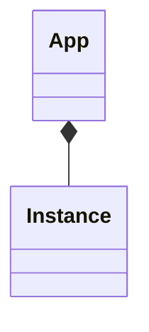

#registry 
#eureka
#ribbon

# Eureka
netflix eureka开源的一款注册中心

## 需求
微服务、分布式情况下，服务消费者如何找到生产者？
以及如何做负载均衡

## 原理
通过代理模式，通过中间商，生产者上去注册，消费者上去找。通过中间商代理解耦。

### 模式一 nginx集中式管理代理
在nginx上配置服务信息，nginx就是一个代理

存在单点故障问题
配置周期长

优点
运维简单
语言无关
集中治理

### 模式二 注册中心
服务提供者注册到注册中心
客户端嵌入消费代理，连接注册中心找到对应的服务地址，然后发起调用

客户端复杂
多语言麻烦
治理松散

### 模式三 主机独立进程代理
service mesh ，k8s集群里，每个节点都有服务的路由信息，上面的进程不感知，也没代理。

对运维、基础设施有要求，模式一二的折中方案，语言无关

## eureka，ribbon 背景、历史

- eureka名称由来
	- 阿基米德发现浮力定律的时候，喊的就是eureka，所以寓意服务发现的意思
- 2012年开源
- java based，支持多语言rest 对接
- 解决云上服务实例启停，服务飘逸问题
- [eureka](https://github.com/Netflix/eureka)

- ribbon
	- java based
	- 蝴蝶结，寓意服务联结
	- 客户端负载组件，支持eureka，支持多种LB策略
		- 随机
		- 轮训
		- 区域
		- 。。。
	- 2013 netflix开源
	- [ribbon](https://github.com/Netflix/ribbon)
	- 

## 架构图
![[Pasted image 20220423155148.png]]

## 设计

## 概念模型

Eureka

ribbon
![[Pasted image 20220423162310.png]]

## lab

## 配置

# 参考
[eureka 分析 知乎专栏](https://zhuanlan.zhihu.com/p/24829766)

[geektime lab](https://github.com/spring2go/eureka_lab)