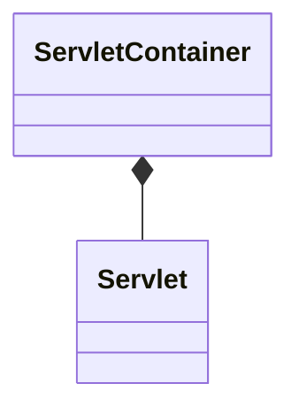

#tomcat 
#jetty

# tomcat & jetty

- tomcat、jetty 和 spring web应用的关系
	- tomcat、jetty是[[202112180545|servlet]]容器的实现
	- spring 封装了tomcat、jetty，对开发者更友好，更容易开发一个web应用

- tomcat、jetty同时又是一个http服务器，可以返回html等资源

那么 servlet和 servlet容器是什么关系呢？

Servlet是sun公司推出的一种技术，可以在服务端运行一个Java小程序。但是单独的Servlet无法运行，必须依附于Servlet容器。

# tomcat
作为http服务器，tomcat要连接socket，接收客户端的http请求。负责这部分的是Connector。
作为servlet容器，tomcat要管理servlet，把http请求转发到servlet里。负责这部分的是Container。

# 组件图
![[Pasted image 20220428220849.png]]

## 层次以及流转图
![[Pasted image 20220425063328.png]]

## 生命周期结构图
![[Pasted image 20220425063652.png]]

通过组合模式来进行层级管理
- 父组件负责调用子组件的生命周期接口

通过模板模式来进行生命周期的流程管理
LifeCycleBase抽象基类
![[Pasted image 20220430091748.png]]

通过观察者模式来提供扩展能力
![[Pasted image 20220430091635.png]]

## 启动流程
![[Pasted image 20220430091018.png]]

org.apache.catalina.startup.Bootstrap#main
|
org.apache.catalina.startup.Bootstrap#init()
|

## 连接器

连接器那么多组件，如何初始化

## 容器

容器那么多组件，关系那么复杂，如何初始化

- 热部署
- 类加载器
	- 自定义类加载器，先自己找，找不到再让父类加载器加载，破坏双拼委派模型
- 应用隔离
	- 

## 通用组件
### 日志
[[202204280548|log]] 

### session管理

## 集群模式
集群模式下，session就面临中心化，还是去中心化同步复制的问题。tomcat都支持。

# Jetty

# spring与tomcat、jetty
tomcat、jetty作为组件，spring负责加载起来

## 参考

[emmbed-jetty](https://github.com/jetty-project/embedded-jetty-jsp)

