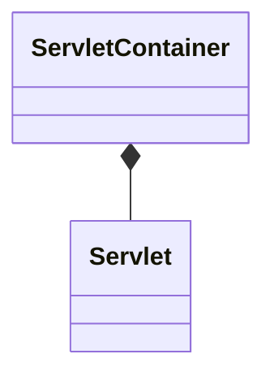

#tomcat 
#jetty

# tomcat & jetty

- tomcat、jetty 和 spring web应用的关系
	- tomcat、jetty是[[202112180545|servlet]]容器的实现
	- spring 封装了tomcat、jetty，对开发者更友好，更容易开发一个web应用

- tomcat、jetty同时又是一个http服务器，可以返回html等资源

那么 servlet和 servlet容器是什么关系呢？

Servlet是sun公司推出的一种技术，可以在服务端运行一个Java小程序。但是单独的Servlet无法运行，必须依附于Servlet容器。

# tomcat

## 层次以及流转图
![[Pasted image 20220425063328.png]]

## 生命周期结构图
![[Pasted image 20220425063652.png]]

# Jetty

## 参考

[emmbed-jetty](https://github.com/jetty-project/embedded-jetty-jsp)

