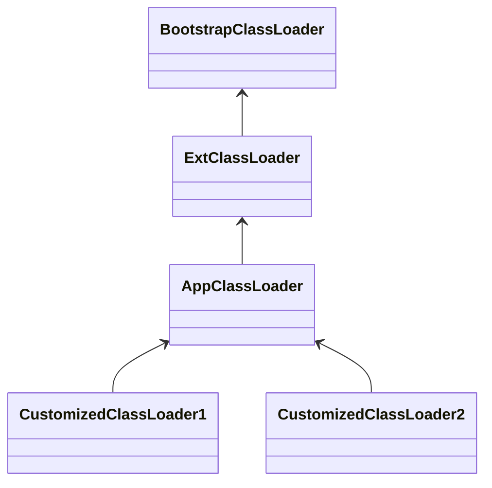

#类加载器
#class-loader


# Java class loader

作用：
将class文件加载到方法区，并在堆区创建一个java.lang.Class的实例，这个实例实际就是我们用的类，比如new 一个对象的时候，对象的的定义、初始化就是从这个java.lang.Class实例来的。


classLoader接口，显示几个核心方法

```java

public abstract class ClassLoader {

    //每个类加载器都有个父加载器
    private final ClassLoader parent;
    
    public Class<?> loadClass(String name) {
  
        //查找一下这个类是不是已经加载过了
        Class<?> c = findLoadedClass(name);
        
        //如果没有加载过
        if( c == null ){
          //先委托给父加载器去加载，注意这是个递归调用
          if (parent != null) {
              c = parent.loadClass(name);
          }else {
              // 如果父加载器为空，查找Bootstrap加载器是不是加载过了
              c = findBootstrapClassOrNull(name);
          }
        }
        // 如果父加载器没加载成功，调用自己的findClass去加载
        if (c == null) {
            c = findClass(name);
        }
        
        return c；
    }
    
    protected Class<?> findClass(String name){
       //1. 根据传入的类名name，到在特定目录下去寻找类文件，把.class文件读入内存
          ...
          
       //2. 调用defineClass将字节数组转成Class对象
       return defineClass(buf, off, len)；
    }
    
    // 将字节码数组解析成一个Class对象，用native方法实现
    protected final Class<?> defineClass(byte[] b, int off, int len){
       ...
    }
}
```

可以看到，加载的时候是会先从父加载器加载，父找不到再自己去加载。这就是双亲委派模型。

## 双亲委派的目的
保证一个class在Jvm中是唯一的。
而双亲委派是classLoader默认的实现，也就是可以重写，重写就可以破坏双亲委派。


# 默认类加载器 -- jdk8 hotspot-jvm




- BootstrapClassLoader
	- 加载 rt.jar 等启动时必须的
	- c/c++实现
- ExtClassLoader
	- 加载/jre/lib/ext下的jar
	- 扩展类加载器
- AppClassLoader
	- 加载 classpath下的jar
	- 也是应用的默认类加载器
- 自定义类加载器
	- 加载自定义路径的jar