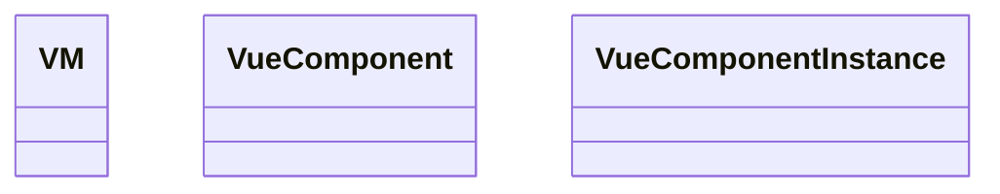

#vue
# vue


# vue-clie

## 使用 vue-cli初始化vue项目

```shell
# 安装
npm install -g @vue-cli

# create a project
vue create my-project
#or 
vue ui
```

# vue 配置文件
[官方指导](https://cli.vuejs.org/zh/config/)


# vue vscode 插件

- vetur
	- 支持.vue文件语法高亮
- ### [Vue VSCode Snippets](https://link.segmentfault.com/?enc=dc1CEca0GjLwol%2B3uxBwwQ%3D%3D.kplsZ8Yke1oZTfpGTduyLlZnqay5JOhQrY%2BKfetx6OHrrNSrNDNAF1JeLl9rvrNd27a%2F2r8f4%2FDX1NVzBo1th6QDjuuzKytGo1Xhgawkli4%3D)
	- 语法高亮、代码片段
		- 查看插件的配置

![[Pasted image 20220717105458.png]]


- ### [Auto Rename Tag](https://link.segmentfault.com/?enc=FA2ySmaS8Tjc3izT02AeeQ%3D%3D.FLF17SlLlLQkPHhrD1GKFWFviFUd6i7k8RwxL%2FdRiDTWlcom5kUGX85kYXWp%2BeKSbsPb282DfMVBFtgpo3tYI%2BVKZhQa%2BrbKTh259R0FEMk89VENemdRhs3YXPwtUocy)
	- 自动添加结束标记


# vue项目结构粗浅理解

写vue组件，组件和组件之间就像搭积木一样搭建起来，最后将顶层的组件暴露出去，通过在main.js里面

```js
import Vue from 'vue'

import App from './App.vue'

  

Vue.config.productionTip = false

  

new Vue({

  render: h => h(App),

}).$mount('#app')
```

在这里App就是顶层组件，然后将这个组件挂载到`#app`上。
而index.html里面实际只有有点点东西。
例如
```html
<!DOCTYPE html>

<html lang="">

  <head>

    <title>helloVue</title>

  </head>

  <body>

    <div id="app">

    </div>

    <!-- built files will be auto injected -->

  </body>

</html>
```


而每个组件都类似于如下结构
```vue
<template>

    <div>

      <div class="todo-footer">

        <label>

          <input type="checkbox"/>

        </label>

        <span>

          <span>已完成0</span> / 全部2

        </span>

        <button class="btn btn-danger">清除已完成任务</button>

      </div>

    </div>

</template>

  
<script>

    export default {

        name:"TodoFooter"

    }

</script>

  

<style  scoped>
  /*footer*/

  .todo-footer {

    height: 40px;

    line-height: 40px;

    padding-left: 6px;

    margin-top: 5px;

  }

</style>
```

包含 
- 模板
- 脚本
- 样式

分别对应传统前端的
- html
- javascript
- css


# vscode 配置

配置在 `.vscode/settings.json`

```json
{
    // vscode默认启用了根据文件类型自动设置tabsize的选项
    "editor.detectIndentation": false,
    // 重新设定tabsize
    "editor.tabSize": 4,
    // #每次保存的时候自动格式化
    "editor.formatOnSave": true,
    // #去掉代码结尾的分号
    "prettier.semi": false,
    // #使用带引号替代双引号
    "prettier.singleQuote": true,
    // #让函数(名)和后面的括号之间加个空格
    "javascript.format.insertSpaceBeforeFunctionParenthesis": true,
    // #这个按用户自身习惯选择
    "vetur.format.defaultFormatter.html": "js-beautify-html",
    // #让vue中的js按编辑器自带的ts格式进行格式化
    "vetur.format.defaultFormatter.js": "vscode-typescript",
    "vetur.format.defaultFormatterOptions": {
        "js-beautify-html": {
            "wrap_line_length": 120,
            "wrap_attributes": "auto"
            // #vue组件中html代码格式化样式
        }
    },
    // 格式化stylus, 需安装Manta's Stylus Supremacy插件
    "stylusSupremacy.insertColons": false, // 是否插入冒号
    "stylusSupremacy.insertSemicolons": false, // 是否插入分号
    "stylusSupremacy.insertBraces": false, // 是否插入大括号
    "stylusSupremacy.insertNewLineAroundImports": false, // import之后是否换行
    "stylusSupremacy.insertNewLineAroundBlocks": false,
    "explorer.confirmDelete": false, // 两个选择器中是否换行
    "editor.codeActionsOnSave": {
        "source.fixAll.eslint": true,
        "source.fixAll.stylelint": true
    },
    "workbench.iconTheme": "vs-seti",
    "files.autoSave": "off",
    "editor.suggestSelection": "first",
    "vsintellicode.modify.editor.suggestSelection": "automaticallyOverrodeDefaultValue",
    "diffEditor.ignoreTrimWhitespace": false,
    "window.zoomLevel": 0,
    "atomKeymap.promptV3Features": true,
    "editor.multiCursorModifier": "ctrlCmd",
    "editor.formatOnPaste": true,
    "guides.enabled": false,
    "eslint.format.enable": true,
    //autoFix默认开启，只需输入字符串数组即可
    "eslint.validate": [
        "javascript",
        "vue",
        "html"
    ],
    "[vue]": {
        "editor.defaultFormatter": "octref.vetur"
    },
    "editor.fontSize": 16,
    "vetur.validation.template": false,
    "[jsonc]": {
        "editor.defaultFormatter": "vscode.json-language-features"
    },
    // 关闭eslint 语法检测
    "eslint.enable": false
}
```


# vue的基础语法

vue在自己定义了一些列的html语法，比如循环，变量绑定，函数绑定等


## 组件之间传递数据  

### 直接依赖的组件
一把是上层组件传递给下层组件。


传递时通过 `:parameterName='value'`

然后被传递参数的组件需要再组件里面声明需要这个参数，就像是函数调用一样，需要声明参数，才能传递参数。


### 下层给上层传递消息

- 上层给下层传递一个函数 ， 或者说下层组件接受一个函数，用于发数据传递进去，上层组件是要提供这个函数就可以


### 那么任意之间组件怎么传递消息呢？
消息总线，这种不管是在前端，还是后端，从服务级别，到线程级别，进程级别，OS级别，都会用到。
总体来说，就是注册、侦听，触发、消费的过程。也就是观察者模式。

总线的要求
- 对所有组件可见
- 实现
	- `$on`
	- `$off`
	-  `$emit`


### 简单粗暴 window
直接在window对象上


### 在组件原型上
`vueComponent.prototype.__proto__ === Vue.prototype`

所以在Vue的原型上加
```
Vue.prototype.x = {...}  // 但这个对象不是vue组件，没有对应的方法
```


那么对象可以直接加到Vue原型上，那么如何让对象有`$on`等方法？
main.js
```js
new Vue({

    render: h => h(App),
    beforeCreate(){
	    Vue.prototype.$bus = this // 全局事件总线，加$ 是表示特殊，一般不用
    }

}).$mount('#app')
```


`$bus`  一般总线都叫这个名词

### 事件注册和销毁、触发

在某个组件里
```js
...
mouted (){
	this.总线名.$on('事件名',回调函数);
},

beforeDestroy(){
	this.总线名.$off('事件名')
}

...

this.总线名.$emit('事件名',参数)
```


## 消息订阅和发布
和总线有什么差异？原理是一样的，都是订阅-发布

三方库

- pubsub-js
	- publish-subscribe-javascript


### pubsub-js

安装
`npm i pubsubjs`

使用
注意这个回调函数，第一个参数默认是事件名

```js

import pubsub from 'pubsub-js'

pubsub.subscribe('name',function(enent_name, param...)) 
// 注意回调函数，可以直接传递this.method， 或者 (event_name, param)=>{
...
}

...
this.pubId = pubsub.publish('name',call_back_function(event_name, param...))

... 销毁
beforeDestroy(){
	pubsub.unsubscribe(this.pubId)
}


```

## 在模板里如何使用组件里的数据？
使用插值语法 {{ value }}

在标签里的值，例如
```html
<p1>{{ value }} </p1>
```

如果是标签属性

```html
<input type="checkbox" :checked="value" />
```

## 如何收集input的值？


### 通过双向绑定 或者 通过事件触发
- v-model进行双向的绑定，值变化的时候，使用到这个值的地方也会变化
- 键盘事件绑定，事件发生的时候会触发一个方法的回调，在回调里进行处理


例如
```html
<template>

  <div class="todo-header">

    <input type="text" placeholder="请输入你的任务名称，按回车键确认" v-model="title" @keyup.enter="addTodo" />

  </div>

</template>

  

<script>

export default {

  name: 'TotoFooter',

  data () {

    return {

      title: ""

    }

  },

  methods: {

    addTodo (event) {

      console.log(event.target.value)

    }

  }

}
```

# vue api


# vue 对象结构



# js里的uuid库 - nanoid
迷你的uuid实现，简单

```shell
npm i nanoid
```


最简单实用

```js
import {nanoid} from 'nanoid'
var id = nanoid()
```


## vc对象
vue component 对象

其中的
- data
- computed
- pros
	- 一般不修改prop传入的数据
- method
等都不能重名，所以注意啦！


## 自定义事件

### 绑定
方式1
1. 在要绑定的组件上用 `v-on:自定义事件名="事件发生时调用的函数"`
	1. 或者 `@自定义事件名="事件发生时调用的函数"`
	2. 绑定原生事件 `@事件名.native="回调函数"`
2. 在对应的组件里面触发 `this.$emit(自定义事件名)`


方式2，在组件挂载的时候加载
```js
<template>
<div>
	<ComponentA ref="componentA"/>
</div>
</template>
<script>
...
mounted(){
	this.$refs.componentA.$on("自定义事件名",this.事件发生时调用的函数)
}
</script>
```

ps
如果在`this.$refs.componentA.$on("自定义事件名",function(param...){})`
这种写法里直接绑定回调函数，那么里面的this实际是回调发生时所处的vue实例。

但是箭头函数可以
```js
	this.$refs.componentA.$on("自定义事件名",()=>{
	})
```

所以关键是寻找this对象怎么找，上下文的问题。
那么  function (xxx) {}  和  (xxx)=> {} 有什么区别？

### 解绑
绑定在谁身上，就在谁身上解绑，直接操作vc实例去删除对应的就可以了
```js

this.$off("自定义事件名")
# 或者
this.$off(["自定义事件名1","事件名2"...])
# 或者 解绑所有
this.$off()
# 销毁组件，也可以解绑事件
this.$destroy()
```

## vue实例的生命周期
![[生命周期.png]]

### 销毁
销毁会销毁对应的侦听事件，但是dom还是在
并且会销毁子组件

# 浏览器本地缓存
浏览器本地提供的api，可以操作localStorage、sessionStorage等，

- localStorage会一直保留

如下例子
```html
 window.localStorage.setItem(key,value)
 window.sessionStorage.setItem(key,value)
```


sessionStorage
- 浏览器会话
- 浏览器关闭，会话就结束