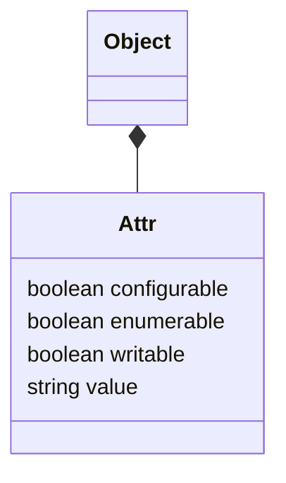
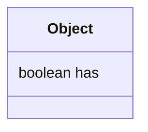

#js-base


# js object and attr



- value的数据类型是动态决的
- configurable
	- 决定这个属性是否可以被删除
- writeable
	- 决定这个属性是否可以被修改
	- 默认为true
- enumerable
	- for-in 循环时是否返回
	- 默认true


通过object字面量定义出来的，这几个都是默认为true，例如

```js

let person = { name:"name"}
for (let i in person){
	console.log(i)
}
> name
```


那么怎么修改这些属性呢？通过Object上的方法

# js  - object
#js-object



参考
https://developer.mozilla.org/zh-CN/docs/Web/JavaScript/Reference/Global_Objects/Object

