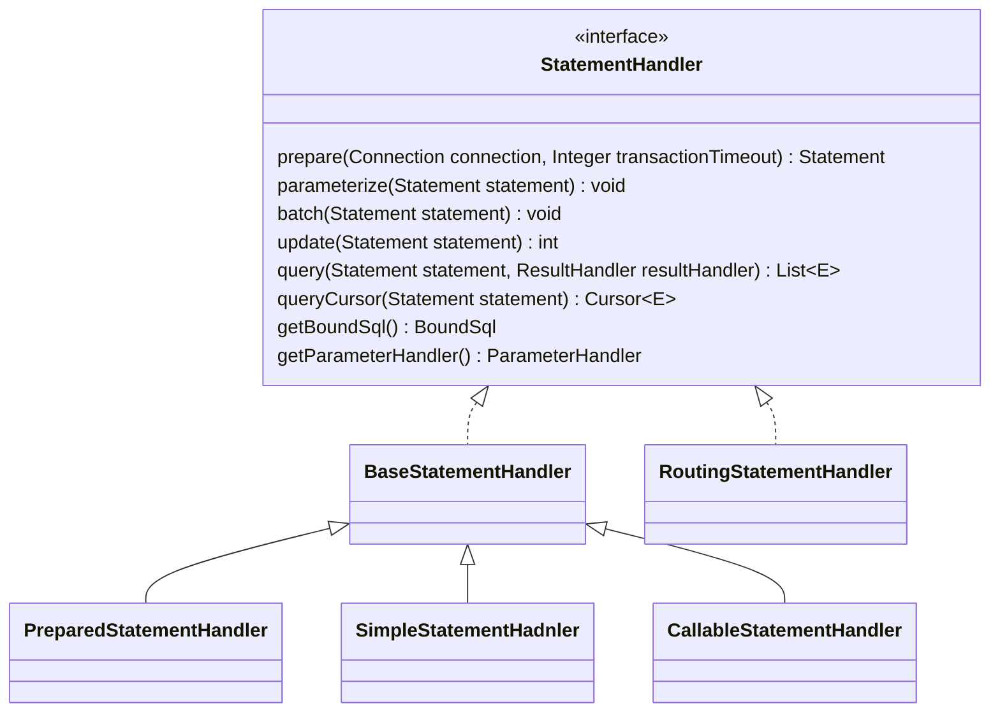

1、mybatis是什么？

是一个持久层框架

2、mybatis提供什么功能

它支持自定义 SQL、存储过程以及高级映射

3、组成部分

POJO和数据库表映射

4、底层技术

JDBC

5、同类实现

JPA、Hibernate等


目标

希望从源码中学到什么？


# JDBC

https://en.wikipedia.org/wiki/Java_Database_Connectivity

> JDBC 4.1, is specified by a maintenance release 1 of JSR 221[[3\]](https://en.wikipedia.org/wiki/Java_Database_Connectivity#cite_note-3) and is included in Java SE 7.[[4\]](https://en.wikipedia.org/wiki/Java_Database_Connectivity#cite_note-4)
>
> JDBC 4.2, is specified by a maintenance release 2 of JSR 221[[5\]](https://en.wikipedia.org/wiki/Java_Database_Connectivity#cite_note-5) and is included in Java SE 8.[[6\]](https://en.wikipedia.org/wiki/Java_Database_Connectivity#cite_note-6)
>
> The latest version, JDBC 4.3, is specified by a maintenance release 3 of JSR 221[[7\]](https://en.wikipedia.org/wiki/Java_Database_Connectivity#cite_note-7) and is included in Java SE 9.[[8\]](https://en.wikipedia.org/wiki/Java_Database_Connectivity#cite_note-8)


[4.2规范文档](https://download.oracle.com/otndocs/jcp/jdbc-4_2-mrel2-spec/index.html)


JDBC基础

- statement
  - 发送给数据库服务器
- preparedStatement
  - 预处理的、缓存的statement
- CallableStatement
  - 用于执行存储过程的statement


JDBC驱动

驱动是客户端的适配器，将java代码转为数据库服务器能理解的协议。

# 用法


首先看Mybatis入门用法


`

# 初始化

## 配置

```java
SqlSessionFactory sqlSessionFactory = new SqlSessionFactoryBuilder().build(inputStream);
```

在builder中，调用了XML配置构建起获取了配置

```java
XMLConfigBuilder parser = new XMLConfigBuilder(inputStream, environment, properties);
Configuration configuration = parser.parse()
```

而在`XMLConfigBuilder`的`parse`方法对xml配置进行解析，以及对mapper文件进行解析。


Configuration的重要配置有

- settings
  - 对应settings配置

- environment
  - 也就是配置里面的environment标签内容
    - 包含datasource
- mapperRegistry
- typerHandlerRegistry
  - 
- typeAlaisRegistry
- mappedStatements
- sqlFragments


`MappedStatement`

是mapper xml 文件里面的映射。包含select|update|insert|delete，或者是通过注解在接口上写的。

配置有

| key           | options                       | default  | description                              |
| ------------- | ----------------------------- | -------- | ---------------------------------------- |
| statementType | STATEMENT、PREPARED或CALLABLE | PREPARED | 根据不同参数，选择不同的statementHandler |


## SqlSessionFactory

```
DefaultSqlSessionFactory里只有Configuration一个字段所以在构建SqlSession的时候，实际用的configuration
```


## 执行

```java
try (SqlSession session = sqlSessionFactory.openSession()) {
    UserMapper mapper = session.getMapper(UserMapper.class);
    List<UserEntity> userEntities = mapper.listAllUser();
    userEntities.forEach(System.out::println);
}
```


通过`SqlSessionFactory` 获取`SqlSession`


通过`sqlSession`获取`mapper`


获取`mapper`后执行接口的方法


通过一个时序图看看


可以看到，最终的执行是交给`StatementHandler`，是对JDCB的对应封装

类图如下




- BaseStatementHandler
  - 模板模式，封装流程
- SimpleStatementHandler
  - 封装JDBC statment对象的操作
- PreparedStatementHandler
  - 封装JDBC PreparedStatement对象的操作
- CallableStatementHandler
  - 封装对JDBC CallableStatement对象的操作
- RoutingStatementHandler
  - 根绝mapper配置里的statementType配置创建对应的statmentHandler
  - 外观？组合？


Executor有很多实现

- BaseExecutor
  - 模板模式，定义流程

- cachingExecutor
  - 开启二级缓存时，对BaseExecutor的三个子类进行装饰，装饰器模式
- simpleExecutor
  - 基本的增删改查
- ReuseExecutor
  - 对JBDC的statement做缓存 - 享元模式
- BatchExecutor
  - 调用statement的批量操作功能


参数处理


```ParameterHandler```

在PreparedStatementHandler和CallableStatementHandler操作对应的Statement执行数据库交互之前为参数占位符设置值，所以就在PreparedStatementHandler或者CallableStatementHandler里找到它的使用


类型处理  -- 序列化 和 反序列化

使用 TypeHandler，Mybatis内置了很多类型的处理器

TypeHandlerRegistry 中有jdbc类型和java类型的互相映射，在配置初始化的时候会把所有的都初始化好。

自定义类型转换的时候，可以注册到typeHandlerRegistry中


ResultSetHandler -- 反序列化

```java
public interface ResultSetHandler {

  /* 对stmt里面的结果进行处理 */
  <E> List<E> handleResultSets(Statement stmt) throws SQLException;

  /* 将ResultSet对象包装成Cursor对象，对Cursor进行遍历时，能够动态地从数据库查询数据，避免一次性将所有数据加载到内存中。 */
  <E> Cursor<E> handleCursorResultSets(Statement stmt) throws SQLException;

  void handleOutputParameters(CallableStatement cs) throws SQLException;

}
// 只有一个实现
public class DefaultResultSetHandler implements ResultSetHandler {

  private static final Object DEFERRED = new Object();

  private final Executor executor;
  private final Configuration configuration;
  private final MappedStatement mappedStatement;
  private final RowBounds rowBounds;
  private final ParameterHandler parameterHandler;
  private final ResultHandler<?> resultHandler;
  private final BoundSql boundSql;
  private final TypeHandlerRegistry typeHandlerRegistry;
  private final ObjectFactory objectFactory;
  private final ReflectorFactory reflectorFactory;

  // nested resultmaps
  private final Map<CacheKey, Object> nestedResultObjects = new HashMap<>();
  private final Map<String, Object> ancestorObjects = new HashMap<>();
  private Object previousRowValue;

  // multiple resultsets
  private final Map<String, ResultMapping> nextResultMaps = new HashMap<>();
  private final Map<CacheKey, List<PendingRelation>> pendingRelations = new HashMap<>();

  // Cached Automappings
  private final Map<String, List<UnMappedColumnAutoMapping>> autoMappingsCache = new HashMap<>();

  // temporary marking flag that indicate using constructor mapping (use field to reduce memory usage)
  private boolean useConstructorMappings;
}
```


类型别名


# 缓存

- 一级缓存
  - 基于sqlSession实现
  - 默认开启，不支持关闭
  - localCacheScope可以管理范围
- 二级缓存
  - 基于mapper实现
  - config中
    - `<setting name="cacheEnable" value="true"/>`
  - mapper中
    - `<cache eviction="FIFO" flushInterval="50000" size="512" readOnly="true"/>`
    - 使用
      - `<select id="listUser" flushCache="false" useCache="true" resultType="xx"> ...</select>`
      - 


接口

```java
public interface Cache {

  /**
   * @return The identifier of this cache
   */
  String getId();

  /**
   * @param key
   *          Can be any object but usually it is a {@link CacheKey}
   * @param value
   *          The result of a select.
   */
  void putObject(Object key, Object value);

  /**
   * @param key
   *          The key
   * @return The object stored in the cache.
   */
  Object getObject(Object key);

  /**
   * As of 3.3.0 this method is only called during a rollback
   * for any previous value that was missing in the cache.
   * This lets any blocking cache to release the lock that
   * may have previously put on the key.
   * A blocking cache puts a lock when a value is null
   * and releases it when the value is back again.
   * This way other threads will wait for the value to be
   * available instead of hitting the database.
   *
   *
   * @param key
   *          The key
   * @return Not used
   */
  Object removeObject(Object key);

  /**
   * Clears this cache instance.
   */
  void clear();

  /**
   * Optional. This method is not called by the core.
   *
   * @return The number of elements stored in the cache (not its capacity).
   */
  int getSize();

  /**
   * Optional. As of 3.2.6 this method is no longer called by the core.
   * <p>
   * Any locking needed by the cache must be provided internally by the cache provider.
   *
   * @return A ReadWriteLock
   */
  default ReadWriteLock getReadWriteLock() {
    return null;
  }

}

```


使用了装饰器模式

实现类有


- BlockingCache
  - 阻塞版装饰器
  - 能够保证同一时间只有一个线程到缓存中查找指定的Key对应的数据
- TrasactionalCache
- FifoCache
  - 先入先出缓存装饰器
  - 
- LoggingCache
  - 为缓存增加日志输出功能
- SerializedCache
  - 线程安全缓存装饰器
- LruCache
  - 最近最少使用的缓存装饰器
- PerpetualCache
  - 基本实现类
- SoftCache
- ScheduledCache
  - 自动刷新缓存装饰器
- WeakCache
- SynchronizedCache
  - 序列化缓存装饰器


