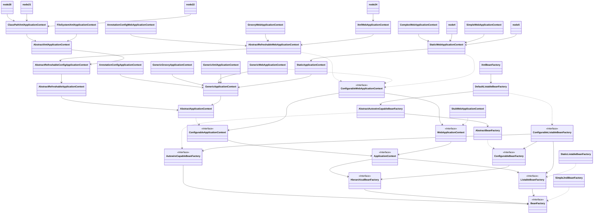

# core

## bean

```mermaid
classDiagram 
    
    class AbstractApplicationContext
    class AbstractAutowireCapableBeanFactory
    class AbstractBeanFactory
    class AbstractRefreshableApplicationContext
    class AbstractRefreshableConfigApplicationContext
    class AbstractRefreshableWebApplicationContext
    class AbstractXmlApplicationContext
    class AnnotationConfigApplicationContext
    class AnnotationConfigWebApplicationContext
    class ApplicationContext {
    <<Interface>>

    }
    class AutowireCapableBeanFactory {
    <<Interface>>

    }
    class BeanFactory {
    <<Interface>>

    }
    class ClassPathXmlApplicationContext
    class node28
    class ComplexWebApplicationContext
    class ConfigurableApplicationContext {
    <<Interface>>

    }
    class ConfigurableBeanFactory {
    <<Interface>>

    }
    class ConfigurableListableBeanFactory {
    <<Interface>>

    }
    class ConfigurableWebApplicationContext {
    <<Interface>>

    }
    class node21
    class DefaultListableBeanFactory
    class FileSystemXmlApplicationContext
    class GenericApplicationContext
    class GenericGroovyApplicationContext
    class GenericWebApplicationContext
    class GenericXmlApplicationContext
    class GroovyWebApplicationContext
    class HierarchicalBeanFactory {
    <<Interface>>

    }
    class ListableBeanFactory {
    <<Interface>>

    }
    class node4
    class node22
    class SimpleJndiBeanFactory
    class SimpleWebApplicationContext
    class node24
    class StaticApplicationContext
    class StaticListableBeanFactory
    class StaticWebApplicationContext
    class StubWebApplicationContext
    class node5
    class WebApplicationContext {
    <<Interface>>

    }
    class XmlBeanFactory
    class XmlWebApplicationContext

    AbstractApplicationContext  ..>  ConfigurableApplicationContext 
    AbstractAutowireCapableBeanFactory  -->  AbstractBeanFactory 
    AbstractAutowireCapableBeanFactory  ..>  AutowireCapableBeanFactory 
    AbstractBeanFactory  ..>  ConfigurableBeanFactory 
    AbstractRefreshableApplicationContext  -->  AbstractApplicationContext 
    AbstractRefreshableConfigApplicationContext  -->  AbstractRefreshableApplicationContext 
    AbstractRefreshableWebApplicationContext  -->  AbstractRefreshableConfigApplicationContext 
    AbstractRefreshableWebApplicationContext  ..>  ConfigurableWebApplicationContext 
    AbstractXmlApplicationContext  -->  AbstractRefreshableConfigApplicationContext 
    AnnotationConfigApplicationContext  -->  GenericApplicationContext 
    AnnotationConfigWebApplicationContext  -->  AbstractRefreshableWebApplicationContext 
    ApplicationContext  -->  HierarchicalBeanFactory 
    ApplicationContext  -->  ListableBeanFactory 
    AutowireCapableBeanFactory  -->  BeanFactory 
    ClassPathXmlApplicationContext  -->  AbstractXmlApplicationContext 
    node28  -->  ClassPathXmlApplicationContext 
    ComplexWebApplicationContext  -->  StaticWebApplicationContext 
    ConfigurableApplicationContext  -->  ApplicationContext 
    ConfigurableBeanFactory  -->  HierarchicalBeanFactory 
    ConfigurableListableBeanFactory  -->  AutowireCapableBeanFactory 
    ConfigurableListableBeanFactory  -->  ConfigurableBeanFactory 
    ConfigurableListableBeanFactory  -->  ListableBeanFactory 
    ConfigurableWebApplicationContext  -->  ConfigurableApplicationContext 
    ConfigurableWebApplicationContext  -->  WebApplicationContext 
    node21  -->  ClassPathXmlApplicationContext 
    DefaultListableBeanFactory  -->  AbstractAutowireCapableBeanFactory 
    DefaultListableBeanFactory  ..>  ConfigurableListableBeanFactory 
    FileSystemXmlApplicationContext  -->  AbstractXmlApplicationContext 
    GenericApplicationContext  -->  AbstractApplicationContext 
    GenericGroovyApplicationContext  -->  GenericApplicationContext 
    GenericWebApplicationContext  ..>  ConfigurableWebApplicationContext 
    GenericWebApplicationContext  -->  GenericApplicationContext 
    GenericXmlApplicationContext  -->  GenericApplicationContext 
    GroovyWebApplicationContext  -->  AbstractRefreshableWebApplicationContext 
    HierarchicalBeanFactory  -->  BeanFactory 
    ListableBeanFactory  -->  BeanFactory 
    node4  -->  StaticWebApplicationContext 
    node22  -->  ClassPathXmlApplicationContext 
    SimpleJndiBeanFactory  ..>  BeanFactory 
    SimpleWebApplicationContext  -->  StaticWebApplicationContext 
    node24  -->  XmlWebApplicationContext 
    StaticApplicationContext  -->  GenericApplicationContext 
    StaticListableBeanFactory  ..>  ListableBeanFactory 
    StaticWebApplicationContext  ..>  ConfigurableWebApplicationContext 
    StaticWebApplicationContext  -->  StaticApplicationContext 
    StubWebApplicationContext  ..>  WebApplicationContext 
    node5  -->  StaticWebApplicationContext 
    WebApplicationContext  -->  ApplicationContext 
    XmlBeanFactory  -->  DefaultListableBeanFactory 
    XmlWebApplicationContext  -->  AbstractRefreshableWebApplicationContext 
```