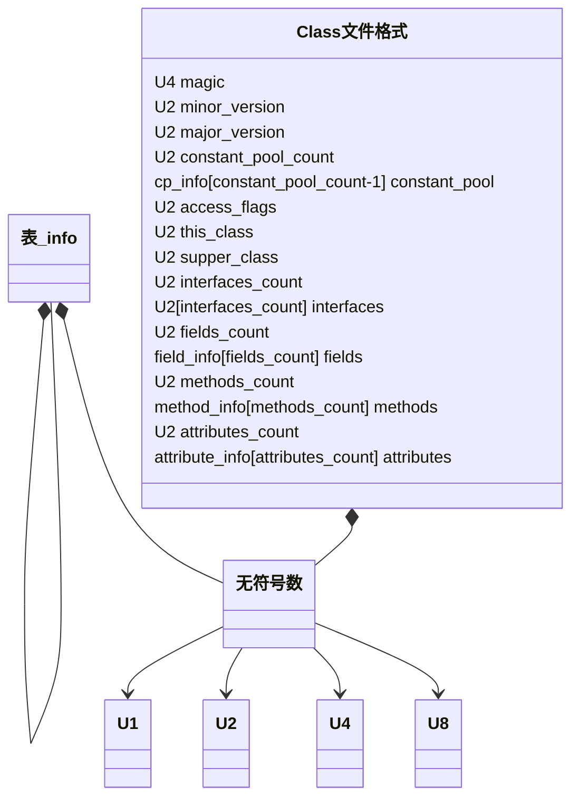

# 观察魔数、版本号

编译以及通过hexdump输出
```shell
➜  tmp hexdump -C Test.class
00000000  ca fe ba be 00 00 00 3d  00 13 0a 00 02 00 03 07  |.......=........|
00000010  00 04 0c 00 05 00 06 01  00 10 6a 61 76 61 2f 6c  |..........java/l|
00000020  61 6e 67 2f 4f 62 6a 65  63 74 01 00 06 3c 69 6e  |ang/Object...<in|
00000030  69 74 3e 01 00 03 28 29  56 09 00 08 00 09 07 00  |it>...()V.......|
00000040  0a 0c 00 0b 00 0c 01 00  04 54 65 73 74 01 00 01  |.........Test...|
00000050  6d 01 00 01 49 01 00 04  43 6f 64 65 01 00 0f 4c  |m...I...Code...L|
00000060  69 6e 65 4e 75 6d 62 65  72 54 61 62 6c 65 01 00  |ineNumberTable..|
00000070  03 69 6e 63 01 00 03 28  29 49 01 00 0a 53 6f 75  |.inc...()I...Sou|
00000080  72 63 65 46 69 6c 65 01  00 09 54 65 73 74 2e 6a  |rceFile...Test.j|
00000090  61 76 61 00 21 00 08 00  02 00 00 00 01 00 02 00  |ava.!...........|
000000a0  0b 00 0c 00 00 00 02 00  01 00 05 00 06 00 01 00  |................|
000000b0  0d 00 00 00 1d 00 01 00  01 00 00 00 05 2a b7 00  |.............*..|
000000c0  01 b1 00 00 00 01 00 0e  00 00 00 06 00 01 00 00  |................|
000000d0  00 01 00 01 00 0f 00 10  00 01 00 0d 00 00 00 1f  |................|
000000e0  00 02 00 01 00 00 00 07  2a b4 00 07 04 60 ac 00  |........*....`..|
000000f0  00 00 01 00 0e 00 00 00  06 00 01 00 00 00 04 00  |................|
00000100  01 00 11 00 00 00 02 00  12                       |.........|
00000109
➜  tmp cat Test.java
public class Test{
	private int m;
	public int inc(){
	return m+1;
		}
	}
```

包含的常量可以使用javap来分析
结果如下
```shell
➜  tmp javap -verbose Test
Classfile /Users/weiyicheng/workspace/tmp/Test.class
  Last modified 2022年6月27日; size 265 bytes
  SHA-256 checksum 0eb390fe5b55fc46542827e3f06c3556143973495255e9acb86f6d8e2847a05b
  Compiled from "Test.java"
public class Test
  minor version: 0
  major version: 61
  flags: (0x0021) ACC_PUBLIC, ACC_SUPER
  this_class: #8                          // Test
  super_class: #2                         // java/lang/Object
  interfaces: 0, fields: 1, methods: 2, attributes: 1
Constant pool:
   #1 = Methodref          #2.#3          // java/lang/Object."<init>":()V
   #2 = Class              #4             // java/lang/Object
   #3 = NameAndType        #5:#6          // "<init>":()V
   #4 = Utf8               java/lang/Object
   #5 = Utf8               <init>
   #6 = Utf8               ()V
   #7 = Fieldref           #8.#9          // Test.m:I
   #8 = Class              #10            // Test
   #9 = NameAndType        #11:#12        // m:I
  #10 = Utf8               Test
  #11 = Utf8               m
  #12 = Utf8               I
  #13 = Utf8               Code
  #14 = Utf8               LineNumberTable
  #15 = Utf8               inc
  #16 = Utf8               ()I
  #17 = Utf8               SourceFile
  #18 = Utf8               Test.java
{
  public Test();
    descriptor: ()V
    flags: (0x0001) ACC_PUBLIC
    Code:
      stack=1, locals=1, args_size=1
         0: aload_0
         1: invokespecial #1                  // Method java/lang/Object."<init>":()V
         4: return
      LineNumberTable:
        line 1: 0

  public int inc();
    descriptor: ()I
    flags: (0x0001) ACC_PUBLIC
    Code:
      stack=2, locals=1, args_size=1
         0: aload_0
         1: getfield      #7                  // Field m:I
         4: iconst_1
         5: iadd
         6: ireturn
      LineNumberTable:
        line 4: 0
}
SourceFile: "Test.java"
```
可以看到常量池里有18个常量
