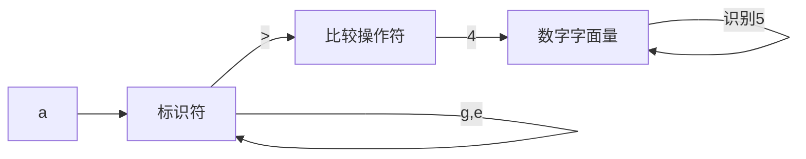
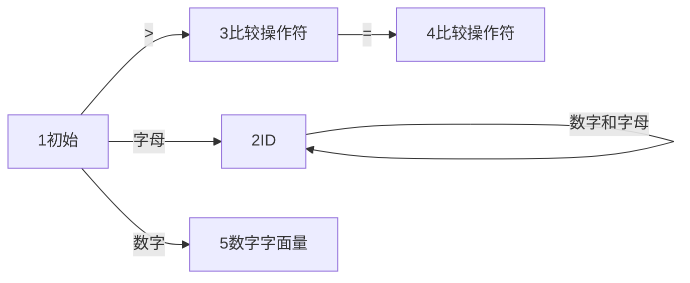

编译过程


# 前端

- 词法分析
  - Token
  - 有限状态机
- 语法分析
  - AST--从Token构建而成
    - 
  - 递归下降
- 语义分析
  - 消除歧义
  - 类型推导
  - 引用消解
    - 函数
    - 变量
    - 引用都要正确
  - 左值
    - 例子
      - a+3
      - a=3
      - 在AST上，a就是一个节点，计算时，对与左值，则时取地址，把值放进去。对于右值，就是要获取到地址对应的值
  - 右值
  - 属性计算
- \


## 理解代码

简单词法分析器，分析目标语句

- age >= 45
- int age = 40
- a+3*5


解析`age >= 45`得出




- 标识符，第一个字符必须是字母，后面的可以是数字或者字母
- 比较操作符 > >=
- 数字字面量


构造有限自动机




1. 初始状态 INIT 临时状态
2. 标识符状态 ID
3. 大于操作符 GT
4. 大于等于操作符 GE
5. 数字字面量


解析 `int age = 40`

int 不是标识符，是关键字，所以在识别标识符前，判断是否是关键字


## 语法分析 手工打造计算器

变量声明

```

intDeclaration : Int Identifier ('=' additiveExpression)?;
```


`int age = 45`的AST应该输出

```
Programm Calculator    
	IntDeclaration age       
		AssignmentExp =         
			IntLiteral 45
```


CFG context-free grammar 上下文无关文法

正则文法是上下文无关文法的一个子集。它们的区别呢，就是上下文无关文法允许递归调用，而正则文法不允许。


表达式优先级


```
additiveExpression
    :   multiplicativeExpression
    |   additiveExpression Plus multiplicativeExpression
    ;

multiplicativeExpression
    :   IntLiteral
    |   multiplicativeExpression Star IntLiterl
    ;
```


无限递归的文法，左递归

````
additiveExpression
    :   IntLiteral
    |   additiveExpression Plus IntLiteral
    ;
````

尝试把递归的地方移动

```additiveExpression
additiveExpression
	:   multiplicativeExpression
    |   multiplicativeExpression Plus additiveExpression
    ;
```

乘法如下

```

multiplicativeExpression
    :   IntLiteral
    |   IntLiteral Star multiplicativeExpression
    ;
```


但是连续相加的计算顺序变了，变成了从右向左


```
 additive -> multiplicative | multiplicative + additive
 multiplicative -> primary | primary * multiplicative
 primary -> IntLiteral | Identifier
```


## 表达式求值

对AST进行深度遍历

## 解决二元表达式的难点

- 左递归
- 优先级
- 结合性


算数表达式文法

```
add -> mul | add + mul
mul -> pri | mul * pri
pri -> Id | Num | (add) 
```

BNF写法 巴科斯范式

```
add ::= mul | add + mul
mul ::= pri | mul * pri
pri ::= Id | Num | (add) 
```


扩展巴科斯范式 (EBNF)

```
add -> mul (+ mul)*
```


那么怎么解决优先级呢？在文法里，是通过文法的嵌套来解决优先级的，add包含了mul。比如

```
exp -> or | or = exp   
or -> and | or || and
and -> equal | and && equal
equal -> rel | equal == rel | equal != rel
rel -> add | rel > add | rel < add | rel >= add | rel <= add
add -> mul | add + mul | add - mul 
mul -> pri | mul * pri | mul / pri 
```

优先级从高到低是：exp、or、and、equal、rel、add、mul、pri


那么括号呢？通过括号改变优先级

```
pri -> Id | Literal | (exp)
```

基础表达式再变为exp，就可以提高优先级


结合性

左结合，或者右结合，

比如如下文法

```
add -> mul | add + mul
mul -> pri | mul * pri
pri -> Num 
```

使用这个文法，解析`2+3+4`

得到的AST就是


计算的时候就是先算3+4，再算2+7.

于是把递归项放左边，则左结合，递归项在右边，则右结合。


想要左结合，但是不想递归，改写文法得到（步骤不清楚）

```
add -> mul (+ mul)* 
```

实现上，递归变循环，所以所有的递归编程循环，就解决递归的问题了？


## 脚本语言

语法规则

```
programm -> intDeclare | expressionStatement | assignmentStatement
intDeclare -> 'int' Id ( = additive) ';'
expressionStatement -> addtive ';'
assignmentStatement -> Id = expressionStatement ';'
addtive -> multiplicative ( (+ | -) multiplicative)*
multiplicative -> primary ( (* | /) primary)*
primary -> IntLiteral | Id | (additive)
```


脚本用例

```
int age = 45;
age + 10 * 2;
```


实现细节

变量存储

使用key-value存储变量和变量的值

```java

private HashMap<String, Integer> variables = new HashMap<>();
```


主线程循环等待


## next

后端

- 生成目标代码


类型系统

- 类型推导
  - S（Synthesized Attribute）属性，综合属性 从AST的下级节点推导
  - I 属性（Inherited Attribute），继承属性，从上级、兄弟、自己推导


- 类型检查
  - 赋值语句
  - 变量声明语句
  - 函数传参
  - 函数返回值
  - 


类型转换


## Antlr工具

https://www.antlr.org/

可用于生成词法分析器。

生成语法分析器

### 

### java-antlr安装

https://github.com/antlr/antlr4/blob/master/doc/getting-started.md


antlr demo

此demo位windows平台

Lexer  词法

grammar 语法

定义文件`Hello.g4`

```g4
// Define a grammar called Hello
grammar Hello;
r  : 'hello' ID ;         // match keyword hello followed by an identifier
ID : [a-z]+ ;             // match lower-case identifiers
WS : [ \t\r\n]+ -> skip ; // skip spaces, tabs, newlines

```


编译

```
antlr4 Hello.g4
```

输出

```
-a----         2021/11/5     22:18            243 Hello.g4
-a----         2021/11/5     22:23            308 Hello.interp
-a----         2021/11/5     22:23             31 Hello.tokens
-a----         2021/11/5     22:23           1355 HelloBaseListener.java
-a----         2021/11/5     22:23           1055 HelloLexer.interp
-a----         2021/11/5     22:23           3685 HelloLexer.java
-a----         2021/11/5     22:23             31 HelloLexer.tokens
-a----         2021/11/5     22:23            556 HelloListener.java
-a----         2021/11/5     22:23           3997 HelloParser.java
```


使用

ctrl+z停止

```sh

>java org.antlr.v4.gui.TestRig Hello r -tree
hello dfd
^Z
(r hello dfd)
```

还可以使用gui显示

```sh
>java org.antlr.v4.gui.TestRig Hello r -gui
hello world
^Z
```


### antlr4-demo

词法和语法参考[通用词法，简单语法](#通用词法、简单语法)

```
grun PlayScript prog -gui
```

表示调用PlayScript这个parser里面的prog方法

输入

```
int a = 10;
```

得到分析的结果为


### 通过java-maven

参考

https://blog.csdn.net/hweinifengkuang/article/details/116334222


参考

https://blog.csdn.net/gongwx/article/details/99645305


https://blog.csdn.net/qq_37771475/article/details/106387201?spm=1001.2101.3001.6650.2&utm_medium=distribute.pc_relevant.none-task-blog-2%7Edefault%7ECTRLIST%7Edefault-2.no_search_link&depth_1-utm_source=distribute.pc_relevant.none-task-blog-2%7Edefault%7ECTRLIST%7Edefault-2.no_search_link


前端技术应用

- 支持数据库分库分表
  - 解析SQL语句
    - 根据字段判断访问哪个数据库
  - 编写规则文法，一般可以找到比较全的，比如oracle，mysql，sqlite
  - 生成词法分析器和语法解析器
  - 通过访问者获取数据
- 报表工具
  - 


算法篇-一门脚本语言

正则表达式

- ->NFA Nondeterministic Finite Automaton
  - 一个状态可以转移到多个状态
  - 没有输入也可以转移到下一个状态
- -> DFA Deterministic Finite Automaton，DFA
  - 任意状态，基于输入，都可以转移到下一个状态
  - 

 

NFA可以转换位DFA


搜索算法

深度优先：解决不了左递归

广度优先：搜索空间会爆炸

LL算法

- left to right 从左向右处理
- leftmost 最左推导


```tex

//一个很简单的语法
add -> pri          //1
add -> add + pri    //2
pri -> Int          //3
pri -> (add)        //4
```


LR算法，自底向上

- L 从左向右读入
- R rightMost 最右推导，从右往左展开非终结符

如何构造AST？ 移进-规约算法。

语法

```

add -> mul
add -> add + mul
mul -> pri
mul -> mul * pri  
pri -> Int | (add)

```


# 后端技术

运行机制，内存模型，生成代码，代码优化，依赖硬件

名词

中间代码 IR  Intermediate Representation


## 运行时

CPU、内存、寄存器、OS


内存管理：

代码区、静态数据、堆，栈


运行过程：

程序->OS->内存->


## 汇编

组成要素

- 指令
- 伪指令
  - `.开头，末尾没有`:`
- 标签
  - 以`:`结尾，用于做标记
- 注释
  - `#`开头


### 指令

指令后缀

| 后缀 | 英文      | 长度             | 举例 |
| ---- | --------- | ---------------- | ---- |
| b    | byte      | 1字节(8位)       | movb |
| w    | word      | 2 byte ( 16 bit) | movw |
| l    | long      | 4 byte (32 bit)  | movl |
| q    | quardword | 8 byte(64 bit)   | movq |
|      |           |                  |      |


操作数格式

- 立即数
  - `$`开头 + 数字字面量
- 寄存器
  - `%`开头
- 直接访问内存
  - 数字
- 间接访问内存
  - 带括号
  - 例如
    - (%rbp) 指的是%rbp寄存器的值指向的地址
  - 完整形式
    - 偏移量（基址，索引值，字节数）


常用指令

mov传递数据

```assembly
mov from, to
```


lea load effective address，装载有效地址

```assembly
lea from, to
```


算数指令

栈指令

跳转指令

过程调用

比较操作


寄存器

X86-64架构寄存器

> %rax，%rbx，%rcx，%rdx，%rsi，%rdi，%rbp，%rsp，  %r8，%r9，%r10，%r11，%r12，%r13，%r14，%r15。


## 中间代码


三地址 TAC

> 每条三地址代码最多有三个地址


LLVM 汇编码（LLVM Assembly）

> LLVM项目是模块化、可重用的编译器以及工具链技术的集合。

https://llvm.org/docs/LangRef.html

> 趣闻：Chris Latter本来只是想写一个底层的虚拟机，这也是LLVM名字的由来，low level virtual machine，跟Java的JVM虚拟机一样，可是后来，llvm从来没有被用作过虚拟机，哪怕LLVM的名气已经传开了。所以人们决定仍然叫他LLVM，更多的时候只是当作“商标”一样的感觉在使用，其实它跟虚拟机没有半毛钱关系。官方描述如下
>  The name "LLVM" itself is not an acronym; it is the full name of the project. “LLVM”这个名称本身不是首字母缩略词; 它是项目的全名。


# 疑惑

怎么通过文法，解析表达式，得到AST？


# 附录


## 通用词法、简单语法


### 词法

```
/*
 [The "BSD licence"]
 版权说明
 本文件的大部分内容来自：https://github.com/antlr/grammars-v4/blob/master/java/JavaParser.g4
 在此基础上进行了一些修改。
 修改者：宫文学  2019年

 原文件采用BSD licence，本文件仍然采用BSD licence.
 原文件的版权声明如下：
*/

/*
 [The "BSD licence"]
 Copyright (c) 2013 Terence Parr, Sam Harwell
 Copyright (c) 2017 Ivan Kochurkin (upgrade to Java 8)
 All rights reserved.
 Redistribution and use in source and binary forms, with or without
 modification, are permitted provided that the following conditions
 are met:
 1. Redistributions of source code must retain the above copyright
    notice, this list of conditions and the following disclaimer.
 2. Redistributions in binary form must reproduce the above copyright
    notice, this list of conditions and the following disclaimer in the
    documentation and/or other materials provided with the distribution.
 3. The name of the author may not be used to endorse or promote products
    derived from this software without specific prior written permission.
 THIS SOFTWARE IS PROVIDED BY THE AUTHOR ``AS IS'' AND ANY EXPRESS OR
 IMPLIED WARRANTIES, INCLUDING, BUT NOT LIMITED TO, THE IMPLIED WARRANTIES
 OF MERCHANTABILITY AND FITNESS FOR A PARTICULAR PURPOSE ARE DISCLAIMED.
 IN NO EVENT SHALL THE AUTHOR BE LIABLE FOR ANY DIRECT, INDIRECT,
 INCIDENTAL, SPECIAL, EXEMPLARY, OR CONSEQUENTIAL DAMAGES (INCLUDING, BUT
 NOT LIMITED TO, PROCUREMENT OF SUBSTITUTE GOODS OR SERVICES; LOSS OF USE,
 DATA, OR PROFITS; OR BUSINESS INTERRUPTION) HOWEVER CAUSED AND ON ANY
 THEORY OF LIABILITY, WHETHER IN CONTRACT, STRICT LIABILITY, OR TORT
 (INCLUDING NEGLIGENCE OR OTHERWISE) ARISING IN ANY WAY OUT OF THE USE OF
 THIS SOFTWARE, EVEN IF ADVISED OF THE POSSIBILITY OF SUCH DAMAGE.
*/

lexer grammar CommonLexer;

// Keywords

ABSTRACT:           'abstract';
ASSERT:             'assert';
BOOLEAN:            'boolean';
BREAK:              'break';
BYTE:               'byte';
CASE:               'case';
CATCH:              'catch';
CHAR:               'char';
CLASS:              'class';
CONST:              'const';
CONTINUE:           'continue';
DEFAULT:            'default';
DO:                 'do';
DOUBLE:             'double';
ELSE:               'else';
ENUM:               'enum';
EXTENDS:            'extends';
FINAL:              'final';
FINALLY:            'finally';
FLOAT:              'float';
FOR:                'for';
IF:                 'if';
GOTO:               'goto';
IMPLEMENTS:         'implements';
IMPORT:             'import';
INSTANCEOF:         'instanceof';
INT:                'int';
INTERFACE:          'interface';
LONG:               'long';
NATIVE:             'native';
NEW:                'new';
PACKAGE:            'package';
PRIVATE:            'private';
PROTECTED:          'protected';
PUBLIC:             'public';
RETURN:             'return';
SHORT:              'short';
STATIC:             'static';
STRICTFP:           'strictfp';
SUPER:              'super';
SWITCH:             'switch';
SYNCHRONIZED:       'synchronized';
THIS:               'this';
THROW:              'throw';
THROWS:             'throws';
TRANSIENT:          'transient';
TRY:                'try';
VOID:               'void';
VOLATILE:           'volatile';
WHILE:              'while';

FUNCTION:           'function';

STRING:             'string';   //added on 2019-08-29 by Richard Gong

// Literals

DECIMAL_LITERAL:    ('0' | [1-9] (Digits? | '_'+ Digits)) [lL]?;
HEX_LITERAL:        '0' [xX] [0-9a-fA-F] ([0-9a-fA-F_]* [0-9a-fA-F])? [lL]?;
OCT_LITERAL:        '0' '_'* [0-7] ([0-7_]* [0-7])? [lL]?;
BINARY_LITERAL:     '0' [bB] [01] ([01_]* [01])? [lL]?;
                    
FLOAT_LITERAL:      (Digits '.' Digits? | '.' Digits) ExponentPart? [fFdD]?
             |       Digits (ExponentPart [fFdD]? | [fFdD])
             ;

HEX_FLOAT_LITERAL:  '0' [xX] (HexDigits '.'? | HexDigits? '.' HexDigits) [pP] [+-]? Digits [fFdD]?;

BOOL_LITERAL:       'true'
            |       'false'
            ;

CHAR_LITERAL:       '\'' (~['\\\r\n] | EscapeSequence) '\'';

STRING_LITERAL:     '"' (~["\\\r\n] | EscapeSequence)* '"';

NULL_LITERAL:       'null';

// Separators

LPAREN:             '(';
RPAREN:             ')';
LBRACE:             '{';
RBRACE:             '}';
LBRACK:             '[';
RBRACK:             ']';
SEMI:               ';';
COMMA:              ',';
DOT:                '.';

// Operators

ASSIGN:             '=';
GT:                 '>';
LT:                 '<';
BANG:               '!';
TILDE:              '~';
QUESTION:           '?';
COLON:              ':';
EQUAL:              '==';
LE:                 '<=';
GE:                 '>=';
NOTEQUAL:           '!=';
AND:                '&&';
OR:                 '||';
INC:                '++';
DEC:                '--';
ADD:                '+';
SUB:                '-';
MUL:                '*';
DIV:                '/';
BITAND:             '&';
BITOR:              '|';
CARET:              '^';
MOD:                '%';

ADD_ASSIGN:         '+=';
SUB_ASSIGN:         '-=';
MUL_ASSIGN:         '*=';
DIV_ASSIGN:         '/=';
AND_ASSIGN:         '&=';
OR_ASSIGN:          '|=';
XOR_ASSIGN:         '^=';
MOD_ASSIGN:         '%=';
LSHIFT_ASSIGN:      '<<=';
RSHIFT_ASSIGN:      '>>=';
URSHIFT_ASSIGN:     '>>>=';

// Java 8 tokens

ARROW:              '->';
COLONCOLON:         '::';

// Additional symbols not defined in the lexical specification

AT:                 '@';
ELLIPSIS:           '...';

// Whitespace and comments

WS:                 [ \t\r\n\u000C]+ -> channel(HIDDEN);
COMMENT:            '/*' .*? '*/'    -> channel(HIDDEN);
LINE_COMMENT:       '//' ~[\r\n]*    -> channel(HIDDEN);

// Identifiers

IDENTIFIER:         Letter LetterOrDigit*;

// Fragment rules

fragment ExponentPart
    : [eE] [+-]? Digits
    ;

fragment EscapeSequence
    : '\\' [btnfr"'\\]
    | '\\' ([0-3]? [0-7])? [0-7]
    | '\\' 'u'+ HexDigit HexDigit HexDigit HexDigit
    ;

fragment HexDigits
    : HexDigit ((HexDigit | '_')* HexDigit)?
    ;

fragment HexDigit
    : [0-9a-fA-F]
    ;

fragment Digits
    : [0-9] ([0-9_]* [0-9])?
    ;

fragment LetterOrDigit
    : Letter
    | [0-9]
    ;

fragment Letter
    : [a-zA-Z$_] // these are the "java letters" below 0x7F
    | ~[\u0000-\u007F\uD800-\uDBFF] // covers all characters above 0x7F which are not a surrogate
    | [\uD800-\uDBFF] [\uDC00-\uDFFF] // covers UTF-16 surrogate pairs encodings for U+10000 to U+10FFFF
    ;

```


### 文法

```
/*
 [The "BSD licence"]
 版权说明
 本文件的大部分内容来自：https://github.com/antlr/grammars-v4/blob/master/java/JavaParser.g4
 在此基础上进行了一些修改。
 修改者：宫文学  2019年

 原文件采用BSD licence，本文件仍然采用BSD licence.
 原文件的版权声明如下：
*/

/*
 [The "BSD licence"]
 Copyright (c) 2013 Terence Parr, Sam Harwell
 Copyright (c) 2017 Ivan Kochurkin (upgrade to Java 8)
 All rights reserved.
 Redistribution and use in source and binary forms, with or without
 modification, are permitted provided that the following conditions
 are met:
 1. Redistributions of source code must retain the above copyright
    notice, this list of conditions and the following disclaimer.
 2. Redistributions in binary form must reproduce the above copyright
    notice, this list of conditions and the following disclaimer in the
    documentation and/or other materials provided with the distribution.
 3. The name of the author may not be used to endorse or promote products
    derived from this software without specific prior written permission.
 THIS SOFTWARE IS PROVIDED BY THE AUTHOR ``AS IS'' AND ANY EXPRESS OR
 IMPLIED WARRANTIES, INCLUDING, BUT NOT LIMITED TO, THE IMPLIED WARRANTIES
 OF MERCHANTABILITY AND FITNESS FOR A PARTICULAR PURPOSE ARE DISCLAIMED.
 IN NO EVENT SHALL THE AUTHOR BE LIABLE FOR ANY DIRECT, INDIRECT,
 INCIDENTAL, SPECIAL, EXEMPLARY, OR CONSEQUENTIAL DAMAGES (INCLUDING, BUT
 NOT LIMITED TO, PROCUREMENT OF SUBSTITUTE GOODS OR SERVICES; LOSS OF USE,
 DATA, OR PROFITS; OR BUSINESS INTERRUPTION) HOWEVER CAUSED AND ON ANY
 THEORY OF LIABILITY, WHETHER IN CONTRACT, STRICT LIABILITY, OR TORT
 (INCLUDING NEGLIGENCE OR OTHERWISE) ARISING IN ANY WAY OUT OF THE USE OF
 THIS SOFTWARE, EVEN IF ADVISED OF THE POSSIBILITY OF SUCH DAMAGE.
*/

grammar PlayScript;

//options { tokenVocab=CommonLexer; }
import CommonLexer;

classDeclaration
    : CLASS IDENTIFIER
      (EXTENDS typeType)?
      (IMPLEMENTS typeList)?
      classBody
    ;

classBody
    : '{' classBodyDeclaration* '}'
    ;

// interfaceBody
//     : '{' interfaceBodyDeclaration* '}'
//     ;

classBodyDeclaration
    : ';'
    //| STATIC? block
    | memberDeclaration
    ;

memberDeclaration
    : functionDeclaration
//    | genericFunctionDeclaration
    | fieldDeclaration
    // | constructorDeclaration
    // | genericConstructorDeclaration
//     | interfaceDeclaration
    // | annotationTypeDeclaration
     | classDeclaration
    // | enumDeclaration
    ;

functionDeclaration
    : typeTypeOrVoid? IDENTIFIER formalParameters ('[' ']')*
      (THROWS qualifiedNameList)?
      functionBody
    ;


functionBody
    : block
    | ';'
    ;

typeTypeOrVoid
    : typeType
    | VOID
    ;

qualifiedNameList
    : qualifiedName (',' qualifiedName)*
    ;

formalParameters
    : '(' formalParameterList? ')'
    ;

formalParameterList
    : formalParameter (',' formalParameter)* (',' lastFormalParameter)?
    | lastFormalParameter
    ;

formalParameter
    : variableModifier* typeType variableDeclaratorId
    ;

lastFormalParameter
    : variableModifier* typeType '...' variableDeclaratorId
    ;

variableModifier
    : FINAL
    //| annotation
    ;

qualifiedName
    : IDENTIFIER ('.' IDENTIFIER)*
    ;

fieldDeclaration
    //: typeType variableDeclarators ';'
    : variableDeclarators ';'
    ;

constructorDeclaration
    : IDENTIFIER formalParameters (THROWS qualifiedNameList)? constructorBody=block
    ;

variableDeclarators
    : typeType variableDeclarator (',' variableDeclarator)*
    ;

variableDeclarator
    : variableDeclaratorId ('=' variableInitializer)?
    ;

variableDeclaratorId
    : IDENTIFIER ('[' ']')*
    ;

variableInitializer
    : arrayInitializer
    | expression
    ;

arrayInitializer
    : '{' (variableInitializer (',' variableInitializer)* (',')? )? '}'
    ;

classOrInterfaceType
    : IDENTIFIER ('.' IDENTIFIER)*
    //: IDENTIFIER
    ;

typeArgument
    : typeType
    | '?' ((EXTENDS | SUPER) typeType)?
    ;

literal
    : integerLiteral
    | floatLiteral
    | CHAR_LITERAL
    | STRING_LITERAL
    | BOOL_LITERAL
    | NULL_LITERAL
    ;

integerLiteral
    : DECIMAL_LITERAL
    | HEX_LITERAL
    | OCT_LITERAL
    | BINARY_LITERAL
    ;

floatLiteral
    : FLOAT_LITERAL
    | HEX_FLOAT_LITERAL
    ;

// STATEMENTS / BLOCKS
prog
    : blockStatements
    ;

block
    : '{' blockStatements '}'
    ;

blockStatements
    : blockStatement*
    ;

blockStatement
    : variableDeclarators ';'
    | statement
   // | localTypeDeclaration
    | functionDeclaration
    | classDeclaration
    ;

statement
    : blockLabel=block
    // | ASSERT expression (':' expression)? ';'
    | IF parExpression statement (ELSE statement)?
    | FOR '(' forControl ')' statement
    | WHILE parExpression statement
    | DO statement WHILE parExpression ';'
    //| TRY block (catchClause+ finallyBlock? | finallyBlock)
    //| TRY resourceSpecification block catchClause* finallyBlock?
    | SWITCH parExpression '{' switchBlockStatementGroup* switchLabel* '}'
    //| SYNCHRONIZED parExpression block
    | RETURN expression? ';'
    //| THROW expression ';'
    | BREAK IDENTIFIER? ';'
    | CONTINUE IDENTIFIER? ';'
    | SEMI
    | statementExpression=expression ';'
    | identifierLabel=IDENTIFIER ':' statement
    ;

/** Matches cases then statements, both of which are mandatory.
 *  To handle empty cases at the end, we add switchLabel* to statement.
 */
switchBlockStatementGroup
    : switchLabel+ blockStatement+
    ;

switchLabel
    : CASE (constantExpression=expression | enumConstantName=IDENTIFIER) ':'
    | DEFAULT ':'
    ;

forControl
    : enhancedForControl
    | forInit? ';' expression? ';' forUpdate=expressionList?
    ;

forInit
    : variableDeclarators
    | expressionList
    ;

enhancedForControl
    : typeType variableDeclaratorId ':' expression
    ;

// EXPRESSIONS

parExpression
    : '(' expression ')'
    ;

expressionList
    : expression (',' expression)*
    ;

functionCall
    : IDENTIFIER '(' expressionList? ')'
    | THIS '(' expressionList? ')'
    | SUPER '(' expressionList? ')'
    ;

expression
    : primary
    | expression bop='.'
      ( IDENTIFIER
      | functionCall
      | THIS
    //   | NEW nonWildcardTypeArguments? innerCreator
    //   | SUPER superSuffix
    //   | explicitGenericInvocation
      )
    | expression '[' expression ']'
    | functionCall
    // | NEW creator   //不用new关键字，而是用类名相同的函数直接生成对象。
    // | '(' typeType ')' expression
    | expression postfix=('++' | '--')
    | prefix=('+'|'-'|'++'|'--') expression
    | prefix=('~'|'!') expression
    | expression bop=('*'|'/'|'%') expression  
    | expression bop=('+'|'-') expression 
    | expression ('<' '<' | '>' '>' '>' | '>' '>') expression
    | expression bop=('<=' | '>=' | '>' | '<') expression
    | expression bop=INSTANCEOF typeType
    | expression bop=('==' | '!=') expression
    | expression bop='&' expression
    | expression bop='^' expression
    | expression bop='|' expression
    | expression bop='&&' expression
    | expression bop='||' expression
    | expression bop='?' expression ':' expression
    | <assoc=right> expression
      bop=('=' | '+=' | '-=' | '*=' | '/=' | '&=' | '|=' | '^=' | '>>=' | '>>>=' | '<<=' | '%=')
      expression
    // | lambdaExpression // Java8

    // Java 8 functionReference
    // | expression '::' typeArguments? IDENTIFIER
    // | typeType '::' (typeArguments? IDENTIFIER | NEW)
    // | classType '::' typeArguments? NEW
    ;


primary
    : '(' expression ')'
    | THIS
    | SUPER
    | literal
    | IDENTIFIER
    // | typeTypeOrVoid '.' CLASS
    ;

typeList
    : typeType (',' typeType)*
    ;

typeType
    : (classOrInterfaceType| functionType | primitiveType) ('[' ']')*
    ;

functionType
    : FUNCTION typeTypeOrVoid '(' typeList? ')'
    ;

primitiveType
    : BOOLEAN
    | CHAR
    | BYTE
    | SHORT
    | INT
    | LONG
    | FLOAT
    | DOUBLE
    | STRING    //added on 2019-08-29 by Richard Gong
    ;

creator
    : IDENTIFIER arguments
    ;

superSuffix
    : arguments
    | '.' IDENTIFIER arguments?
    ;

arguments
    : '(' expressionList? ')'
    ;

```

